<html xmlns:v="urn:schemas-microsoft-com:vml"
xmlns:o="urn:schemas-microsoft-com:office:office"
xmlns:w="urn:schemas-microsoft-com:office:word"
xmlns:m="http://schemas.microsoft.com/office/2004/12/omml"
xmlns="http://www.w3.org/TR/REC-html40">

<head>
<meta http-equiv=Content-Type content="text/html; charset=windows-1252">
<meta name=ProgId content=Word.Document>
<meta name=Generator content="Microsoft Word 15">
<meta name=Originator content="Microsoft Word 15">
<link rel=File-List href="ConceptLibraries_files/filelist.xml">
<link rel=Edit-Time-Data href="ConceptLibraries_files/editdata.mso">
<link rel=OLE-Object-Data href="ConceptLibraries_files/oledata.mso">
<!--[if !mso]>

<![endif]--><!--[if gte mso 9]><xml>
 <o:DocumentProperties>
  <o:Author>Cory Casanave</o:Author>
  <o:LastAuthor>Cory Casanave</o:LastAuthor>
  <o:Revision>2</o:Revision>
  <o:TotalTime>12</o:TotalTime>
  <o:Created>2017-05-21T03:06:00Z</o:Created>
  <o:LastSaved>2017-05-21T03:06:00Z</o:LastSaved>
  <o:Pages>1</o:Pages>
  <o:Words>4578</o:Words>
  <o:Characters>26097</o:Characters>
  <o:Company>Model Driven Solutions</o:Company>
  <o:Lines>217</o:Lines>
  <o:Paragraphs>61</o:Paragraphs>
  <o:CharactersWithSpaces>30614</o:CharactersWithSpaces>
  <o:Version>16.00</o:Version>
 </o:DocumentProperties>
 <o:OfficeDocumentSettings>
  <o:AllowPNG/>
 </o:OfficeDocumentSettings>
</xml><![endif]-->
<link rel=dataStoreItem href="ConceptLibraries_files/item0046.xml"
target="ConceptLibraries_files/props047.xml">
<link rel=themeData href="ConceptLibraries_files/themedata.thmx">
<link rel=colorSchemeMapping
href="ConceptLibraries_files/colorschememapping.xml">
<!--[if gte mso 9]><xml>
 <w:WordDocument>
  <w:TrackMoves>false</w:TrackMoves>
  <w:TrackFormatting/>
  <w:PunctuationKerning/>
  <w:ValidateAgainstSchemas/>
  <w:SaveIfXMLInvalid>false</w:SaveIfXMLInvalid>
  <w:IgnoreMixedContent>false</w:IgnoreMixedContent>
  <w:AlwaysShowPlaceholderText>false</w:AlwaysShowPlaceholderText>
  <w:DoNotPromoteQF/>
  <w:LidThemeOther>EN-US</w:LidThemeOther>
  <w:LidThemeAsian>X-NONE</w:LidThemeAsian>
  <w:LidThemeComplexScript>X-NONE</w:LidThemeComplexScript>
  <w:Compatibility>
   <w:BreakWrappedTables/>
   <w:SnapToGridInCell/>
   <w:WrapTextWithPunct/>
   <w:UseAsianBreakRules/>
   <w:UseWord2010TableStyleRules/>
   <w:DontGrowAutofit/>
   <w:SplitPgBreakAndParaMark/>
   <w:EnableOpenTypeKerning/>
   <w:DontFlipMirrorIndents/>
   <w:OverrideTableStyleHps/>
  </w:Compatibility>
  <m:mathPr>
   <m:mathFont m:val="Cambria Math"/>
   <m:brkBin m:val="before"/>
   <m:brkBinSub m:val="&#45;-"/>
   <m:smallFrac m:val="off"/>
   <m:dispDef/>
   <m:lMargin m:val="0"/>
   <m:rMargin m:val="0"/>
   <m:defJc m:val="centerGroup"/>
   <m:wrapIndent m:val="1440"/>
   <m:intLim m:val="subSup"/>
   <m:naryLim m:val="undOvr"/>
  </m:mathPr></w:WordDocument>
</xml><![endif]--><!--[if gte mso 9]><xml>
 <w:LatentStyles DefLockedState="false" DefUnhideWhenUsed="false"
  DefSemiHidden="false" DefQFormat="false" DefPriority="99"
  LatentStyleCount="374">
  <w:LsdException Locked="false" Priority="0" QFormat="true" Name="Normal"/>
  <w:LsdException Locked="false" Priority="9" QFormat="true" Name="heading 1"/>
  <w:LsdException Locked="false" Priority="9" SemiHidden="true"
   UnhideWhenUsed="true" QFormat="true" Name="heading 2"/>
  <w:LsdException Locked="false" Priority="9" SemiHidden="true"
   UnhideWhenUsed="true" QFormat="true" Name="heading 3"/>
  <w:LsdException Locked="false" Priority="9" SemiHidden="true"
   UnhideWhenUsed="true" QFormat="true" Name="heading 4"/>
  <w:LsdException Locked="false" Priority="9" SemiHidden="true"
   UnhideWhenUsed="true" QFormat="true" Name="heading 5"/>
  <w:LsdException Locked="false" Priority="9" SemiHidden="true"
   UnhideWhenUsed="true" QFormat="true" Name="heading 6"/>
  <w:LsdException Locked="false" Priority="9" SemiHidden="true"
   UnhideWhenUsed="true" QFormat="true" Name="heading 7"/>
  <w:LsdException Locked="false" Priority="9" SemiHidden="true"
   UnhideWhenUsed="true" QFormat="true" Name="heading 8"/>
  <w:LsdException Locked="false" Priority="9" SemiHidden="true"
   UnhideWhenUsed="true" QFormat="true" Name="heading 9"/>
  <w:LsdException Locked="false" SemiHidden="true" UnhideWhenUsed="true"
   Name="index 1"/>
  <w:LsdException Locked="false" SemiHidden="true" UnhideWhenUsed="true"
   Name="index 2"/>
  <w:LsdException Locked="false" SemiHidden="true" UnhideWhenUsed="true"
   Name="index 3"/>
  <w:LsdException Locked="false" SemiHidden="true" UnhideWhenUsed="true"
   Name="index 4"/>
  <w:LsdException Locked="false" SemiHidden="true" UnhideWhenUsed="true"
   Name="index 5"/>
  <w:LsdException Locked="false" SemiHidden="true" UnhideWhenUsed="true"
   Name="index 6"/>
  <w:LsdException Locked="false" SemiHidden="true" UnhideWhenUsed="true"
   Name="index 7"/>
  <w:LsdException Locked="false" SemiHidden="true" UnhideWhenUsed="true"
   Name="index 8"/>
  <w:LsdException Locked="false" SemiHidden="true" UnhideWhenUsed="true"
   Name="index 9"/>
  <w:LsdException Locked="false" Priority="39" SemiHidden="true"
   UnhideWhenUsed="true" Name="toc 1"/>
  <w:LsdException Locked="false" Priority="39" SemiHidden="true"
   UnhideWhenUsed="true" Name="toc 2"/>
  <w:LsdException Locked="false" Priority="39" SemiHidden="true"
   UnhideWhenUsed="true" Name="toc 3"/>
  <w:LsdException Locked="false" Priority="39" SemiHidden="true"
   UnhideWhenUsed="true" Name="toc 4"/>
  <w:LsdException Locked="false" Priority="39" SemiHidden="true"
   UnhideWhenUsed="true" Name="toc 5"/>
  <w:LsdException Locked="false" Priority="39" SemiHidden="true"
   UnhideWhenUsed="true" Name="toc 6"/>
  <w:LsdException Locked="false" Priority="39" SemiHidden="true"
   UnhideWhenUsed="true" Name="toc 7"/>
  <w:LsdException Locked="false" Priority="39" SemiHidden="true"
   UnhideWhenUsed="true" Name="toc 8"/>
  <w:LsdException Locked="false" Priority="39" SemiHidden="true"
   UnhideWhenUsed="true" Name="toc 9"/>
  <w:LsdException Locked="false" SemiHidden="true" UnhideWhenUsed="true"
   Name="Normal Indent"/>
  <w:LsdException Locked="false" SemiHidden="true" UnhideWhenUsed="true"
   Name="footnote text"/>
  <w:LsdException Locked="false" SemiHidden="true" UnhideWhenUsed="true"
   Name="annotation text"/>
  <w:LsdException Locked="false" SemiHidden="true" UnhideWhenUsed="true"
   Name="header"/>
  <w:LsdException Locked="false" SemiHidden="true" UnhideWhenUsed="true"
   Name="footer"/>
  <w:LsdException Locked="false" SemiHidden="true" UnhideWhenUsed="true"
   Name="index heading"/>
  <w:LsdException Locked="false" Priority="35" SemiHidden="true"
   UnhideWhenUsed="true" QFormat="true" Name="caption"/>
  <w:LsdException Locked="false" SemiHidden="true" UnhideWhenUsed="true"
   Name="table of figures"/>
  <w:LsdException Locked="false" SemiHidden="true" UnhideWhenUsed="true"
   Name="envelope address"/>
  <w:LsdException Locked="false" SemiHidden="true" UnhideWhenUsed="true"
   Name="envelope return"/>
  <w:LsdException Locked="false" SemiHidden="true" UnhideWhenUsed="true"
   Name="footnote reference"/>
  <w:LsdException Locked="false" SemiHidden="true" UnhideWhenUsed="true"
   Name="annotation reference"/>
  <w:LsdException Locked="false" SemiHidden="true" UnhideWhenUsed="true"
   Name="line number"/>
  <w:LsdException Locked="false" SemiHidden="true" UnhideWhenUsed="true"
   Name="page number"/>
  <w:LsdException Locked="false" SemiHidden="true" UnhideWhenUsed="true"
   Name="endnote reference"/>
  <w:LsdException Locked="false" SemiHidden="true" UnhideWhenUsed="true"
   Name="endnote text"/>
  <w:LsdException Locked="false" SemiHidden="true" UnhideWhenUsed="true"
   Name="table of authorities"/>
  <w:LsdException Locked="false" SemiHidden="true" UnhideWhenUsed="true"
   Name="macro"/>
  <w:LsdException Locked="false" SemiHidden="true" UnhideWhenUsed="true"
   Name="toa heading"/>
  <w:LsdException Locked="false" SemiHidden="true" UnhideWhenUsed="true"
   Name="List"/>
  <w:LsdException Locked="false" SemiHidden="true" UnhideWhenUsed="true"
   Name="List Bullet"/>
  <w:LsdException Locked="false" SemiHidden="true" UnhideWhenUsed="true"
   Name="List Number"/>
  <w:LsdException Locked="false" SemiHidden="true" UnhideWhenUsed="true"
   Name="List 2"/>
  <w:LsdException Locked="false" SemiHidden="true" UnhideWhenUsed="true"
   Name="List 3"/>
  <w:LsdException Locked="false" SemiHidden="true" UnhideWhenUsed="true"
   Name="List 4"/>
  <w:LsdException Locked="false" SemiHidden="true" UnhideWhenUsed="true"
   Name="List 5"/>
  <w:LsdException Locked="false" SemiHidden="true" UnhideWhenUsed="true"
   Name="List Bullet 2"/>
  <w:LsdException Locked="false" SemiHidden="true" UnhideWhenUsed="true"
   Name="List Bullet 3"/>
  <w:LsdException Locked="false" SemiHidden="true" UnhideWhenUsed="true"
   Name="List Bullet 4"/>
  <w:LsdException Locked="false" SemiHidden="true" UnhideWhenUsed="true"
   Name="List Bullet 5"/>
  <w:LsdException Locked="false" SemiHidden="true" UnhideWhenUsed="true"
   Name="List Number 2"/>
  <w:LsdException Locked="false" SemiHidden="true" UnhideWhenUsed="true"
   Name="List Number 3"/>
  <w:LsdException Locked="false" SemiHidden="true" UnhideWhenUsed="true"
   Name="List Number 4"/>
  <w:LsdException Locked="false" SemiHidden="true" UnhideWhenUsed="true"
   Name="List Number 5"/>
  <w:LsdException Locked="false" Priority="10" QFormat="true" Name="Title"/>
  <w:LsdException Locked="false" SemiHidden="true" UnhideWhenUsed="true"
   Name="Closing"/>
  <w:LsdException Locked="false" SemiHidden="true" UnhideWhenUsed="true"
   Name="Signature"/>
  <w:LsdException Locked="false" Priority="1" SemiHidden="true"
   UnhideWhenUsed="true" Name="Default Paragraph Font"/>
  <w:LsdException Locked="false" SemiHidden="true" UnhideWhenUsed="true"
   Name="Body Text"/>
  <w:LsdException Locked="false" SemiHidden="true" UnhideWhenUsed="true"
   Name="Body Text Indent"/>
  <w:LsdException Locked="false" SemiHidden="true" UnhideWhenUsed="true"
   Name="List Continue"/>
  <w:LsdException Locked="false" SemiHidden="true" UnhideWhenUsed="true"
   Name="List Continue 2"/>
  <w:LsdException Locked="false" SemiHidden="true" UnhideWhenUsed="true"
   Name="List Continue 3"/>
  <w:LsdException Locked="false" SemiHidden="true" UnhideWhenUsed="true"
   Name="List Continue 4"/>
  <w:LsdException Locked="false" SemiHidden="true" UnhideWhenUsed="true"
   Name="List Continue 5"/>
  <w:LsdException Locked="false" SemiHidden="true" UnhideWhenUsed="true"
   Name="Message Header"/>
  <w:LsdException Locked="false" Priority="11" QFormat="true" Name="Subtitle"/>
  <w:LsdException Locked="false" SemiHidden="true" UnhideWhenUsed="true"
   Name="Salutation"/>
  <w:LsdException Locked="false" SemiHidden="true" UnhideWhenUsed="true"
   Name="Date"/>
  <w:LsdException Locked="false" SemiHidden="true" UnhideWhenUsed="true"
   Name="Body Text First Indent"/>
  <w:LsdException Locked="false" SemiHidden="true" UnhideWhenUsed="true"
   Name="Body Text First Indent 2"/>
  <w:LsdException Locked="false" SemiHidden="true" UnhideWhenUsed="true"
   Name="Note Heading"/>
  <w:LsdException Locked="false" SemiHidden="true" UnhideWhenUsed="true"
   Name="Body Text 2"/>
  <w:LsdException Locked="false" SemiHidden="true" UnhideWhenUsed="true"
   Name="Body Text 3"/>
  <w:LsdException Locked="false" SemiHidden="true" UnhideWhenUsed="true"
   Name="Body Text Indent 2"/>
  <w:LsdException Locked="false" SemiHidden="true" UnhideWhenUsed="true"
   Name="Body Text Indent 3"/>
  <w:LsdException Locked="false" SemiHidden="true" UnhideWhenUsed="true"
   Name="Block Text"/>
  <w:LsdException Locked="false" SemiHidden="true" UnhideWhenUsed="true"
   Name="Hyperlink"/>
  <w:LsdException Locked="false" SemiHidden="true" UnhideWhenUsed="true"
   Name="FollowedHyperlink"/>
  <w:LsdException Locked="false" Priority="22" QFormat="true" Name="Strong"/>
  <w:LsdException Locked="false" Priority="20" QFormat="true" Name="Emphasis"/>
  <w:LsdException Locked="false" SemiHidden="true" UnhideWhenUsed="true"
   Name="Document Map"/>
  <w:LsdException Locked="false" SemiHidden="true" UnhideWhenUsed="true"
   Name="Plain Text"/>
  <w:LsdException Locked="false" SemiHidden="true" UnhideWhenUsed="true"
   Name="E-mail Signature"/>
  <w:LsdException Locked="false" SemiHidden="true" UnhideWhenUsed="true"
   Name="HTML Top of Form"/>
  <w:LsdException Locked="false" SemiHidden="true" UnhideWhenUsed="true"
   Name="HTML Bottom of Form"/>
  <w:LsdException Locked="false" SemiHidden="true" UnhideWhenUsed="true"
   Name="Normal (Web)"/>
  <w:LsdException Locked="false" SemiHidden="true" UnhideWhenUsed="true"
   Name="HTML Acronym"/>
  <w:LsdException Locked="false" SemiHidden="true" UnhideWhenUsed="true"
   Name="HTML Address"/>
  <w:LsdException Locked="false" SemiHidden="true" UnhideWhenUsed="true"
   Name="HTML Cite"/>
  <w:LsdException Locked="false" SemiHidden="true" UnhideWhenUsed="true"
   Name="HTML Code"/>
  <w:LsdException Locked="false" SemiHidden="true" UnhideWhenUsed="true"
   Name="HTML Definition"/>
  <w:LsdException Locked="false" SemiHidden="true" UnhideWhenUsed="true"
   Name="HTML Keyboard"/>
  <w:LsdException Locked="false" SemiHidden="true" UnhideWhenUsed="true"
   Name="HTML Preformatted"/>
  <w:LsdException Locked="false" SemiHidden="true" UnhideWhenUsed="true"
   Name="HTML Sample"/>
  <w:LsdException Locked="false" SemiHidden="true" UnhideWhenUsed="true"
   Name="HTML Typewriter"/>
  <w:LsdException Locked="false" SemiHidden="true" UnhideWhenUsed="true"
   Name="HTML Variable"/>
  <w:LsdException Locked="false" SemiHidden="true" UnhideWhenUsed="true"
   Name="Normal Table"/>
  <w:LsdException Locked="false" SemiHidden="true" UnhideWhenUsed="true"
   Name="annotation subject"/>
  <w:LsdException Locked="false" SemiHidden="true" UnhideWhenUsed="true"
   Name="No List"/>
  <w:LsdException Locked="false" SemiHidden="true" UnhideWhenUsed="true"
   Name="Outline List 1"/>
  <w:LsdException Locked="false" SemiHidden="true" UnhideWhenUsed="true"
   Name="Outline List 2"/>
  <w:LsdException Locked="false" SemiHidden="true" UnhideWhenUsed="true"
   Name="Outline List 3"/>
  <w:LsdException Locked="false" SemiHidden="true" UnhideWhenUsed="true"
   Name="Table Simple 1"/>
  <w:LsdException Locked="false" SemiHidden="true" UnhideWhenUsed="true"
   Name="Table Simple 2"/>
  <w:LsdException Locked="false" SemiHidden="true" UnhideWhenUsed="true"
   Name="Table Simple 3"/>
  <w:LsdException Locked="false" SemiHidden="true" UnhideWhenUsed="true"
   Name="Table Classic 1"/>
  <w:LsdException Locked="false" SemiHidden="true" UnhideWhenUsed="true"
   Name="Table Classic 2"/>
  <w:LsdException Locked="false" SemiHidden="true" UnhideWhenUsed="true"
   Name="Table Classic 3"/>
  <w:LsdException Locked="false" SemiHidden="true" UnhideWhenUsed="true"
   Name="Table Classic 4"/>
  <w:LsdException Locked="false" SemiHidden="true" UnhideWhenUsed="true"
   Name="Table Colorful 1"/>
  <w:LsdException Locked="false" SemiHidden="true" UnhideWhenUsed="true"
   Name="Table Colorful 2"/>
  <w:LsdException Locked="false" SemiHidden="true" UnhideWhenUsed="true"
   Name="Table Colorful 3"/>
  <w:LsdException Locked="false" SemiHidden="true" UnhideWhenUsed="true"
   Name="Table Columns 1"/>
  <w:LsdException Locked="false" SemiHidden="true" UnhideWhenUsed="true"
   Name="Table Columns 2"/>
  <w:LsdException Locked="false" SemiHidden="true" UnhideWhenUsed="true"
   Name="Table Columns 3"/>
  <w:LsdException Locked="false" SemiHidden="true" UnhideWhenUsed="true"
   Name="Table Columns 4"/>
  <w:LsdException Locked="false" SemiHidden="true" UnhideWhenUsed="true"
   Name="Table Columns 5"/>
  <w:LsdException Locked="false" SemiHidden="true" UnhideWhenUsed="true"
   Name="Table Grid 1"/>
  <w:LsdException Locked="false" SemiHidden="true" UnhideWhenUsed="true"
   Name="Table Grid 2"/>
  <w:LsdException Locked="false" SemiHidden="true" UnhideWhenUsed="true"
   Name="Table Grid 3"/>
  <w:LsdException Locked="false" SemiHidden="true" UnhideWhenUsed="true"
   Name="Table Grid 4"/>
  <w:LsdException Locked="false" SemiHidden="true" UnhideWhenUsed="true"
   Name="Table Grid 5"/>
  <w:LsdException Locked="false" SemiHidden="true" UnhideWhenUsed="true"
   Name="Table Grid 6"/>
  <w:LsdException Locked="false" SemiHidden="true" UnhideWhenUsed="true"
   Name="Table Grid 7"/>
  <w:LsdException Locked="false" SemiHidden="true" UnhideWhenUsed="true"
   Name="Table Grid 8"/>
  <w:LsdException Locked="false" SemiHidden="true" UnhideWhenUsed="true"
   Name="Table List 1"/>
  <w:LsdException Locked="false" SemiHidden="true" UnhideWhenUsed="true"
   Name="Table List 2"/>
  <w:LsdException Locked="false" SemiHidden="true" UnhideWhenUsed="true"
   Name="Table List 3"/>
  <w:LsdException Locked="false" SemiHidden="true" UnhideWhenUsed="true"
   Name="Table List 4"/>
  <w:LsdException Locked="false" SemiHidden="true" UnhideWhenUsed="true"
   Name="Table List 5"/>
  <w:LsdException Locked="false" SemiHidden="true" UnhideWhenUsed="true"
   Name="Table List 6"/>
  <w:LsdException Locked="false" SemiHidden="true" UnhideWhenUsed="true"
   Name="Table List 7"/>
  <w:LsdException Locked="false" SemiHidden="true" UnhideWhenUsed="true"
   Name="Table List 8"/>
  <w:LsdException Locked="false" SemiHidden="true" UnhideWhenUsed="true"
   Name="Table 3D effects 1"/>
  <w:LsdException Locked="false" SemiHidden="true" UnhideWhenUsed="true"
   Name="Table 3D effects 2"/>
  <w:LsdException Locked="false" SemiHidden="true" UnhideWhenUsed="true"
   Name="Table 3D effects 3"/>
  <w:LsdException Locked="false" SemiHidden="true" UnhideWhenUsed="true"
   Name="Table Contemporary"/>
  <w:LsdException Locked="false" SemiHidden="true" UnhideWhenUsed="true"
   Name="Table Elegant"/>
  <w:LsdException Locked="false" SemiHidden="true" UnhideWhenUsed="true"
   Name="Table Professional"/>
  <w:LsdException Locked="false" SemiHidden="true" UnhideWhenUsed="true"
   Name="Table Subtle 1"/>
  <w:LsdException Locked="false" SemiHidden="true" UnhideWhenUsed="true"
   Name="Table Subtle 2"/>
  <w:LsdException Locked="false" SemiHidden="true" UnhideWhenUsed="true"
   Name="Table Web 1"/>
  <w:LsdException Locked="false" SemiHidden="true" UnhideWhenUsed="true"
   Name="Table Web 2"/>
  <w:LsdException Locked="false" SemiHidden="true" UnhideWhenUsed="true"
   Name="Table Web 3"/>
  <w:LsdException Locked="false" SemiHidden="true" UnhideWhenUsed="true"
   Name="Balloon Text"/>
  <w:LsdException Locked="false" Priority="59" SemiHidden="true"
   UnhideWhenUsed="true" Name="Table Grid"/>
  <w:LsdException Locked="false" SemiHidden="true" UnhideWhenUsed="true"
   Name="Table Theme"/>
  <w:LsdException Locked="false" SemiHidden="true" Name="Placeholder Text"/>
  <w:LsdException Locked="false" Priority="1" QFormat="true" Name="No Spacing"/>
  <w:LsdException Locked="false" Priority="60" Name="Light Shading"/>
  <w:LsdException Locked="false" Priority="61" Name="Light List"/>
  <w:LsdException Locked="false" Priority="62" Name="Light Grid"/>
  <w:LsdException Locked="false" Priority="63" Name="Medium Shading 1"/>
  <w:LsdException Locked="false" Priority="64" Name="Medium Shading 2"/>
  <w:LsdException Locked="false" Priority="65" Name="Medium List 1"/>
  <w:LsdException Locked="false" Priority="66" Name="Medium List 2"/>
  <w:LsdException Locked="false" Priority="67" Name="Medium Grid 1"/>
  <w:LsdException Locked="false" Priority="68" Name="Medium Grid 2"/>
  <w:LsdException Locked="false" Priority="69" Name="Medium Grid 3"/>
  <w:LsdException Locked="false" Priority="70" Name="Dark List"/>
  <w:LsdException Locked="false" Priority="71" Name="Colorful Shading"/>
  <w:LsdException Locked="false" Priority="72" Name="Colorful List"/>
  <w:LsdException Locked="false" Priority="73" Name="Colorful Grid"/>
  <w:LsdException Locked="false" Priority="60" Name="Light Shading Accent 1"/>
  <w:LsdException Locked="false" Priority="61" Name="Light List Accent 1"/>
  <w:LsdException Locked="false" Priority="62" Name="Light Grid Accent 1"/>
  <w:LsdException Locked="false" Priority="63" Name="Medium Shading 1 Accent 1"/>
  <w:LsdException Locked="false" Priority="64" Name="Medium Shading 2 Accent 1"/>
  <w:LsdException Locked="false" Priority="65" Name="Medium List 1 Accent 1"/>
  <w:LsdException Locked="false" SemiHidden="true" Name="Revision"/>
  <w:LsdException Locked="false" Priority="34" QFormat="true"
   Name="List Paragraph"/>
  <w:LsdException Locked="false" Priority="29" QFormat="true" Name="Quote"/>
  <w:LsdException Locked="false" Priority="30" QFormat="true"
   Name="Intense Quote"/>
  <w:LsdException Locked="false" Priority="66" Name="Medium List 2 Accent 1"/>
  <w:LsdException Locked="false" Priority="67" Name="Medium Grid 1 Accent 1"/>
  <w:LsdException Locked="false" Priority="68" Name="Medium Grid 2 Accent 1"/>
  <w:LsdException Locked="false" Priority="69" Name="Medium Grid 3 Accent 1"/>
  <w:LsdException Locked="false" Priority="70" Name="Dark List Accent 1"/>
  <w:LsdException Locked="false" Priority="71" Name="Colorful Shading Accent 1"/>
  <w:LsdException Locked="false" Priority="72" Name="Colorful List Accent 1"/>
  <w:LsdException Locked="false" Priority="73" Name="Colorful Grid Accent 1"/>
  <w:LsdException Locked="false" Priority="60" Name="Light Shading Accent 2"/>
  <w:LsdException Locked="false" Priority="61" Name="Light List Accent 2"/>
  <w:LsdException Locked="false" Priority="62" Name="Light Grid Accent 2"/>
  <w:LsdException Locked="false" Priority="63" Name="Medium Shading 1 Accent 2"/>
  <w:LsdException Locked="false" Priority="64" Name="Medium Shading 2 Accent 2"/>
  <w:LsdException Locked="false" Priority="65" Name="Medium List 1 Accent 2"/>
  <w:LsdException Locked="false" Priority="66" Name="Medium List 2 Accent 2"/>
  <w:LsdException Locked="false" Priority="67" Name="Medium Grid 1 Accent 2"/>
  <w:LsdException Locked="false" Priority="68" Name="Medium Grid 2 Accent 2"/>
  <w:LsdException Locked="false" Priority="69" Name="Medium Grid 3 Accent 2"/>
  <w:LsdException Locked="false" Priority="70" Name="Dark List Accent 2"/>
  <w:LsdException Locked="false" Priority="71" Name="Colorful Shading Accent 2"/>
  <w:LsdException Locked="false" Priority="72" Name="Colorful List Accent 2"/>
  <w:LsdException Locked="false" Priority="73" Name="Colorful Grid Accent 2"/>
  <w:LsdException Locked="false" Priority="60" Name="Light Shading Accent 3"/>
  <w:LsdException Locked="false" Priority="61" Name="Light List Accent 3"/>
  <w:LsdException Locked="false" Priority="62" Name="Light Grid Accent 3"/>
  <w:LsdException Locked="false" Priority="63" Name="Medium Shading 1 Accent 3"/>
  <w:LsdException Locked="false" Priority="64" Name="Medium Shading 2 Accent 3"/>
  <w:LsdException Locked="false" Priority="65" Name="Medium List 1 Accent 3"/>
  <w:LsdException Locked="false" Priority="66" Name="Medium List 2 Accent 3"/>
  <w:LsdException Locked="false" Priority="67" Name="Medium Grid 1 Accent 3"/>
  <w:LsdException Locked="false" Priority="68" Name="Medium Grid 2 Accent 3"/>
  <w:LsdException Locked="false" Priority="69" Name="Medium Grid 3 Accent 3"/>
  <w:LsdException Locked="false" Priority="70" Name="Dark List Accent 3"/>
  <w:LsdException Locked="false" Priority="71" Name="Colorful Shading Accent 3"/>
  <w:LsdException Locked="false" Priority="72" Name="Colorful List Accent 3"/>
  <w:LsdException Locked="false" Priority="73" Name="Colorful Grid Accent 3"/>
  <w:LsdException Locked="false" Priority="60" Name="Light Shading Accent 4"/>
  <w:LsdException Locked="false" Priority="61" Name="Light List Accent 4"/>
  <w:LsdException Locked="false" Priority="62" Name="Light Grid Accent 4"/>
  <w:LsdException Locked="false" Priority="63" Name="Medium Shading 1 Accent 4"/>
  <w:LsdException Locked="false" Priority="64" Name="Medium Shading 2 Accent 4"/>
  <w:LsdException Locked="false" Priority="65" Name="Medium List 1 Accent 4"/>
  <w:LsdException Locked="false" Priority="66" Name="Medium List 2 Accent 4"/>
  <w:LsdException Locked="false" Priority="67" Name="Medium Grid 1 Accent 4"/>
  <w:LsdException Locked="false" Priority="68" Name="Medium Grid 2 Accent 4"/>
  <w:LsdException Locked="false" Priority="69" Name="Medium Grid 3 Accent 4"/>
  <w:LsdException Locked="false" Priority="70" Name="Dark List Accent 4"/>
  <w:LsdException Locked="false" Priority="71" Name="Colorful Shading Accent 4"/>
  <w:LsdException Locked="false" Priority="72" Name="Colorful List Accent 4"/>
  <w:LsdException Locked="false" Priority="73" Name="Colorful Grid Accent 4"/>
  <w:LsdException Locked="false" Priority="60" Name="Light Shading Accent 5"/>
  <w:LsdException Locked="false" Priority="61" Name="Light List Accent 5"/>
  <w:LsdException Locked="false" Priority="62" Name="Light Grid Accent 5"/>
  <w:LsdException Locked="false" Priority="63" Name="Medium Shading 1 Accent 5"/>
  <w:LsdException Locked="false" Priority="64" Name="Medium Shading 2 Accent 5"/>
  <w:LsdException Locked="false" Priority="65" Name="Medium List 1 Accent 5"/>
  <w:LsdException Locked="false" Priority="66" Name="Medium List 2 Accent 5"/>
  <w:LsdException Locked="false" Priority="67" Name="Medium Grid 1 Accent 5"/>
  <w:LsdException Locked="false" Priority="68" Name="Medium Grid 2 Accent 5"/>
  <w:LsdException Locked="false" Priority="69" Name="Medium Grid 3 Accent 5"/>
  <w:LsdException Locked="false" Priority="70" Name="Dark List Accent 5"/>
  <w:LsdException Locked="false" Priority="71" Name="Colorful Shading Accent 5"/>
  <w:LsdException Locked="false" Priority="72" Name="Colorful List Accent 5"/>
  <w:LsdException Locked="false" Priority="73" Name="Colorful Grid Accent 5"/>
  <w:LsdException Locked="false" Priority="60" Name="Light Shading Accent 6"/>
  <w:LsdException Locked="false" Priority="61" Name="Light List Accent 6"/>
  <w:LsdException Locked="false" Priority="62" Name="Light Grid Accent 6"/>
  <w:LsdException Locked="false" Priority="63" Name="Medium Shading 1 Accent 6"/>
  <w:LsdException Locked="false" Priority="64" Name="Medium Shading 2 Accent 6"/>
  <w:LsdException Locked="false" Priority="65" Name="Medium List 1 Accent 6"/>
  <w:LsdException Locked="false" Priority="66" Name="Medium List 2 Accent 6"/>
  <w:LsdException Locked="false" Priority="67" Name="Medium Grid 1 Accent 6"/>
  <w:LsdException Locked="false" Priority="68" Name="Medium Grid 2 Accent 6"/>
  <w:LsdException Locked="false" Priority="69" Name="Medium Grid 3 Accent 6"/>
  <w:LsdException Locked="false" Priority="70" Name="Dark List Accent 6"/>
  <w:LsdException Locked="false" Priority="71" Name="Colorful Shading Accent 6"/>
  <w:LsdException Locked="false" Priority="72" Name="Colorful List Accent 6"/>
  <w:LsdException Locked="false" Priority="73" Name="Colorful Grid Accent 6"/>
  <w:LsdException Locked="false" Priority="19" QFormat="true"
   Name="Subtle Emphasis"/>
  <w:LsdException Locked="false" Priority="21" QFormat="true"
   Name="Intense Emphasis"/>
  <w:LsdException Locked="false" Priority="31" QFormat="true"
   Name="Subtle Reference"/>
  <w:LsdException Locked="false" Priority="32" QFormat="true"
   Name="Intense Reference"/>
  <w:LsdException Locked="false" Priority="33" QFormat="true" Name="Book Title"/>
  <w:LsdException Locked="false" Priority="37" SemiHidden="true"
   UnhideWhenUsed="true" Name="Bibliography"/>
  <w:LsdException Locked="false" Priority="39" SemiHidden="true"
   UnhideWhenUsed="true" QFormat="true" Name="TOC Heading"/>
  <w:LsdException Locked="false" Priority="41" Name="Plain Table 1"/>
  <w:LsdException Locked="false" Priority="42" Name="Plain Table 2"/>
  <w:LsdException Locked="false" Priority="43" Name="Plain Table 3"/>
  <w:LsdException Locked="false" Priority="44" Name="Plain Table 4"/>
  <w:LsdException Locked="false" Priority="45" Name="Plain Table 5"/>
  <w:LsdException Locked="false" Priority="40" Name="Grid Table Light"/>
  <w:LsdException Locked="false" Priority="46" Name="Grid Table 1 Light"/>
  <w:LsdException Locked="false" Priority="47" Name="Grid Table 2"/>
  <w:LsdException Locked="false" Priority="48" Name="Grid Table 3"/>
  <w:LsdException Locked="false" Priority="49" Name="Grid Table 4"/>
  <w:LsdException Locked="false" Priority="50" Name="Grid Table 5 Dark"/>
  <w:LsdException Locked="false" Priority="51" Name="Grid Table 6 Colorful"/>
  <w:LsdException Locked="false" Priority="52" Name="Grid Table 7 Colorful"/>
  <w:LsdException Locked="false" Priority="46"
   Name="Grid Table 1 Light Accent 1"/>
  <w:LsdException Locked="false" Priority="47" Name="Grid Table 2 Accent 1"/>
  <w:LsdException Locked="false" Priority="48" Name="Grid Table 3 Accent 1"/>
  <w:LsdException Locked="false" Priority="49" Name="Grid Table 4 Accent 1"/>
  <w:LsdException Locked="false" Priority="50" Name="Grid Table 5 Dark Accent 1"/>
  <w:LsdException Locked="false" Priority="51"
   Name="Grid Table 6 Colorful Accent 1"/>
  <w:LsdException Locked="false" Priority="52"
   Name="Grid Table 7 Colorful Accent 1"/>
  <w:LsdException Locked="false" Priority="46"
   Name="Grid Table 1 Light Accent 2"/>
  <w:LsdException Locked="false" Priority="47" Name="Grid Table 2 Accent 2"/>
  <w:LsdException Locked="false" Priority="48" Name="Grid Table 3 Accent 2"/>
  <w:LsdException Locked="false" Priority="49" Name="Grid Table 4 Accent 2"/>
  <w:LsdException Locked="false" Priority="50" Name="Grid Table 5 Dark Accent 2"/>
  <w:LsdException Locked="false" Priority="51"
   Name="Grid Table 6 Colorful Accent 2"/>
  <w:LsdException Locked="false" Priority="52"
   Name="Grid Table 7 Colorful Accent 2"/>
  <w:LsdException Locked="false" Priority="46"
   Name="Grid Table 1 Light Accent 3"/>
  <w:LsdException Locked="false" Priority="47" Name="Grid Table 2 Accent 3"/>
  <w:LsdException Locked="false" Priority="48" Name="Grid Table 3 Accent 3"/>
  <w:LsdException Locked="false" Priority="49" Name="Grid Table 4 Accent 3"/>
  <w:LsdException Locked="false" Priority="50" Name="Grid Table 5 Dark Accent 3"/>
  <w:LsdException Locked="false" Priority="51"
   Name="Grid Table 6 Colorful Accent 3"/>
  <w:LsdException Locked="false" Priority="52"
   Name="Grid Table 7 Colorful Accent 3"/>
  <w:LsdException Locked="false" Priority="46"
   Name="Grid Table 1 Light Accent 4"/>
  <w:LsdException Locked="false" Priority="47" Name="Grid Table 2 Accent 4"/>
  <w:LsdException Locked="false" Priority="48" Name="Grid Table 3 Accent 4"/>
  <w:LsdException Locked="false" Priority="49" Name="Grid Table 4 Accent 4"/>
  <w:LsdException Locked="false" Priority="50" Name="Grid Table 5 Dark Accent 4"/>
  <w:LsdException Locked="false" Priority="51"
   Name="Grid Table 6 Colorful Accent 4"/>
  <w:LsdException Locked="false" Priority="52"
   Name="Grid Table 7 Colorful Accent 4"/>
  <w:LsdException Locked="false" Priority="46"
   Name="Grid Table 1 Light Accent 5"/>
  <w:LsdException Locked="false" Priority="47" Name="Grid Table 2 Accent 5"/>
  <w:LsdException Locked="false" Priority="48" Name="Grid Table 3 Accent 5"/>
  <w:LsdException Locked="false" Priority="49" Name="Grid Table 4 Accent 5"/>
  <w:LsdException Locked="false" Priority="50" Name="Grid Table 5 Dark Accent 5"/>
  <w:LsdException Locked="false" Priority="51"
   Name="Grid Table 6 Colorful Accent 5"/>
  <w:LsdException Locked="false" Priority="52"
   Name="Grid Table 7 Colorful Accent 5"/>
  <w:LsdException Locked="false" Priority="46"
   Name="Grid Table 1 Light Accent 6"/>
  <w:LsdException Locked="false" Priority="47" Name="Grid Table 2 Accent 6"/>
  <w:LsdException Locked="false" Priority="48" Name="Grid Table 3 Accent 6"/>
  <w:LsdException Locked="false" Priority="49" Name="Grid Table 4 Accent 6"/>
  <w:LsdException Locked="false" Priority="50" Name="Grid Table 5 Dark Accent 6"/>
  <w:LsdException Locked="false" Priority="51"
   Name="Grid Table 6 Colorful Accent 6"/>
  <w:LsdException Locked="false" Priority="52"
   Name="Grid Table 7 Colorful Accent 6"/>
  <w:LsdException Locked="false" Priority="46" Name="List Table 1 Light"/>
  <w:LsdException Locked="false" Priority="47" Name="List Table 2"/>
  <w:LsdException Locked="false" Priority="48" Name="List Table 3"/>
  <w:LsdException Locked="false" Priority="49" Name="List Table 4"/>
  <w:LsdException Locked="false" Priority="50" Name="List Table 5 Dark"/>
  <w:LsdException Locked="false" Priority="51" Name="List Table 6 Colorful"/>
  <w:LsdException Locked="false" Priority="52" Name="List Table 7 Colorful"/>
  <w:LsdException Locked="false" Priority="46"
   Name="List Table 1 Light Accent 1"/>
  <w:LsdException Locked="false" Priority="47" Name="List Table 2 Accent 1"/>
  <w:LsdException Locked="false" Priority="48" Name="List Table 3 Accent 1"/>
  <w:LsdException Locked="false" Priority="49" Name="List Table 4 Accent 1"/>
  <w:LsdException Locked="false" Priority="50" Name="List Table 5 Dark Accent 1"/>
  <w:LsdException Locked="false" Priority="51"
   Name="List Table 6 Colorful Accent 1"/>
  <w:LsdException Locked="false" Priority="52"
   Name="List Table 7 Colorful Accent 1"/>
  <w:LsdException Locked="false" Priority="46"
   Name="List Table 1 Light Accent 2"/>
  <w:LsdException Locked="false" Priority="47" Name="List Table 2 Accent 2"/>
  <w:LsdException Locked="false" Priority="48" Name="List Table 3 Accent 2"/>
  <w:LsdException Locked="false" Priority="49" Name="List Table 4 Accent 2"/>
  <w:LsdException Locked="false" Priority="50" Name="List Table 5 Dark Accent 2"/>
  <w:LsdException Locked="false" Priority="51"
   Name="List Table 6 Colorful Accent 2"/>
  <w:LsdException Locked="false" Priority="52"
   Name="List Table 7 Colorful Accent 2"/>
  <w:LsdException Locked="false" Priority="46"
   Name="List Table 1 Light Accent 3"/>
  <w:LsdException Locked="false" Priority="47" Name="List Table 2 Accent 3"/>
  <w:LsdException Locked="false" Priority="48" Name="List Table 3 Accent 3"/>
  <w:LsdException Locked="false" Priority="49" Name="List Table 4 Accent 3"/>
  <w:LsdException Locked="false" Priority="50" Name="List Table 5 Dark Accent 3"/>
  <w:LsdException Locked="false" Priority="51"
   Name="List Table 6 Colorful Accent 3"/>
  <w:LsdException Locked="false" Priority="52"
   Name="List Table 7 Colorful Accent 3"/>
  <w:LsdException Locked="false" Priority="46"
   Name="List Table 1 Light Accent 4"/>
  <w:LsdException Locked="false" Priority="47" Name="List Table 2 Accent 4"/>
  <w:LsdException Locked="false" Priority="48" Name="List Table 3 Accent 4"/>
  <w:LsdException Locked="false" Priority="49" Name="List Table 4 Accent 4"/>
  <w:LsdException Locked="false" Priority="50" Name="List Table 5 Dark Accent 4"/>
  <w:LsdException Locked="false" Priority="51"
   Name="List Table 6 Colorful Accent 4"/>
  <w:LsdException Locked="false" Priority="52"
   Name="List Table 7 Colorful Accent 4"/>
  <w:LsdException Locked="false" Priority="46"
   Name="List Table 1 Light Accent 5"/>
  <w:LsdException Locked="false" Priority="47" Name="List Table 2 Accent 5"/>
  <w:LsdException Locked="false" Priority="48" Name="List Table 3 Accent 5"/>
  <w:LsdException Locked="false" Priority="49" Name="List Table 4 Accent 5"/>
  <w:LsdException Locked="false" Priority="50" Name="List Table 5 Dark Accent 5"/>
  <w:LsdException Locked="false" Priority="51"
   Name="List Table 6 Colorful Accent 5"/>
  <w:LsdException Locked="false" Priority="52"
   Name="List Table 7 Colorful Accent 5"/>
  <w:LsdException Locked="false" Priority="46"
   Name="List Table 1 Light Accent 6"/>
  <w:LsdException Locked="false" Priority="47" Name="List Table 2 Accent 6"/>
  <w:LsdException Locked="false" Priority="48" Name="List Table 3 Accent 6"/>
  <w:LsdException Locked="false" Priority="49" Name="List Table 4 Accent 6"/>
  <w:LsdException Locked="false" Priority="50" Name="List Table 5 Dark Accent 6"/>
  <w:LsdException Locked="false" Priority="51"
   Name="List Table 6 Colorful Accent 6"/>
  <w:LsdException Locked="false" Priority="52"
   Name="List Table 7 Colorful Accent 6"/>
  <w:LsdException Locked="false" SemiHidden="true" UnhideWhenUsed="true"
   Name="Mention"/>
  <w:LsdException Locked="false" SemiHidden="true" UnhideWhenUsed="true"
   Name="Smart Hyperlink"/>
  <w:LsdException Locked="false" SemiHidden="true" UnhideWhenUsed="true"
   Name="Hashtag"/>
 </w:LatentStyles>
</xml><![endif]-->

<!--[if gte mso 10]>

<![endif]--><!--[if gte mso 9]><xml>
 <o:shapedefaults v:ext="edit" spidmax="1043"/>
</xml><![endif]--><!--[if gte mso 9]><xml>
 <o:shapelayout v:ext="edit">
  <o:idmap v:ext="edit" data="1"/>
 </o:shapelayout></xml><![endif]-->
</head>

<body lang=EN-US link=blue vlink=purple style='tab-interval:.5in'>

<!--[if gte vml 1]><v:shapetype id="_x0000_t202"
 coordsize="21600,21600" o:spt="202" path="m,l,21600r21600,l21600,xe">
 <v:stroke joinstyle="miter"/>
 <v:path gradientshapeok="t" o:connecttype="rect"/>
</v:shapetype><v:shape id="Text_x0020_Box_x0020_2" o:spid="_x0000_s1042"
 type="#_x0000_t202" style='position:absolute;margin-left:18.4pt;margin-top:-48.25pt;
 width:424.45pt;height:129.6pt;z-index:251663360;visibility:visible;
 mso-wrap-style:none;mso-wrap-distance-left:9pt;mso-wrap-distance-top:0;
 mso-wrap-distance-right:9pt;mso-wrap-distance-bottom:0;
 mso-position-horizontal:absolute;mso-position-horizontal-relative:text;
 mso-position-vertical:absolute;mso-position-vertical-relative:text;
 v-text-anchor:top' o:gfxdata="UEsDBBQABgAIAAAAIQC2gziS/gAAAOEBAAATAAAAW0NvbnRlbnRfVHlwZXNdLnhtbJSRQU7DMBBF
90jcwfIWJU67QAgl6YK0S0CoHGBkTxKLZGx5TGhvj5O2G0SRWNoz/78nu9wcxkFMGNg6quQqL6RA
0s5Y6ir5vt9lD1JwBDIwOMJKHpHlpr69KfdHjyxSmriSfYz+USnWPY7AufNIadK6MEJMx9ApD/oD
OlTrorhX2lFEilmcO2RdNtjC5xDF9pCuTyYBB5bi6bQ4syoJ3g9WQ0ymaiLzg5KdCXlKLjvcW893
SUOqXwnz5DrgnHtJTxOsQfEKIT7DmDSUCaxw7Rqn8787ZsmRM9e2VmPeBN4uqYvTtW7jvijg9N/y
JsXecLq0q+WD6m8AAAD//wMAUEsDBBQABgAIAAAAIQA4/SH/1gAAAJQBAAALAAAAX3JlbHMvLnJl
bHOkkMFqwzAMhu+DvYPRfXGawxijTi+j0GvpHsDYimMaW0Yy2fr2M4PBMnrbUb/Q94l/f/hMi1qR
JVI2sOt6UJgd+ZiDgffL8ekFlFSbvV0oo4EbChzGx4f9GRdb25HMsYhqlCwG5lrLq9biZkxWOiqY
22YiTra2kYMu1l1tQD30/bPm3wwYN0x18gb45AdQl1tp5j/sFB2T0FQ7R0nTNEV3j6o9feQzro1i
OWA14Fm+Q8a1a8+Bvu/d/dMb2JY5uiPbhG/ktn4cqGU/er3pcvwCAAD//wMAUEsDBBQABgAIAAAA
IQC4wQiiwQIAAJIFAAAOAAAAZHJzL2Uyb0RvYy54bWysVE1vGjEQvVfqf7B8bxYISQjKEtFEtJWi
JCpUORuvl13Ja1u2gU1/fd94F0LTnqpyWObL4zczz3Nz2zaa7ZQPtTU5H54NOFNG2qI2m5z/WC0+
TTgLUZhCaGtUzl9V4Lezjx9u9m6qRrayulCeIYkJ073LeRWjm2ZZkJVqRDizThk4S+sbEaH6TVZ4
sUf2RmejweAy21tfOG+lCgHW+87JZyl/WSoZn8oyqMh0zoEtpq9P3zV9s9mNmG68cFUtexjiH1A0
oja49JjqXkTBtr7+I1VTS2+DLeOZtE1my7KWKtWAaoaDd9UsK+FUqgXNCe7YpvD/0srH3bNndZHz
EWdGNBjRSrWRfbYtG1F39i5MEbR0CIstzJjywR5gpKLb0jf0j3IY/Ojz67G3lEzSocloMhnAJeE7
KMifvR13PsQvyjaMhJx7DC/1VOweQuxCDyF0m7GLWus0QG1+MyBnZ1GJAf1pqqRDTFJs121f3toW
r6jO244dwclFDQQPIsRn4UEHoAbF4xM+pbb7nNte4qyy/uff7BSPKcHL2R70yrkB/znT3wymdz0c
j4mNSRlfXI2g+FPP+tRjts2dBX+HeEpOJpHioz6IpbfNC97BnO6ESxiJm3MeD+Jd7CiPdyTVfJ6C
wD8n4oNZOkmpqYHU3VX7IrzrRxAxvUd7oKGYvptEF0sng5tvI+ZBY4ImlVHnBYkSlPKiT2d9rGz/
2Bbemtg9P11vqvi93jBfY2mUWgB3URN+nWBhMAzGhBpbJP17tcv55eWAfpSFRt6nScoJhODOC4ZC
/JaW1Fcw/WKciAgAdutfcj6ZXA/STWu1U3rFMOHzyZBiKkjDq4t+T8juxJ32XZXYUQoK2wlMR0hU
HUcpT6hEoTozDh8Rpq1GJxLE02yATzBhJ252hOwVPPwU3veNNsupnqLeVunsFwAAAP//AwBQSwME
FAAGAAgAAAAhABnxombeAAAACgEAAA8AAABkcnMvZG93bnJldi54bWxMj8FOg0AQhu8mvsNmTLy1
C7SQgiyNqXquVh9gy46AsLOE3bbo03c86XFmvvzz/eV2toM44+Q7RwriZQQCqXamo0bBx/vLYgPC
B01GD45QwTd62Fa3N6UujLvQG54PoREcQr7QCtoQxkJKX7dotV+6EYlvn26yOvA4NdJM+sLhdpBJ
FGXS6o74Q6tH3LVY94eTVbCJ7L7v8+TV2/VPnLa7J/c8fil1fzc/PoAIOIc/GH71WR0qdjq6Exkv
BgWrjM2DgkWepSAYWCVr3hyZzOMUZFXK/xWqKwAAAP//AwBQSwECLQAUAAYACAAAACEAtoM4kv4A
AADhAQAAEwAAAAAAAAAAAAAAAAAAAAAAW0NvbnRlbnRfVHlwZXNdLnhtbFBLAQItABQABgAIAAAA
IQA4/SH/1gAAAJQBAAALAAAAAAAAAAAAAAAAAC8BAABfcmVscy8ucmVsc1BLAQItABQABgAIAAAA
IQC4wQiiwQIAAJIFAAAOAAAAAAAAAAAAAAAAAC4CAABkcnMvZTJvRG9jLnhtbFBLAQItABQABgAI
AAAAIQAZ8aJm3gAAAAoBAAAPAAAAAAAAAAAAAAAAABsFAABkcnMvZG93bnJldi54bWxQSwUGAAAA
AAQABADzAAAAJgYAAAAA
" filled="f" stroked="f">
 <v:textbox style='mso-fit-shape-to-text:t'/>
</v:shape><![endif]--><![if !vml]>

<table cellpadding=0 cellspacing=0>
 <tr>
  <td width=711 height=220 style='vertical-align:top'><![endif]><![if !mso]>
  <table cellpadding=0 cellspacing=0 width="100%">
   <tr>
    <td><![endif]>
    

    
<b
    style='mso-bidi-font-weight:normal'>InformationFederation.com<o:p></o:p></b>

    

    <![if !mso]></td>
   </tr>
  </table>
  <![endif]><![if !mso & !vml]>&nbsp;<![endif]><![if !vml]></td>
 </tr>
</table>

<![endif]><o:p>&nbsp;</o:p>

 

<!--[if gte vml 1]><v:rect id="_x0000_s1041" style='position:absolute;
 margin-left:76.8pt;margin-top:13.35pt;width:342pt;height:107.55pt;z-index:251661312;
 visibility:visible;mso-wrap-style:square;mso-width-percent:0;
 mso-height-percent:0;mso-wrap-distance-left:9pt;mso-wrap-distance-top:0;
 mso-wrap-distance-right:9pt;mso-wrap-distance-bottom:0;
 mso-position-horizontal:absolute;mso-position-horizontal-relative:text;
 mso-position-vertical:absolute;mso-position-vertical-relative:text;
 mso-width-percent:0;mso-height-percent:0;mso-width-relative:margin;
 mso-height-relative:margin;v-text-anchor:top' o:gfxdata="UEsDBBQABgAIAAAAIQC2gziS/gAAAOEBAAATAAAAW0NvbnRlbnRfVHlwZXNdLnhtbJSRQU7DMBBF
90jcwfIWJU67QAgl6YK0S0CoHGBkTxKLZGx5TGhvj5O2G0SRWNoz/78nu9wcxkFMGNg6quQqL6RA
0s5Y6ir5vt9lD1JwBDIwOMJKHpHlpr69KfdHjyxSmriSfYz+USnWPY7AufNIadK6MEJMx9ApD/oD
OlTrorhX2lFEilmcO2RdNtjC5xDF9pCuTyYBB5bi6bQ4syoJ3g9WQ0ymaiLzg5KdCXlKLjvcW893
SUOqXwnz5DrgnHtJTxOsQfEKIT7DmDSUCaxw7Rqn8787ZsmRM9e2VmPeBN4uqYvTtW7jvijg9N/y
JsXecLq0q+WD6m8AAAD//wMAUEsDBBQABgAIAAAAIQA4/SH/1gAAAJQBAAALAAAAX3JlbHMvLnJl
bHOkkMFqwzAMhu+DvYPRfXGawxijTi+j0GvpHsDYimMaW0Yy2fr2M4PBMnrbUb/Q94l/f/hMi1qR
JVI2sOt6UJgd+ZiDgffL8ekFlFSbvV0oo4EbChzGx4f9GRdb25HMsYhqlCwG5lrLq9biZkxWOiqY
22YiTra2kYMu1l1tQD30/bPm3wwYN0x18gb45AdQl1tp5j/sFB2T0FQ7R0nTNEV3j6o9feQzro1i
OWA14Fm+Q8a1a8+Bvu/d/dMb2JY5uiPbhG/ktn4cqGU/er3pcvwCAAD//wMAUEsDBBQABgAIAAAA
IQBc43pHqAEAADsDAAAOAAAAZHJzL2Uyb0RvYy54bWysUttuGyEQfa/Uf0C812vHTWStvI6qRs1L
1EZK8gGYBS/qwtAZ7F336zvgtXt7iyIkBMNw5pw5s74dfS8OBslBaORiNpfCBA2tC7tGvjx/+bCS
gpIKreohmEYeDcnbzft36yHW5go66FuDgkEC1UNsZJdSrKuKdGe8ohlEE/jRAnqV+Iq7qkU1MLrv
q6v5/KYaANuIoA0RR+9Oj3JT8K01On2zlkwSfSOZWyo7ln2b92qzVvUOVeycnmioV7DwygUueoG6
U0mJPbr/oLzTCAQ2zTT4Cqx12hQNrGYx/0fNU6eiKVq4ORQvbaK3g9VfD48oXMveSRGUZ4ueXeqN
WObWDJFqzniKj5jFUXwA/Z1EgHtkrxY5pforJ19oyh4t+vyLRYqxdPx46bgZk9Ac/LjkNWdjNL8t
ljfXq9V1QVX1+XtESvcGvMiHRiJbWjqtDg+UMgFVn1MmNicCmUoat+MkblKzhfbIgnliGasD/CnF
wO43kn7sFRopVNAcbmQ6Hz+nMi5ZSYBP+wTWlbIZ/4Q2lWWHCptpmvII/HkvWb9nfvMLAAD//wMA
UEsDBBQABgAIAAAAIQAYYe7W3gAAAAoBAAAPAAAAZHJzL2Rvd25yZXYueG1sTI/BTsMwEETvSPyD
tUjcqNMGkiiNU1UgboDUUsTVid04aryObKcNf89yKseZfZqdqTazHdhZ+9A7FLBcJMA0tk712Ak4
fL4+FMBClKjk4FAL+NEBNvXtTSVL5S640+d97BiFYCilABPjWHIeWqOtDAs3aqTb0XkrI0nfceXl
hcLtwFdJknEre6QPRo762ej2tJ+sgLx5OUxpeJtUErYfX8rvTt/vRoj7u3m7Bhb1HK8w/NWn6lBT
p8ZNqAIbSD+lGaECVlkOjIAizcloyHhcFsDriv+fUP8CAAD//wMAUEsBAi0AFAAGAAgAAAAhALaD
OJL+AAAA4QEAABMAAAAAAAAAAAAAAAAAAAAAAFtDb250ZW50X1R5cGVzXS54bWxQSwECLQAUAAYA
CAAAACEAOP0h/9YAAACUAQAACwAAAAAAAAAAAAAAAAAvAQAAX3JlbHMvLnJlbHNQSwECLQAUAAYA
CAAAACEAXON6R6gBAAA7AwAADgAAAAAAAAAAAAAAAAAuAgAAZHJzL2Uyb0RvYy54bWxQSwECLQAU
AAYACAAAACEAGGHu1t4AAAAKAQAADwAAAAAAAAAAAAAAAAACBAAAZHJzL2Rvd25yZXYueG1sUEsF
BgAAAAAEAAQA8wAAAA0FAAAAAA==
" filled="f" stroked="f">
 <v:path arrowok="t"/>
 <o:lock v:ext="edit" grouping="t"/>
</v:rect><![endif]--><![if !vml]>

<table cellpadding=0 cellspacing=0>
 <tr>
  <td width=574 height=183 style='vertical-align:top'><![endif]><![if !mso]>
  <table cellpadding=0 cellspacing=0 width="100%">
   <tr>
    <td><![endif]>
    

    
Semantic Modeling for Information Federation <o:p></o:p>

    
Concept Libraries<o:p></o:p>

    

    <![if !mso]></td>
   </tr>
  </table>
  <![endif]><![if !mso & !vml]>&nbsp;<![endif]><![if !vml]></td>
 </tr>
</table>

<![endif]><!--[if gte vml 1]><v:rect id="Title_x0020_3" o:spid="_x0000_s1040"
 style='position:absolute;margin-left:253.4pt;margin-top:189.4pt;width:199pt;
 height:107.55pt;z-index:251659264;visibility:visible;mso-wrap-style:square;
 mso-width-percent:0;mso-height-percent:0;mso-wrap-distance-left:9pt;
 mso-wrap-distance-top:0;mso-wrap-distance-right:9pt;
 mso-wrap-distance-bottom:0;mso-position-horizontal:absolute;
 mso-position-horizontal-relative:text;mso-position-vertical:absolute;
 mso-position-vertical-relative:text;mso-width-percent:0;mso-height-percent:0;
 mso-width-relative:margin;mso-height-relative:margin;v-text-anchor:top'
 o:gfxdata="UEsDBBQABgAIAAAAIQC2gziS/gAAAOEBAAATAAAAW0NvbnRlbnRfVHlwZXNdLnhtbJSRQU7DMBBF
90jcwfIWJU67QAgl6YK0S0CoHGBkTxKLZGx5TGhvj5O2G0SRWNoz/78nu9wcxkFMGNg6quQqL6RA
0s5Y6ir5vt9lD1JwBDIwOMJKHpHlpr69KfdHjyxSmriSfYz+USnWPY7AufNIadK6MEJMx9ApD/oD
OlTrorhX2lFEilmcO2RdNtjC5xDF9pCuTyYBB5bi6bQ4syoJ3g9WQ0ymaiLzg5KdCXlKLjvcW893
SUOqXwnz5DrgnHtJTxOsQfEKIT7DmDSUCaxw7Rqn8787ZsmRM9e2VmPeBN4uqYvTtW7jvijg9N/y
JsXecLq0q+WD6m8AAAD//wMAUEsDBBQABgAIAAAAIQA4/SH/1gAAAJQBAAALAAAAX3JlbHMvLnJl
bHOkkMFqwzAMhu+DvYPRfXGawxijTi+j0GvpHsDYimMaW0Yy2fr2M4PBMnrbUb/Q94l/f/hMi1qR
JVI2sOt6UJgd+ZiDgffL8ekFlFSbvV0oo4EbChzGx4f9GRdb25HMsYhqlCwG5lrLq9biZkxWOiqY
22YiTra2kYMu1l1tQD30/bPm3wwYN0x18gb45AdQl1tp5j/sFB2T0FQ7R0nTNEV3j6o9feQzro1i
OWA14Fm+Q8a1a8+Bvu/d/dMb2JY5uiPbhG/ktn4cqGU/er3pcvwCAAD//wMAUEsDBBQABgAIAAAA
IQBbK/Y5FwIAAPQDAAAOAAAAZHJzL2Uyb0RvYy54bWysU8tu2zAQvBfoPxC813r4pQiWgyJBcgna
IEk/gKZWFlGJZJe0Jffru6Rl93UrqgNBUruzs7PDze3Yd+wI6JTRFc9mKWegpamV3lf8y9vDh4Iz
54WuRWc0VPwEjt9u37/bDLaE3LSmqwEZgWhXDrbirfe2TBInW+iFmxkLmn42Bnvh6Yj7pEYxEHrf
JXmarpLBYG3RSHCObu/PP/k24jcNSP+5aRx41lWcuPm4Ylx3YU22G1HuUdhWyYmG+AcWvVCail6h
7oUX7IDqL6heSTTONH4mTZ+YplESYg/UTZb+0c1rKyzEXkgcZ68yuf8HKz8dn5GpuuILzrToaURv
ynfA5kGawbqSIl7tM4bmnH0y8qtj2jwizSoLIclvMeHgpuixwT5kUZNsjIqfrorD6Jmky3yZr+cp
DUbSv2y+WhbFMqKK8pJu0flHMD0Lm4ojjTQqLY5PzgcCoryERI4SNMzrsJXUDoopz5JHLeWqI9wZ
7VE4T355UfvWPwhJW84ac6z46iYNXyyBhnwjqOiyWK/XN5yRh4lmsVpl2WLOGQIl5GmxSrNFtBJx
ORcN5buATQUYKnoLvkWAZ89Zrch+fmrSXdhGGc/KBQ39uBvjVPLLGHamPtGk6KkRn9bgd84Gsm3F
3beDQOBMaEnXAXra3vno80BFm48HbxoV9Qr4Z7RpemStKOP0DIJ3fz3HqJ+PdfsDAAD//wMAUEsD
BBQABgAIAAAAIQAzNqEJ3wAAAAsBAAAPAAAAZHJzL2Rvd25yZXYueG1sTI/BTsMwEETvSPyDtUjc
qA2BtknjVBWIG1RqKeLqxG4cNV5HttOGv2c5wW1WM5p9U64n17OzCbHzKOF+JoAZbLzusJVw+Hi9
WwKLSaFWvUcj4dtEWFfXV6UqtL/gzpz3qWVUgrFQEmxKQ8F5bKxxKs78YJC8ow9OJTpDy3VQFyp3
PX8QYs6d6pA+WDWYZ2ua0350Ehb1y2HM4tuoRdxsP3XYnb7erZS3N9NmBSyZKf2F4Ref0KEiptqP
qCPrJTyJOaEnCdliSYISuXgkUZOVZznwquT/N1Q/AAAA//8DAFBLAQItABQABgAIAAAAIQC2gziS
/gAAAOEBAAATAAAAAAAAAAAAAAAAAAAAAABbQ29udGVudF9UeXBlc10ueG1sUEsBAi0AFAAGAAgA
AAAhADj9If/WAAAAlAEAAAsAAAAAAAAAAAAAAAAALwEAAF9yZWxzLy5yZWxzUEsBAi0AFAAGAAgA
AAAhAFsr9jkXAgAA9AMAAA4AAAAAAAAAAAAAAAAALgIAAGRycy9lMm9Eb2MueG1sUEsBAi0AFAAG
AAgAAAAhADM2oQnfAAAACwEAAA8AAAAAAAAAAAAAAAAAcQQAAGRycy9kb3ducmV2LnhtbFBLBQYA
AAAABAAEAPMAAAB9BQAAAAA=
" filled="f" stroked="f">
 <v:path arrowok="t"/>
 <o:lock v:ext="edit" grouping="t"/>
</v:rect><![endif]--><![if !vml]>

<table cellpadding=0 cellspacing=0>
 <tr>
  <td width=336 height=184 style='vertical-align:top'><![endif]><![if !mso]>
  <table cellpadding=0 cellspacing=0 width="100%">
   <tr>
    <td><![endif]>
    

    
Federated Information as a Service<o:p></o:p>

    

    <![if !mso]></td>
   </tr>
  </table>
  <![endif]><![if !mso & !vml]>&nbsp;<![endif]><![if !vml]></td>
 </tr>
</table>

<![endif]><!--[if gte vml 1]><v:shapetype
 id="_x0000_t75" coordsize="21600,21600" o:spt="75" o:preferrelative="t"
 path="m@4@5l@4@11@9@11@9@5xe" filled="f" stroked="f">
 <v:stroke joinstyle="miter"/>
 <v:formulas>
  <v:f eqn="if lineDrawn pixelLineWidth 0"/>
  <v:f eqn="sum @0 1 0"/>
  <v:f eqn="sum 0 0 @1"/>
  <v:f eqn="prod @2 1 2"/>
  <v:f eqn="prod @3 21600 pixelWidth"/>
  <v:f eqn="prod @3 21600 pixelHeight"/>
  <v:f eqn="sum @0 0 1"/>
  <v:f eqn="prod @6 1 2"/>
  <v:f eqn="prod @7 21600 pixelWidth"/>
  <v:f eqn="sum @8 21600 0"/>
  <v:f eqn="prod @7 21600 pixelHeight"/>
  <v:f eqn="sum @10 21600 0"/>
 </v:formulas>
 <v:path o:extrusionok="f" gradientshapeok="t" o:connecttype="rect"/>
 <o:lock v:ext="edit" aspectratio="t"/>
</v:shapetype><v:shape id="Picture_x0020_2" o:spid="_x0000_i1032" type="#_x0000_t75"
 style='width:468pt;height:438pt;visibility:visible;mso-wrap-style:square'>
 <v:imagedata src="ConceptLibraries_files/image001.jpg" o:title="maninfotunnel"/>
</v:shape><![endif]--><![if !vml]><![endif]>

A
business and technology concept for combatting the threats and risks facing our
society, corporations and governments through information sharing, federation
and analytics<o:p></o:p>

<!--[if gte vml 1]><v:shape id="_x0000_i1025" type="#_x0000_t75"
 style='width:5in;height:78.6pt' o:ole="">
 <v:imagedata src="ConceptLibraries_files/image003.emz" o:title=""/>
</v:shape><![endif]--><![if !vml]><![endif]><!--[if gte mso 9]><xml>
 <o:OLEObject Type="Embed" ProgID="PowerPoint.Show.8" ShapeID="_x0000_i1025"
  DrawAspect="Content" ObjectID="_1556826726">
 </o:OLEObject>
</xml><![endif]--><o:p></o:p>

<h2>Business Need</h2>

A driving force for organizations is the need to
collaborate, coordinate and share services – internally and externally. For
information technology the emphasis has shifted from “how to I build or acquire
systems” to “how do I make my processes and systems work with my partners”. The
business need for collaboration inside and outside of enterprise walls drives
the technology requirement for integration. This requirement has no bounds of
organization, technology, domain or nationality. The challenge is to facilitate
global collaboration quickly, effectively and with minimal cost and risk.

Nowhere is this need more evident than in dealing with the <i
style='mso-bidi-font-style:normal'>threats and risks facing our society,
corporations and governments</i>. Terrorism, Cyber-crime, espionage and state
sponsored attacks threaten the very fabric of our society. These threats are in
are news daily and of concern to senior executives and government leaders. While
the technology foundation we envision is horizontal, our initial focus will be
threat and risk information sharing, federation and analytics.

Threats and risks are increasingly multi-dimensional in
nature – spanning physical space and cyber space. Threat actors understand and
exploit our stove piped approach to sharing and analyzing information which
leads to ineffective collaboration and mediation. 

<!--[if gte vml 1]><v:shape id="Picture_x0020_2" o:spid="_x0000_s1039"
 type="#_x0000_t75" style='position:absolute;margin-left:194.45pt;margin-top:3.4pt;
 width:294pt;height:294pt;z-index:-251652096;visibility:visible;
 mso-width-percent:0;mso-height-percent:0;mso-wrap-distance-left:9pt;
 mso-wrap-distance-top:0;mso-wrap-distance-right:9pt;
 mso-wrap-distance-bottom:0;mso-position-horizontal:absolute;
 mso-position-horizontal-relative:text;mso-position-vertical:absolute;
 mso-position-vertical-relative:text;mso-width-percent:0;mso-height-percent:0;
 mso-width-relative:page;mso-height-relative:page' o:gfxdata="UEsDBBQABgAIAAAAIQCKFT+YDAEAABUCAAATAAAAW0NvbnRlbnRfVHlwZXNdLnhtbJSRwU7DMAyG
70i8Q5QratPtgBBqu8M6joDQeIAocdtA40RxKNvbk3abBNNA4pjY3+/PSbna2YGNEMg4rPgiLzgD
VE4b7Cr+un3I7jijKFHLwSFUfA/EV/X1VbndeyCWaKSK9zH6eyFI9WAl5c4DpkrrgpUxHUMnvFTv
sgOxLIpboRxGwJjFKYPXZQOt/Bgi2+zS9cHkzUPH2frQOM2quLFTwFwQF5kAA50x0vvBKBnTdmJE
fWaWHa3yRM491BtPN0mdX54wVX5KfR9w5J7ScwajgT3LEB+lTepCBxKwdI1T+d8Zk6SlzLWtUZA3
gTYzdXL6LVu7Twww/je8SdgLjKd0MX9q/QUAAP//AwBQSwMEFAAGAAgAAAAhADj9If/WAAAAlAEA
AAsAAABfcmVscy8ucmVsc6SQwWrDMAyG74O9g9F9cZrDGKNOL6PQa+kewNiKYxpbRjLZ+vYzg8Ey
ettRv9D3iX9/+EyLWpElUjaw63pQmB35mIOB98vx6QWUVJu9XSijgRsKHMbHh/0ZF1vbkcyxiGqU
LAbmWsur1uJmTFY6KpjbZiJOtraRgy7WXW1APfT9s+bfDBg3THXyBvjkB1CXW2nmP+wUHZPQVDtH
SdM0RXePqj195DOujWI5YDXgWb5DxrVrz4G+79390xvYljm6I9uEb+S2fhyoZT96vely/AIAAP//
AwBQSwMEFAAGAAgAAAAhAFWmOYLEAgAAjwUAAA4AAABkcnMvZTJvRG9jLnhtbKRUTW/bMAy9D9h/
EHxPbCfpkhpNiixJhwJNVwwtdpiHQZHlWKv1AUr5wrD/Pkq2uxY7bOgOcUhKenp8JHVxeZQ12XOw
QqtplPaTiHDFdCHUdho93F/1JhGxjqqC1lrxaXTiNrqcvX1zcTAZH+hK1wUHgiDKZgczjSrnTBbH
llVcUtvXhitcLDVI6tCFbVwAPSC6rONBkryLDxoKA5pxazG6bBajWcAvS87cx7K03JF6GiE3F74Q
vhv/jWcXNNsCNZVgLQ36ChaSCoWXPkEtqaNkB+IVUEYwtwOOaGhl+GtpofUfaC2I/CcMSeFxZ3pM
S0Od2IhauFNQuyWl9neC3UHDkN3u74CIAqufRkRRiVXGZZ8DGUSk4Jah3ossf7DYJvlCwymfG+MV
ym80o3W+Fgy01aXLPwtV6IPN77k0GiicyLVyHBTW70rU3J9GX7n+9eosXw+Gy9vRcpiz04bDN8sZ
Cu5OX9Kv/e9m6yuLkmWeXkOWejHxxkdLlF5UVG353BrsEGSOxLsQgD5UnBbWhxEkfokS3BcCbGph
kF3ty+/tVmpM+u/NrMtSML7UbCcxraajgdeoula2EsZGBDIuNxzlhesCeTKcJocSGxDKhZbjR3dj
nb8drabpfgwm8yQ5H7zvLc6SRW+UjFe9+flo3Bsnq/EoGU3SRbr46U+no2xneajD0ohuAtLRH+Rl
V6Q+tkXc8O5mEXmnSRxmgOxpmDQvXCDU/QeKGPIKea4W2CfUPsyfdcAdq3y4RCHbOG5+Wgiq/xba
l8QabLvNYa0LVIPunA5iHEuQHgcJkmMY89PTmHt5GAaH4+FwkuBrwHCtcxrC3XED1n3gWhJvoPTI
NMDTPebRbO22+NuU9g0QcuHh0WkL4pt6VWw5AYoFHKbjM7y2Of5iX1NCv9Bl1proBgHbF8oPzXMf
7efv6OwXAAAA//8DAFBLAwQUAAYACAAAACEAWGCzG7oAAAAiAQAAGQAAAGRycy9fcmVscy9lMm9E
b2MueG1sLnJlbHOEj8sKwjAQRfeC/xBmb9O6EJGmbkRwK/UDhmSaRpsHSRT79wbcKAgu517uOUy7
f9qJPSgm452ApqqBkZNeGacFXPrjagssZXQKJ+9IwEwJ9t1y0Z5pwlxGaTQhsUJxScCYc9hxnuRI
FlPlA7nSDD5azOWMmgeUN9TE13W94fGTAd0Xk52UgHhSDbB+DsX8n+2HwUg6eHm35PIPBTe2uAsQ
o6YswJIy+A6b6hpIA+9a/vVZ9wIAAP//AwBQSwMEFAAGAAgAAAAhAEO6Dh/hAAAACQEAAA8AAABk
cnMvZG93bnJldi54bWxMj91Kw0AUhO8F32E5gjdiN/UnJjGbkgpaFBTa+gDb7GkSzJ4N2U2b+vQe
r/RymGHmm3wx2U4ccPCtIwXzWQQCqXKmpVrB5/b5OgHhgyajO0eo4IQeFsX5Wa4z4460xsMm1IJL
yGdaQRNCn0npqwat9jPXI7G3d4PVgeVQSzPoI5fbTt5EUSytbokXGt3jU4PV12a0Cobl3l2tP5bv
42p+il+/X8rt21gqdXkxlY8gAk7hLwy/+IwOBTPt3EjGi07BbZKkHFUQ8wP204eY9U7BfXqXgCxy
+f9B8QMAAP//AwBQSwMECgAAAAAAAAAhAKSC5UUAfwAAAH8AABUAAABkcnMvbWVkaWEvaW1hZ2Ux
LmpwZWf/2P/gABBKRklGAAECAABkAGQAAP/sABFEdWNreQABAAQAAAA8AAD/7gAOQWRvYmUAZMAA
AAAB/9sAhAAGBAQEBQQGBQUGCQYFBgkLCAYGCAsMCgoLCgoMEAwMDAwMDBAMDg8QDw4MExMUFBMT
HBsbGxwfHx8fHx8fHx8fAQcHBw0MDRgQEBgaFREVGh8fHx8fHx8fHx8fHx8fHx8fHx8fHx8fHx8f
Hx8fHx8fHx8fHx8fHx8fHx8fHx8fHx//wAARCAFeAV4DAREAAhEBAxEB/8QAvAAAAQUBAQEAAAAA
AAAAAAAAAwABAgQFBgcIAQEAAwEBAQEAAAAAAAAAAAAAAQIDBAUGBxAAAgEDAgIGBgYHBAcHBQEA
AQIDABEEIRIxBUFRYSITBnGBkTJSFKGxwUIjB9HhYnKSM1OCQyQV8KKywmM0CNJzg0RUJRbxo9M1
RRcRAAIBAgQCBwcDBAICAQUAAAABAhEDITESBEFRYXGRoSIyE/CBsdFSFAXB4UJicpIj8aKCUway
wkMkFf/aAAwDAQACEQMRAD8A+akdkYMpsRUAJKiunjRiw++g+6f0UAGgFQCoA6/jRbP72MdztXpF
AAoBUAqAlFIY5A46OI6xQEpowj6ao3eQ9hoAdAKgFQBnu+OrdMZ2n0HUUAGgFQCoAmOQJ0vwJsfX
pQEGXaxXqNvZQDUAqAVAGk/5aH+19dABoBUAqANj6eI/wofadPtoANAKgFQCAJIA4nhQBcmwcRjh
GAvr6fpoAVAKgFQBpPw4Vj4M/ef7BQAaAVAKgDxDw08c8eEY7ev1UAAm5v00AqAVAKgJxStG9xqD
owPAigJTRBbSJrE/unqPUaAFQCoB1YqwZTZhqDQBZ1VlEycG98dTfroANAKgFQBl/EgK/ej7yj9k
8aADQCoBUAbHN2aPokFh6RqKADQCoBUAgbEHq1oAuV/Pcjg1mHrF6AFQCoBUAaT/AJeH+19dABoB
UA9AEXTHkPxFV9lzQAqAVAKgC4wHibzwjBY+rh9NACJJJJ4mgFQCoAkCAvub3EG5vQOigIyOzuXb
idaAjQCoCcMe97E2Uau3UKAeaUO2gso0VeoUAOgFQEgjFWYDurxPpoCNAKgCwyhLq43Rt7y/aO2g
IzRGNhrdW1Rh0igIUAqAJBKEYqwvG+jj7aAaWMxuVOvSD1g8DQEKAVASjkKOGHR0dlASnjCP3fcY
bkPYaAHQCoB1YqwYcQbigCZKgS7l91xuHroAVAKgFQBZxdYm+JB9GlAC1oBUArHqoA0gPy0OnxfX
QArHqNALa3UaAcI/wn2UAV0cY6KFNyzMdPVQAvDk+E+ygF4Unwn2GgH8KX4G9hoAoilXHICHdIdd
Ohf10ALwJvgb2GgH+Xn/AKbew0Avlsj+m3soAxx50gCKhLP3nIHsFAC+Uyf6beygF8pk/wBM+ygH
+Uyf6ZoAz406RCNENzrI3b0D1UAH5PJ+D6RQC+TyPh+kUBJcGdjYgAdJuNKAKYGJWO1oR2i5Nve4
0BCUY0TWaIm+oIbQjs0oCHi4v9E/xUAvGxv6H+saAJHkY7WjaKyE8SSbGgIyPDG5VscXHaaAj8xB
/QX2mgF8zF/QX2mgDR5Eco2eEu5R+GDfXsoARyU/oJ7D+mgG+aX+insNAL5of0U9lAFTJEkbL4ab
kG5RbiOmgBfNn+lH/DQC+bb+mn8IoKi+bf4E/hFAE+adoNwVbobHujgeFAD+cl6l/hFBUXzk37P8
IoBfOz9Y9goAhypjjh7jcGKnQdIuKAH85kfF9AoBvnMj4voFAL5vI+P6qALJkziCJgxud1z6DQAf
m8j4zQC+ayP6hoBfMz/1G9tAEnnmXYoc32AnXpOtAC+Yn/qN7TQDePN8be00A4mnJsHa57TQBMie
QSbFY2QBePEjjQAvGl+NvaaAbxZfjPtNAFgLs5LMdiDc2v0eugBvNI7Fix1N+NAR3v8AEfbQC3N1
n20AeG6J4zceEYPX1+qgAs7E8aAjc9dAOoZmCi5J4CgDSMI18JDc/wB43Wer0CgAXNAGilUr4Uvu
Hg3Sp66AhLE0bWOoOqsOBHZQEKAVAHjZZkET6OP5TH/ZNABZWVirCxGhBoBqAcEggjQjgaANMBIn
jrx4SgdB6/XQAKAVASRyjhxxBvQEp0CvdfcfvL6DQA6ARoAuNYuYzwkG318R9NACOhseIoBUAqAL
GbwSr1bW9ht9tACoBUAqANJ/y8P9r66ADQCoCSi5A69KAnkn8d+w29mlACoBUAXGsJN54Rgt6xw+
mgBEkm54mgFQCoA0n4cKx/efvP6OgUAGgFQE4YvEe17KNWbqFASml3tpoq6IOoCgBUAqAP8AyE/4
zDX9kH7TQAKAVAKgDRTLt8KXWI8D0qesUBCWJo2sdQdVYcCKAhQCoCx/zCf8dR/EB9ooCvQCoCcM
gRu8Lo2jr1igFNH4b24qdUbrBoCFAKgDJ+JEY+LJ3k9HSKADQD0AgSCCOjUUATJH4m8cJBuHr4/T
QAqAVAFxhd2T41YfRf7KAFQCoBUAaT/lof7X10AGgFQBcVbzpfgDc+rWgQNzuYnrN6AagFQBbbMa
/wB6RtP3V/XQAqAVAEgQM929xe8/oHRQEZHLuWPSaAjQCoA0pEUfgj3zrIfqFABoBUAaNREglb3j
/KX/AHjQAmYsxJNyeJoBqAcAkEgaDUmgGIINiLEdFAKgCxSrt8OQbozw61PWKAaaFo211U6qw4EU
AOgHVmUgqbEcDQBpFEyGVBZx/MX/AHhQAKAWtAHi/FTwW48Yyevq9dABKsDYjWgFY9VAOhdHDLe4
NxQBJ4rPuUdx+8vZ2eqgBbX6j7KAcI/wn2UAYoz41tp3RnTTob9dAB8OT4T7KAXhS/AfYaAJAkqz
I2xrAi+hoBPizB2AQkAm2hqKk6WIYmR/Tb2GlUToY/yeT/Tb2GlUNDCyYeQceIBGuN1xbtpqRLts
D8nk/wBNvZSqI0sXymT/AEzU1IoFx8adS7FCDtIHpOlAgRxMn4DQgXyeT8BoBDDyfg+kUAWfFnLB
VXuoAo1HRxoAXyeR8I9ooB/k5+oe0UAU40qwBBbcxu5uPUKAF8nN1r/EKAXycvWv8QoDt/y5/Lpe
eSTc05rMMbkmFfxHU9+VwL7FIvtC/ea3o7OTc7nRgvMzosWNeLyJ5vKOX5WXIOV48aYaMVSyXJUW
BclrsePE1hG7JLF4nQ7UXkjq+WfksmXjuM9FhiKN/iIxZo2t3W6z3gQQR9dZveSWKLPbRPJ8/kkn
LuY5GLkurfLSMl/d32Oh7L16cJ6lVHnzjpdCrJC0jFmlj9F+FXKkPlR/WT20A64e4m0qaanjwoAp
jhsIxKoi+9xuT1nSgEmXHKbSIgk+6xFx6DQA5J3jYq0KAj9mgI/Nn+mn8NAEjztQrouzsA07aAU0
8sZHdQqfdcKLEUAP52T4U/hFAOM6YG42/wAIoAsuRJsEkdth94bR3T1UAH53I6x7BQC+dyPi+gUA
Vsqd4vERrFdJBYeo0AL53J+P6qAb5zJ+M0AWLKnkV03nf7ydtuIoAXzeT/UNAN83k/1G9tAEx8qY
yBXkNn7t78CeBoCDT5AJBka40OtAMJ5z/eN7TQEhNP8AG3tNCQ+S8qy6OwDAMNT0i9VRpNNMGJZv
jb2mpoRVi8SX4j7aUFWHmLjEga5uS9/aKqs2azXgi+sqln+I+2rmBElus0ICoCMaRr8Sqj66gmmF
SsxN+NSVGueugDY2jmQ6iMFvX0fTQAixJuemgGuaAJjoGe7e4g3P6B0UBGSRpHLHiaAjQE4k3va9
lGrN1AcTQH0n+X3lVuf+SY+RcrDwbtDmeGWikDMDYnhwrw7jk7lT2bcEodB3mD+SsPIeVKIVXI5j
sKmRtRvY/VVrtufEm1ctvA8s88+esnCeTAEDcveOTa8RZjZ49NL9dUtWnIi9LTgeMeZsgz5yylw5
dSSQbj3jXr2FRUPLvOrMetjInHG0jWX0kngB1mgJySKq+HF7nS3SxoANzQCoA0cysojm1Qe63StA
QlhaMi+qnVWHAigIUAWKYAeHIN0R4jpHaKAaaIxkEHcjaq3XQA6AJDKY260bR16xQDzRBbMmsTe6
fsNACoCcUhje/EHRh1g8aAeeIIwK6xtqh7KAHQDqxVgw0INxQBMhFDB09xxdezrFACoBDjpQFidL
ssnRIN3r4H6agtQgFqSKEgtCaFudd0OO/wCyUP8AZNUjm0dN2PgjLop2ANtWMKD7aChZmT/BY56C
X+sVnF+JnZej/pg/7ioVFaHHQiVqSKB3XbiRD42ZvZoKqszSSpFdJTZdasYsgRahAY9zGA6ZTc+h
f10AGgFQBnvHCI+DP329HQKADQCoA8n4MfhD321k+xaA+vf+nDzz5Wx/yx5diZXMMbGz8A5CZOPI
6iUKJWYPtOuqEVwXKQm2dsFK5FJHYZX5s+RsmQ42DzdMzJZhbHxY5J3JOi32KbX7axuSwqdNmzR0
Z5b+b3kLJ5jzzlOSsKtNmyN84GICoqEMNwHe73u6VlauaK1OmdtXGqZHhX5pxctg85ZOLgCEDGji
iy1xiphXJVbzJGVVFIRjt4dFept09GJ5e+lF3HpyOUjjaRto9JJ4AddbHIEkkQL4cXudLdLHroAN
AOFYqSBovE/RQBngV1MkGqj3kPvD9VAAoAsM+0bHG+I8V+0UApYNq+Ih3RHp6R2GgBUAWGYKCkg3
RNxHUesUA00JjsQdyN7rddADoAsMgW6PrE3EdR6xQEZYjG1jqDqrDgRQEKANCwdTA/BtUY9DfroA
TKysVYWI0IoBqANDZ42hPve9H6RxHroANASAoC0i+JiMPvQncP3W0P01XiapVj1A1FWKkwtQSWrb
sEdaSfQw/VWf8vcdmdj+2fxX7ALVoctB7VBNC5kL/wC3Ynpk+sVlHzv3HffX/wCvb65fFFEitjz2
hiKFQ2SLeEnwRj6dftqseJvfVKLlFd+JTYa1c5mR2FiAOJ0FCKEsq3i7V91AFHq40QYGhASCMO92
9xO83oFARlcyOXPE0BGgDwKEUzsOGkY626/VQAWJJJOpNAejf9P3NfL/AC/8zeWjnsUbYeQdsORJ
f8DJj/EhkFuvaUI/arK8sK8jaxJp0XE+tvKkvk/Mil515b5dBixTyOcbJSMQHI+KYR2FwbaNa5rz
pTjV0zR6LUqJN1Tz/wCTh/Ok8qZUjZ0/iZea4ix41uNkd7twN9ek1yKrdTuVFRI+YvNfkfmXKM7K
McbPgxym0x+6rd5SewA2J669ixuVNLmeJuds4SfI52SRAnhxe595ulj+iuk5QNAEih3Asx2xrxb7
BQEzMhYLttAPuX1PaT10BJIVRgy5CgjpF6AK8OPNb8VVlPEi4B/RQAmxIlNmmAI6CDQEohDG1xOC
DoVKkgigHOLjPueOQhRxUC5FAD8HF/rH+H9dAEjOKgKmQujcVK/VrQEXx8ZQG8RircCFuProCGzE
/qN/CP00AVDiMnhNIxW/dJA0PtoCDw4qMVZnBHYP00BHbh/E/sFAFYY0y77sWQANwuR10AK2H1v9
FAJWxVYMu+41B0oAsi4htIQ1pNdLWv0ioLJIQ+S+F/aKjEstJZxXwhJtCv3xsNyLWOnVVZJ0Oiy4
VpjjgJvkkYqY3BU2Oo6PVUeJ8S/+pOjUu39iaycu6YnP9ofoqKT5mkZ7f6Zf5fsW8eTl7QzKsLWA
DsC3HabdXbWclKqxO/bz27hNKEsEn5uT6ukEJuWf+nb+P9VW0z5nOr+1/wDW/wDIcT8t/wDTH+P9
VRpnzJ+423/rf+RYlyMIYkJOPdLttXcdNapGMtTxOy9uLCswbt1Xioq5FVsrA6MQfxmtNEvqOF7r
b/8Aq/7MgMjEZgq4oBJsO8emp0SXEqr9mTSVpY/1MfIyMcTuphDFTbdc9GlIQdMyd1uLfqNaFhhm
+GBXfJxr/wDLL7TV1F8zildh9K7x4ZoSWcQKvhjde549H01LRVST4FZsiH+gvtP6atQxbXIgciIf
3CfTUlQsk6Roq+Et3G5l19VCAXzSf0U9hoCcUwkcKIYwOJNuA6TQCkzQTYRoVGi3HRQEPm/+En8N
AWYZMgNGsEW7McjwY4kJcHoIAuSeqodCT6C5X598q+W/JcWVLyxsXzJmRLEW8IoEyNv4oV3LWAY3
stePctTlJxWX6HsR3C0Jsj5Q5nkeZ/MOLNzCUSZEkoj8JdQkfFrfvAXqJWtKoawucWa/OeW8yfM5
lzOblrfLxliUddqFEJuvHW/DSuaD4GV2aaZj5Plj8qeeLPC7Ly/NST/EAIsUimwuYztuw16jXSrt
6CTzRwqym6cThfPf5Qcy5BB/mXKMlub8rsXaNYR8wicd3curpbiwt6K7LG8U3SSozKdqmR5k2dMT
cWA6AAK7jEj85kHW/DjoP0UA5iimF4e6/TGen900AAqymxFiOINAGSdWURzDco91h7woCMsDINwO
+M8HFAQR2RgymxHA0AYqmQLpZZulOhvRQFcgg2IsRxoAkU2y6sN0be8v6O2gFNDtAdDuib3W+w0A
OgDoROgjY/iL/LPX+yfsoABBBsRYjiKAlFI0bh14jo66AnPGoIdP5b6jsPSKAEKAtY48RGh6T3o/
3h+moZeKrgDtrUkEloSWsk7ikv8AUXvfvDQ1nDkdN/GkvqXfxBCrmBawXHilT99WU+sVldWB37B1
uafqTXcB4VocY96Eh5m/wsQ6ifprOPmZ2Xpf6IL+4qk1ocITEt8zGTwU7j6tarc8rOjZ09WNeDr2
Ygi26Qt1m9WOZyq6ljlnLW5jzGHDWVITMwQSyX2LfpbaGPsFJSoqlrdpzlpWZ2MX5XFoTH/nuGpY
gsRFlNoOj+WKwW4TZ6Nz8XdhGjQZPydxmUF/MkKt94LhzsPUSy1dXkefPbyjmEj/ACb5YHBl8y3U
dCYDkn+KZat6hjpOe89eSsLy/BBkY3M5OYtO+2QPjDHVdCRY+LNfh1CrRlUq0cfViA8loYvCH8xt
ZD1dS0ACgDQoqL4z8B7inpP6BQHp/wCTfIsrLj5jzWMRHILLDjyysFKgBjIdeg3Gi6m1efvZqqi8
uJ17dYN8eB6NyLyD5d82Zp5NmZORlYmGyyHOjJu2VK6iQqjWPh97XXXWqWZtz5E3MInUc18oeV/y
x5DzLJ5HlJLz6HHLzZuWGcJGlm8NFuQm4atrc+itbqSahnXMyler0dBxvL/za5lzyQ4GVi4v+XZE
beO0ElnA0uyM7Nc/s2vWE9nGCqm6l43G3Qv+Z8zyhmcqxc/y9CsOXksUfICbJTDCSDvufvHg3E1j
JSjhLgaWp6pGJF5j5rhY77cx48ZQSymzC3T7wJrPQmzoaijwOXGX5iUqduOrttY8dpN1HptXvReB
5TWI3jR/ywpEP3gPePaTUkA2ilRrMpBFAFEniDbOpbqkA7w/TQEJMWRRuXvoeDD7RQDxGeO9lJU+
8pGhoCT4u8b4VI64zxHo66AEIZgbhG9hoCx4bzC0iFZOiSxsf3v00AA4uQCRsOnZQBIo8hLq0bNG
3vLY60ApcKYG6KWQ8NNfXQEBiZQ18NqAO+NNMm4oRMOP7Q/TQAPk8n4KALFjzWMci9xuB00PQaEk
fksgG236RUVJUWTTEyVYMAARqDcVDki6gw02HKzb1AG7VhcaHpqFI0labxREYM/7P8QprQViXR2h
1xZDjlCV3A7l1Hrqjmq1OmNmTtuLpg6rFe8h8nL1r/EKt6iMvtpdHagkOLIkisWXQ/FUSkmi9q3K
Ek6rDpJPiFnazKNTYXqFMSs1bxRH5RvjWp1FfS6QkkN4UTeo2k6nhUJ41NJxrFKuQA4o/qp7atq6
DH0ulE4YApZvFQ2UjQ8L6VEpV4GlqCjV1WTBDHTcPxk+mraugyVpV8yD4iiHLV0lXeCCoF73Goqk
3WOR07WKjeXiWZ6dgZIchwe64DD115qPv91b1W0zYie4rogz47eWqMPfSt0eNONDmfzCwBl+XZW4
HHIlv1bTr/q3q8HiYyR5VFDDH+KZAehNDx/VWxQG0cDEkzXJ4naaAkmNjkFzLdFtu0I9VAaXJOSN
z7mseBjzqjlWfvAgLHGLtbjrbhWd24oRqzS3b1yoer8mlxOT4svKlj8HGETukid1SFszbiDfeQde
uvNfjlqOi+3bilE738ovMfKOQeTOZ+YeYPuSGfcI4wWdyXLRRKo4kl17vRXXGKjKpxScm6HnnmTz
55481ZLcskxlwIMgssk7qGndXNz4hXuqLd0Aa9F651pXirVnZ6NWsKG3HyjkHLeW8y8wMsS81w4l
ZnCBWmV2CtYjh3yPVWEazajXA6LjUMaHNcrAx8aXLypx/iWMpiBtGnEkD7a1vy1Oi4FbMUsXxIY/
+YZDNk5I2IwK42P8KnQuw+IjheqScVgu0tGrxZ5dmxxQ5D48xffCzIQLW7rEV60HVVPOkqOhH5fH
C3O8MdVXTcfVVipCPOmU98ll6R0+o0BMvNIC0MrHrjJ7366AEMvJVr7zcdBoA3jNN7khjk+AnQ+g
0JANNko1mdgR0EmhAUZBlAV3KSdD3Nj6aEgpGyY22szA+k60IJR5JK7JWNuhwdRQEZvHjOrkqfdY
E2IoBosl0bU7lOjKemgHmVgA8bFo29oPUaAEssgIIY3HCgDSfioZU0YfzEH1igABm66AsgmaK/8A
eRj2r+qoLrEECeupILGO28NCT72qHqYVV8zSGOAK5Bt01YoEx5Nsq3PdOjeg6VWSwL25UYz7kdlP
EG1SirVHQYOaCoaeS8m8feANQkXnLGpHxAw0PeHEUFajyS3hQdV6JYiUsEBL1JSoRHtBIfiIX7ah
5lk/Cwat3h6akoizDZctnPBNfWdBVXkb23pnXkegcgkY8ujPSn1V5U8JH6fsf9m3VTo8WcMorSDP
B3+2o2XleuiLPmb9qgHmOMuVgZGO3CWNl9otWiZwSieEZG5ZDERt8IlNvUVNj9NdBiQijaRrXsOJ
J4AUBOaUEBV0jXgOvtNAeheRPLmRyqEc+zCqPLE3gxOSDHGbWka3xDo6BauDc3dS0o6NvhPHM1PM
eNLlriZ7wx/KZSOkGbDkq8RVdW8ULZo2091h2VSx4XSuPKhrckpcDd5PHzKH8vuYYuBCxmm5hjNi
kjviIq93NxdRaPsrW5JPP3nKpUlVC8s42Tyhpsh5I8rLkI0dTeMNc3Y7iSzAVyycZZF7rn/INlZG
Tkw5OEcZciDOjZJQNxYAkEbduo1GlQkouvIepOSoc9mwco5XDhyZDu+SpYY3KkBLoqto8pY93c3A
ak1qlKbdMuZrGemlS3gz8xyJo5JPCwomIZUY752Ua2AOi39tQ4Rjlj8DK9fc8Dzfzf4WP5izSi/i
O5e54LfqFd1h1iZMwt8m7fc7hqW6a2ILXhPL/Oj2t/UW30igBthTqbrZgPvA0ATY8gAnS/VICN3r
66Ag2DKCdpDKOkEfTQE1SQqEmCuvQdw3D0GoJIPhPclGDL13At6akE445AvhybXj6BuFx6KAg+E2
pRlZB03GnpoCUUbqCjsjRtxXcPaKAi+DxZHUp1kjT00IHiiaMn8SMq2jKW0IoSNJhLqySLs6yeB6
qEDRxGNgyypcdvGgHfFjN3SRQvSL8DUE0FHEEYMJUuOFCyXSTkgjJ3q6qp9PGoqWcVmQESA38Vbj
01NRpXMnLHGx3+IBu48ePTUJkySeNQfhxDXxR9NTUii5mtgeWeaczKyQpsiYfz5QVQ20uNLn1Cui
ztLk8lgJNZ1Ot5V+VEc21sjIkl+LYBGntNzXfHYQj5nUr7zr8T8rfK8aIGjV5APvDfp/bLVpG1bW
UCzS5luHyJ5YMgQYqol7eO8UYUkdC2XWttMfpj2GTosqlqb8rPJubGQkaFl94IiAj+DaaycIcYou
3VHN83/JDlhBfByJI7alQfsfd9dZS2luXOJWqOH55+XPPeWR7kQ5WPe4ZFs/8NyD6jXNc2E1jHxf
EtqVDlXjjjkKSb0kQ2ZGWxB7Qa4mmnRk4FmYRLNa5G8g/RWarQ3uJKVDv/LyAcuQ663ry7y8R+o/
iIr0I05GnHIYn/ZNRFl95ttSNKGcEDWt4yPkd3tGiyrgj01tGR4V6w0cQfy4gz+cZ2Zm5nyfLBJv
Zogskt342RmjVe98TV6e227uKtaI8Pc7hWnSlWdLlf8AT/gZpgwvKnPxm5rR+LlwZsRg26XChoxI
dw+Hb23rSezaVamcN4m6NGPjflHHgc2/y7NU53M4zc4bLKsDXXct3iIkHA6tw6Rxrzb8rkXpp2Yn
bBxa1J4HUv5j8oZWK8fNcJ+X5sQ2/wCYYxeaJGVgkga1/CYcLMCtcDtzWTr0Gqp7zmeXeWWj83LN
hZMTcvSY480q7vlJJgpYeINQtgQ3TrwrWV3wY+bvKcccj0Pni4nLvLk8mLM8zO8ayypcb3VrdzS9
gH0rmtybrUtbtxeCZwUnmPnvKYIUw8GNjnSMcjIlY30tfu3Xc1um/qraEYyrXgWu26NYlvM57zqT
Jw8zlOVMJYpAsnL4Ikuz3HcyL6lbX0qkYqjTXvCgosp5GNyt8vIyOZpNJmNOBkh2EYjLruDsEbcy
8BpVk2kkshN16Ogu8s8tYPMPG+RYxTQWY48zGWFtbAq3vD0VE7rjmZxt1yzPOPNhxv8AP8syKpKF
UO1idzIoB29nbXoWPIirVDG+ai27PCATpFzr6a2II74n0kHhv8S8PWKAXhzxfiRtuX4l19ooBB4Z
ffHhv8a8PWKAYpPD31N1PBl1BoBXgl978OTrHun0jooCJE+OwPC/AjUEUBP8Gbqjl/1T+igIAzQP
Y909IPAigJbI5tYu7J0x9B9FAQSSSJj0dDKeB9IoCbxq4Lw8Bq6dI9HZQkhHK0Z01U6Mp4EUIHki
W3iR6oeI6Qeo0JFE5Q9anRl6xQIUsW0gqbofdNCWh4ntdW9xuP6ahkpkHUqxBqSGSjNwUOgbgT0G
lCUzvfKHk3DmhjzWHzUm6wd1ZYlYC+0BgNxAr2NvYswaUmnczp+xmozmm4p6Y5vgutnpfLeU4sUC
vIAzcVvqPZXZKbeRZxUcDRMgsdmiqLsx0t66qombkGxsmB0dXkBsCTa4sB1Xo4slSVAsSRTeK0hd
oUW+5wVAt6fsqHgQsQnJGmyJ3ZlAjQXBAAIJOgvbWlxJIrGTLnNhNjYyz4mljaVD3gB0EXqlvF0Z
eawqjnJZCHO0lkcfiKQLEnjddVNdCRlqMLn/AJG5Lz+IbYvCzdpKMpsTb4T9huKxu2oz8/bxNV0H
lnmzyrzTkXNEiyl3QEII5wNDdb2YfdP+grxLm2lbVc41eJ27nzr+2PwPS+S8hb/IIJQtnK7ga8S7
mfpP4i/ptRTA5WK0epHdNZHtpqRXSR4j1rVlI8/c7NSLkOYrdNaqZ87ufxz5BzBJn7uU4u353mbx
jGVztV2ivIV3HQXCadtezstzGMGnzR8F+W2UldVFwZGKfzXy/wA4xc/wMj5LHmj241iniMIbxt4s
LKXA3swW9r2r0YT9SbSfhR48krcE2vEz6DxOcYceTFy+INk81EUU3MXGpQFffnk4ceA9lW9PjkjP
1KvmzP5r5U8n82mA5hy3FmlyzJHlNtCuQzCy702m9x18bVnOzGWLRpC61k6HjPnHyryryrzqKDkS
tHy+WFM3l2G8ruizDdC/iKxs+08N2uteNv7StyXJnsbKXqwaeaOaxsnmGPhZEObltNFIVJxnJNpe
oG/RauC5NN+FUO+1b0rErytg43yMc5V1xZAFikO8DxQDfaxOt9aqpSdXzE4xSoH57lZiSxz4QVmF
xLCwARwQbX4d4dBvWttLieeqt0EuOmXjf5gkniZixBeaxBGtCLnwyztpKCTt3cfZesnco9PDgdDj
pVXmUG81ZvKMHIyMS4bKtHFGRclFUKP/AK1pG0punItLBauJ580GTPI00+7c5LMbEsSdTpXorA52
Lw290QMIz73xH11JASTwgLThn6nIF/4gaAaGOD3opWDfDoDQDSHFJtIrK/SwAH0UA6pFGpeMu6dO
2xHrFAQvgyNqGjPqtQEyYoRtKu0Z6CQVNCSKpiSX2Bg3wEgeyhAjPAF8N42IHQx1Ho0oBeHjbfEj
RnA42bUeqhIvHxZCBIh0+/fX10IGYxQsCIyOlWDaGgHDY8tyIwJPhva/ooAazxoxAit0EEmhJItD
t3rGCOnU3FQSMuRHbaUsp48aULKQ7vGpsUHYaCqFvjcaqLjh6KCqZ6F+WX5b/wCd50OZzARx4Cku
TISEsi7yWI7BXPvN6rEdMMbz/wCn7/A7rGwck53KqCWH9fU+XN+49q5hy3k3L+TPG+PHGIYjL3lX
fHGQRFCltFLE7mUevhXy96U1PTVu43Vy49p3wUpTjat5VWCyr+3NlPH5YmXy6HMiIiEoGxSNikWP
pN9K+h/H/npWvBebmlx/kvmu883f7OcL006KSk+oq5uHKIkx1Q+OzbivTYdPVavsLF6M1ri6xfE8
25FrDiHw+VJFjs0qeLkMDaPqPRbt7amVyrEYUQKbMy/DXF0TwlMb7Tfd0G/sqyisyjk8jouU4cWL
ypJ3AXeu9z0kngB21hOVZUNIqiKudNPmWhx4bDddGPvEj6KtFJZkam8jPyuWSOXHh+HlRi8kPxDr
Wrxn2EyhXFBcCLHkw7+GFmh4SDRgb2JNvTeqTbT6za1FOL5oF5k5HBzNIEyIkcSQorAgEXFxY9ml
ZwapJPKp03E5OL/pRsJ5WXC5XFjqvdRbLfWwr5i/apJ0Pq9nuaRSOZ5pyxUUo690dlckke/Yv1xR
yuXgIjtsJUDobUephWbR60J1WJQeBlOosegjhUamiJWlIjllpMFrnvxEEHsrs286nwn/AMl2WhqS
NPknKfO/m2aJsfLUxYEXgpk5m4oouSi7xr3WYkXr0bO+9BUpU+Iv7NXXVuh6dJic/aSLB5xlxck8
qYyg5D4GR4eXnSqNreNPKFKBjqVHe/aq138lKflVGVtbCMM8TlfNPM+QYOSyeUueZwwtPEgy41kh
Rr6uMh2WYDU95wSOg1rD8hcSVcSJbC260wPKOf8A5oeYjzNguTjZkONdMcLCohCmxNrktx049FYb
p+vTVw5G23tqz5Spk/mJzDNaHIysKBfCUgMt0uxNyQBXF9kuZ2R3DXAycLmb8x5wGySi+ISdzDW9
tAvw9fqraUNMaIwlNt14nRYsuVk5OTiyqzOMd5Ywun4sZF/Zrp665XFKPvN61lXoLGNz48pJkZ4/
DlAEsTruWVbXZG6drdNiKyVnW+otefhON5tzts2dDDH4axrsQXJ6T3rdZr0bVrQjnnNyKJDKbzSE
E67Abt6+qtSghNIQSEIhHvanX+1QBfAdB+HKB1xuRQCbGB1cCM/ErC3sNAOsU2q7kmjHQT/oaAic
dAd0cojf4S1/poCTw3H42wH+opt+o0BFIJFv4cqunSDqPWKAi8EDarIqP1XuP1UBMx2XbO6sPuk3
uPQbUBBcYBi8UwsvSL3+igHdMeT3pFWT4gDY+kUAhGsPdeQMjfdINj2g0JIHGiN2jl7o7DcUIEVh
kADSDeNA9jr6aEjCNYn/AJmvSLcRQDNFEbsrd3qtwqSRvwyu0tfq04VAOi8j+VX51zeOM3ECMDI9
rAC+pvw4fp6K1dyNi27suHl6xC3rlp4ceo92nwm5fi48vJIRDhO6QR7wFADja7AjW7KDuPQPo+R9
fW226zeLZ9LsLkJS0XK+movTThyXVWnv62XfMzR415MxXkljQgq4AiU2/urEodTob3665YR1PSsP
biZ2rdyd2Eba1R1ZR6MfFx7cORZEeNHkxZESKMoYx8cxuGxiJCG2FumUKBd106O2uy7JR2uhSqnP
l4sONOC68eJzRhNtRuQlVcaZdGOf6cGXsfP5Zz8TY2KCMjDCqzMANqm4Chhowv21P47f39tJJYwf
Bv2ozbffjZW4RnNKk/K18gUeMsDqrSKyt7jqdDra+tiNRaxFfewuOca0PGSjzM3H5er5TqkqyWYg
NfjrXS54ZHL6WODO15R5dyZ8dImBMSncANRc1yTvJM09KVDafyV+FcJYjgRWP3A0nLc48vZEEplB
YSKbh+m9dMLqaoFFp1RVh5dJkb1RfCyj3po7aONtris7s+k9PZRSdWsDT8uchbOnw5XBkjClf3Sj
sGBHWG0Nc8r+B17ixG3VV8uXSs13HZc05Ouwi3RXBONTKxuDg+ecpiUsGIHprjuQPoNruWefc7wY
I9zCUIfSK5mj6LbbjmcrJJHuKh1462OlZyR60bkeZb5XDgzO/wA1C+REgDSQxsAJFDDcjE+7cfeH
Cr2HRnhf/IrKnt21wNDnX5yryjD/AMt5WsPJuXoo8DCwyZprH9uTdtuOJ0vXoq0flzkeb535k83z
nkZI9wa4bIymMjBb36dPrrXQV1HN5nOMrNlPjPJkFre8xA0+FR3VHoFWoRUrM+NHb8MNIOIBJAqS
CW5HHiSxhV6CSbn0ChIo5r3WGEBekkke00IJrnNDIrwljOpuHRnFj2G96q4pk1JT5ksqr83Yhb7E
Ora0UUsiXJvMEkralIljQ8WbT6asVF4iHSOJZG+K1gKAl4zXAJjMnQAO6PSeFAO6EkKXSTsfRh66
gDmLwxpJ4f7Ld5TQDDHUjebJ+3GdPZQERAZJLs6ygC3GxqQIIEbbHMLHjG/CgE8Eam5cRSdBW9qA
kYldQ0rKw/qLe/rsKAjHEbEJKskfShBP0UBHwYN4Mcux+rX6DQklLHCdJmAf4gpF/TQgYRpGmsge
I9FiR7eihJFYIt2+GUi3RbWpSIE0cDn3rOeOlgalJAYiMLsdibcLjUVNCSJVENwxt6NDUUAywpI4
Ck6nXsqYQ1OgZ7h+VHKcWPAWVrIr913b2tx+FFt6715X5+65SjajwOvaRSi5fU+5fv8AA9I5xkQM
3K44tr4btKkYjIYaxsvdsbcTpXz7hKFaqjR3W5eGTXJf/VE5jneUowBybOZlyVYJdSS3hKNyEcRu
YgA1S3F6tayPQ2lmbruI+HTnL6ZOlX1Ude45LJ5kOWoFZh46AhoBdpADbTqF+Nq+jsfi91fg2k9H
ThUy3W+/F2r8lcbvVxUlwrzy1e/qZ1Xkr81PLPLwYcvGfBxipAnhUyTNIRa7bigVhxHGsZfhtMk5
Kbms06U+FaETsQurVbvQlGWVaxfVxSfRh1FLyz5h8rY/N8qLNbJzcbJQJjczyJGM8DsSzsYQzjaX
Yknj08TX1l3dqUU4SUKZx04Ncq0PEt/iNxCTTi59KlF91am7yLJikMcsZvG2qmuxzUlVOqOWdicH
SUWmeueUciDuXOlq82+i8UzulKFdLEVxEOpz/mPExWjJKBifSPqrW3Jo6LarmcPlS8s+YSFWmjzg
QIhjWmcAfEoB09NTKTPoLFmShglo/qw7za5XnZHKZ5Q2MSr/AIpZQAxZ9Sdtza56L1Shz37SupY9
Bl858+SAERQSCS/eWW6EW6Nth9da2rSkytzZu1GqozxX83PMfmMY5zMWVoo4yDIEuAUbj7Lg+2td
zsoOGpZo4Hv7sfCnRHjU/mLnOS95JHYnrY15npxMnvbvMgeZZwuFVmvxOutPTiWX5C8spMKOY8wW
IgB9zixUM1tvU2v0VVWo1Jufk7046XLArJAzkvLAOu1zc/TWlTzmxxFK4CvAqRrwBv8AUDqampNS
JjmBKx44VDoST9etSTUZoihASFWca36PUCaEjlWI3PGruegfaSaAQEpFpERVX7vT7L1JIwEobuxp
Gp+8bXtUAdla11jTtkawFCBzvIJskhHE6BRQCXxCtro3TtWwA9JNAMGexN4v3Ba3rNAF2h0sVBt8
R3D28aAaNQLqFHqbcPYaAiiKJDZVv1qxB9lSBSKu8XVCfTtaoApQLAMEPY97+2gEwCpYBFB+6xJH
qNCRKqou4BIz8QJKmgGVVILsqDX316PVQCA3klvDkA6RxoBrFjtVkdB90g3qQIAXtEyAn3lI/VVl
EhsY7bi21HHRt0+qtFErUix4hrbuvbVmueYTGN/vEHqIFGqZkpkDccSCD2VRoktcrxzLPe+h7gNu
k117OGcjC/NqlDveYc8XH5cOVQyiIH+fxHcsFCDTgdo3Vxfi7Kdx7iacpcPmeh+TtLV6cJwUaLnx
VeXSH8seZMjFmxozlb8PELyrjg21b3rEjSrfn7ULlqqg/UbS1ezN/wAFsdV2VuV6Ci4Oi6ap8UuX
MJzDzTzHmDT5UirBkOfwXUEyR2N1N72HsrXZf/G9vGCq3KvTgc178/ubMpW7f+uP0vGvTKudezgs
DFjmMjXyBaViSXHBydb69Jr2Y3LthUfih3+3tgck7W13bwXpXuS8r6k3x5VXQpEyDIxK2Zho23jb
qZT9ord3LN2mrDlX9H8mckNturDbh4vq04+6cGq/5RoShSM910NuAKDcL/uN9lZz2dMaKXc+1Z+/
tL2/yia0tu2/84f4Srp/8f8AE63yTmiKV8NZAyPeSIC4IYe9pfpHZWbjBYKq6H7fqdFq7dkqvTOP
OL+KzX+KR6jyHnr47AEnTtrnuWqmquHfct8270VL3J01P6K4J2KG0Gm8S3n/AOJgbxnZ7j3Adg9g
+01gszugtOWBxcnNosedsXHVYhIdpMdrgnTTrrqdltVNLe5Tl4sSGNzYScwzIp5CVmhihhLHjJGX
Ib13FYem6nrXVGMIuPNvtpgc3zTmK5Up8Vd5RSksZO1lvpcMOHYeFd1q044o829uIyTi1VHP845B
Bn8kyIInM10MhgkIVwGuHA6G0rp9ThJYM8ye3U/I6vk8/kz55ycSXEypsSRSJYXaNwTY3U2rwZxo
2uRzNNYPBjxooI2i7H9rhVCrDRwpcd0NJf3S9RUq2E8GMncyq0pPul9KVK1JNBGxJlVdw0CBz/oK
VFRNCvuSqiKNQisdaVJTBmIKNrKiIddGNyKtUumQEYQ3VVVTwYkk1JIjEqkMqLr95rn6KATxi4ba
p/abcfooB3jBUNtUnrO76FoB3TcnAHquCB6hQC2XTUA9hUgeygGCHwiLD0bbD2cTQBVTvE2Fuuwq
QLZd79HaBQCKbmueHbY/WKATJuPYPR9ooBMhPA2Hqt7CKARS4sCQOm1h9FqARTSwNusjS/qtQCKd
RI7RofqoBbOAufTwNAP4elrn031rWFupDYzDS1yfSda6oWTJyBlWNwCfQTrXQrRTUDKHXX1dNT6Q
Uge6xrJ2+RdSER1fbXNKJomaPKwUCOONy3sNehtY+DrOa/nU6jMjw5Vmz5dwM1vCj00ZxuFedsrt
2M1YilSDeqXR8zp3MItK59S71gLFc42HK0TIUzIzDK5XvIVs+0cdX4A16l23G7JRmvI9S6a1Vfd8
jihOVvxRf/KxKccsgj2obpu70J90EfCejsrS1B1onSa7+lr2xO2/eVFJx1WZ8PofGMZZrmuFHigy
yRsu0nYT9x9PYeBrqV9x8696xXz+J5j2cbr/ANU8fplg/wDLyv8A69Q5QqdRuA4Br6fusNRVfQhP
G2/1XvXszT7u9Zem/FumVaqS/tlmu+PQFSVgdviWIOizAMPU4rPS4Zpx6Y5f4/szZXldrSUZ/wBN
1KvuufvE0eW5Jh5piTGKzCVR4iHSzGx4+nrrSLlKOEozXf3fIynG3buLXbnbl0Pw/wDZPDqkekRs
477P4aD7zC/srnb5HqQhXFvDpRpYfmB4e7jd0/emb3vq7tZStN5mquQj5e32Rov50m+XMKObEd5z
xP6qy+2xrQ0V3DMrYHM2bFyp/B8YxkbW4WaQbR21F2OKR0bWEXVt9xncyn8OPGkQ2cOSeu42n6K1
tRq2U3N1pKnBv9Cnzl41yvGUXx8m0sak94I19yn0HSrWVVUfAbq44tU5Ye/PsyKWLlGTKMNyYpFZ
dT2XFdGmiqedOdaLijxrzWjQeYcuOQeIrFXBPHVQDY+kV4G+tUuumFS8Nw2qT8Xx7TPjgQ/y29R4
1x6nxKSin5WGSK3dsR9dRU55YB0iA04X9N/rqGzNsKsQ4C4vx1J+2q1I1CMQ4C4vxJvVkyykCMQv
pcem/wBtXTLqQB4gL209v21dM0TBWA7KsXFYeigFYdGlAKwGvA0ArAa2saAbaONhegEGBNuFqAQd
SbX19VAIOCbHQ+qgFvG6x0PpFAIyAGx09Y+qgEXAOunbf7KARcDjw6DegEXsdeB4H9VAOGtYngeB
/VWkI1IbEzno4dev1WrvtwoYyYwDe8Bpf3je/stXXFFNJLa9mKDQfeIYfRar9RKQN1Y32g2Gu4hh
9lR1E0K0i9h9JBFYyrwJoQDHhXLNF0aeIxWOP0dXXXfZ8qMrqqjddkk5TDK5PiIxhXj93Uf6tefF
u3u2l5Zqr9uv4msV6lin8o4r9e7H3D4c3iQNhIN8mSwsCdu1k903OhvuNd190krjdFBP3p5/BHFb
VU4rGoOSKXGyWjlQpImkkZtfr0+ytIzV2KuW3Xl09Brbnorbn5JZ81ykuld6quJO4I6Cp4dRFddu
6pqvsjjv2JWpUePJrJrmvboJJdPcYpfoGo9h0qJWISx4kW97dtYRfh5PFdjwDK8rkAojjhcd39Ip
pnHKVevEup27vmtqL5xbj3Oq7EjQ5MMb/M8eKNZFkMikkar3Tc3sbdHVWM4TljKK617fqd22vWLT
02rk03waqu5//ad5JkM7EswP0VCVDqb1Z0+AMzdA0HYRUkaF7UF44+KhKt9Jow5c0OPHDGzbGPiz
hNdTol/RXPLF1p0HowtUio6lk2/fl3GhJh5DwxmFjvLMZJZbEkMF7NOFV4mcLkYxx8WZHO5Kcrlx
AmvkYveRSLAox7w9R1qYT0y6GZTk7lun0/AzMvEggw2ZECTBBuYHW4FzXQm3gcddOJ4x5/KL5jY3
AVowQbjhvavI/Ir/AGLqKQMSN9oBJXaeDXH6K85ksuxz925ZXj4bydR9FZuJVy5h1ZSGaN0eMcST
qPUFqj6TNxCI4YkRSJJpwJNx6ABUPpKNUzG8VGO2KRWNrFXLXv2aVJNHxINIl9gcb+DK+6w9BsKu
iyASsFIUmznjuDEeo1dM0iVpTs4+8exiDV0zVMgX2rc9PSAxFSSLdZb6ntAJHsqQOrWW4ufQD9RN
AJGNr6k9gN/YTQDBu6TY36tpv7L1AECQNdwv2D6hQDAtxs1uuwX6BrQCBctoHIHToo/TUgRLEgAO
fR3R7TQCYvawD36l/SagCYuFIs9+pTc+2pAgX22Idb9Ru1AKPxLaqyjr3XarRjUNiTxNQFYftM2t
d1m2+XeYykicccm4lImYfGzgAGuqEGngm+tlQvgPuGyIzScW/F7v13Nbem08E5P+4VFJFpvdd8p6
BMNoHbqPoqZQebVX/cKg5YWuTMgUjRYxIL9ml9BVJQbxkqdGolMryRtYFlVVtdQGvf0a1jKDfmVF
1l0AI9nprmlFtZKnWDQxrtAgVRa3X1V22X4VQpPLq/U0onMuIIFcB4nLot/euOjtFqyvJRnqa8Ml
R+3vM4tqml4p1RFoMlV8XwyqrYluonUVNncwk9FU5Itds6fHHyy7ua+XQHGdJkFVmJkn0AlJJO0c
F7a6bcVDLBcv1OefiQWMMDoCVv3l4kdoq04tPXHP4+3Bl7V5SXpXPJwazi+a6OcePWFutr7r3GhG
t62t3lNYf8GV7aei/FjXJrJrmvaq4kvEJ0HDoFbI47lxvDgb/lLEZ8l8xvciBRD1u3H2CouTwoa7
GwtTlyOqL1ieqQL0BPGTxpkjB1ZgLWubVEnRGluOqSRuiF4MWcyN32ZSVHAAEACubkdSlWTftkaP
zA8BDfo+yopiYtgY81RNqbKQVk0+62lJRqi1qVJGVmuBvi33I0BI4itoY4mF2OltHhvnLKR+fOry
X2Rqvu8Ddj9teR+RdbnuM4LAzEkERG+W6nUDZoR2EV57VSWqlqOQBDMmQxiB7w2A27GqjXChm1wo
WoJY53/AynWS38sILnr23P0Vm01mijVM0F+dxZHCHKkglGjHYFUkdlztqNDXCo0tcKiyMmKIeFkS
zh7XSQKo067gkMKRi3iqBRriqEHmVIi/iy5EH9RbXB7SDuHrqUseTCjjkkyvHKjAmKaWUnjE1t3q
vb6K06zSnNFUzQlzaSWNvgfUfTWiNVUBI6rIN3iR9oNwfrqyLikcFd1nYfGh+ygFvVx3Q0nr2tQC
WRCu0hifhc2+m1AK9gUKSXPBb6fxUAzSIGCiU68VQXPt1oBMyIPfKHt1b66ASmPbvJYX+/J9gvQE
UaNydXkt0nRR9IqSRmeEuF3vJ+wmg+igHlaJVszsn/DW1/XQCQxFbruiT4za59Z+yhAozBusiu7n
gxsforotJVpRtlZVCf4RWBlLyN95QRb211NW4vxNyZRVDsmKYw0/iRxnWOMFbn0Lbh2muqUYaay1
RXBfsUq+BKNsaVfChhkRAPxWDqBbrdiKtalCa0xUkuOPxZDqsyKycuicrBFJK50WS4vf9gbfsqIz
sxlSKcn7ZCknmKX5GFrvE7z3u6M4YAn4jbU9lVu+lB1abl117SY1YBvBcGV0YKdAS1yT1DQVlLRJ
a5J06/gXVSuxVjYLbsvXM5xlRKPeWLeFNGsRTbrfU36K6rMo6aLgUdK4+3/BrcvxGYjJACRRmwYt
YlrcFrD8juYRt6eMlh8yLNp6seBs40RluHIBAIYEXuCLEV8v6zttOJ6dlRb0y8rz6On3fsVcjkxx
92VFIskMbXKE2cAe6W0tYnqr6Tafk43vDSku73Gf5D8PLautVOGaa5dPIrLKeA7b+uvaizwZzxwJ
X295On3kPA/oPbVZ264xwl7ZlrG6cfDNa7b4fqnwfs6oPio+RMkMI3SSMFCnQgnhfs7am3fx0ywl
8er2qLmybWu29cO+P9y4deT58D0HCw1wcSPGTXYO83Wx1JrRup127ahGiCF6GhBpKmhBs+XIFPi5
jG5i7kY/aI4+ysLzyR02cE5FzNlPyza8Sv8AtCqJFoPHtH8e0Sr02qaGVSpJk2B7ONXSIbM/mub4
WIZhY7VOpHVSKoTceqKkeH84y2zOaZcqhWlDkEWBuqjbceyvA3Uq3GZRVEAx82xCSquzoIUXUnpF
c7jyJlHkWGysvGcW8MowurKq7WX2VTSpFNKZeXImyUMuEEEqjdJjbFLC3FkNtR9IrPSlgzOiWDHx
+cPMpiyWEUpPdyQinU/1BbUdo1pK1TFB2qZEpM7mmFKqZaiaBh3CoXaVP3o2AooRksMyFCMlhmRl
lz3RpsGcyxj34iqiVR2qB3h2iiUcpIsqZSRXOfJkABnONMPvAXjPpFrrVtFOktop0gJcjOiOzJUu
raiReNusMNDV1R5F0k8iu5y/fikMqDijCzD0j9FXTNED8aR+DPE3UblasSO0uQO7Krdjp/paoAg2
UASpMqdINwwqQNvf3h4oHTGb6+g0A8hhVbFzH+wgF/XaoA6CELdQUHTI1r/TQEFOOZDYPM3QTwqQ
PMYLfiOxP9NSLD2aUA6tGyd1Wij6WuB9PE1ABq+KrkIjO3Qx19gqQTZIfel3bzwXcCf1VeKXEhhY
gsg2qhVB7x3BVHpJFd9pKSok0uv4mbwCrNgwsfCjaRrWErMBY9agr9daxuWbb8Kb6fkVakwuzDCG
bKjkUtqimS7ueu20WHaa6HbtU1TTx6cWZ6pZRHSWHK2xJilIo9WtLtRR8Tnbxq8JQuLSo0iumi95
VpxxbGbL5fCXTHgZlYW8YuVbt26XAqvr2rbahH3k6ZPNjWwUhEkuOVZtYovEJLD4jpov11WUbUY6
pRx4KpZOVaVAyTRTyC2OSx0UBzYDqHUK55XY3JeXHrNEmuIGVoQSqL6Wufo7KzuXIRqoosqixZI4
5CXW6kaa9PRU7aUa5UTKzqsTo+XZcUmLHFssyyOxNzbvBbW9S15n5VPWn0HVZpONVwzNFHVWNtDb
ovXiyiap0LPKJsWSaTHy1LY810k2mzDeLBgeteNRKTttSXA6ZXK6XzjTsw/RGRzHl2dy2bZkxHwy
SIclBeORRwZbaa9hr67a7tXI1g9S5cV7dPaeNetRb8a0PmvK/dw93YAV9wuCCONxXdC9GWHE4bm0
nDHOPNYr9vfQ7jyZyExw/wCZ5CWlkFscEaqh4t/a+qtWb7W24+I6KVeupR2YMpygjUcKumUaaKeV
n4mPbxplj7GIv7ONSUlJLM7fyp5d5rncgj5jirGcTKJaFnkVSwU7b7TrxB415G6/J2Lc9Mniug7Y
xbiqFfnuDzLChX5mBkRnAEmjIba+8tx0Vrtd7ZveSSfx7CHBxrVcCi+X3QOoV2KJg2VMnM2LuFrH
WrFDnefeYhBy2dWIu6/haC27o9psK5tzPTFy5Fo0yPJhlZUchvYOCdx2i9+mvn6VJcUX/mMh4PHx
7dzSaPapK/tcOBrPSq0ZlRVow2DzqdW8PIN4m03Kq7kPxLpb1VWVpcCs7S4FjJz+cYcilZw0TjdB
OiqFdesG3tHRURhGXArGEJcC7j82y+YxiOKcY3MFFlU7RHN6CR3X+g1nK2o5qq+Bm7ahmqx+BVi8
wc2xp2iyyzoLrJC42sv7pt3TV3Zi1gXdmLVUTyp+ZmE5mBmST4w98aCWLsdR0ftDSojGNaSWIio1
pJUZWXm75aiOeZsaYCwnX3G/fXo9Iq3paclUv6enJVKk+TzTDktMxdG4XO5GHWpFXiovI0iovIBJ
I843QTMr/wBF21/st01dYF1gVjky32TbgRpuGjD9NXLi3ZCd+OQyJ09PtFAN4yyffaJvSSv6qAl4
mXohIN/dlvw9dAOsLrfwUW4++xBP6BUAYwA9+VxI/wAO4W9tSBNHkMtgUji4aEAfroBeDHH7hV2+
JiLeoUAzY8jODPKADqNdfUKAkEb3IGRb9N7sfXRKoJR4yLfe6lh929h6zXZasx/k11VM3IspiTZB
2rLFZATtDEKo6+Fda287mClGi7ijmkFjhxoVVo8mFp+l3J2p+6tjc9prpt2IQVYyi5c3w6jGU280
6Djlq3WfKzIxFKb+ICSzejcKstmm9U5YMq73CKxFPDDNthiy4I4Qe5Cu4kk9Lad5q0uW1JaVJKPI
iMmsaOvu+ZNcHDxGbx8qI5K+4jX2Keth0+ikdtC28WtRHquWSdAK4S5M5AzY5ZnuTo9z1nhWMtqr
kvOmzRXKLId4sRIvDiyk3NpM9m1/ZFh7v11SVuEY6YyXSXjJvNFf5WI3InUqurEK32iuVbaLx1YI
11AJAl+62g4WvWdxRbwllkWNvkJgLbGkG+dSsYP3ZF1Ht4eurby2rlnUnlj8xtbzs3VJZl+EysLC
QCxtYi1jevnJRij0bl3xOkY09ukOqyxsrqySbTrYbWt66zklkay3nqQUJxj4cpLNfNGkOZZubyyb
lfhiaGQXSMixWQe6ynoNTs/9V6Mk6Y49Rx303Bxa6gPkvynLzjPMuQjJh4rfinUFnB/l3+uvtNKa
xPK26kpak2j1WSAKu0AADgK0TOypznPfMXKOVhhPLunHCBO8/rtw9dS5UVSjnBOjdPboOH5l5wzc
0skEi4sV9Ah75HaW+wVnK/FrGq7Sn+3V4HF+9PufyMjxWJu6lr/fXU+sH9NZeq1lJS68+39jT7dS
fjhOHTFNx7H+kvcekeRvPuanKU5MckY8OF/LIG28bkk7rjjur5f87ttT9RVxzR3bSM66FplTKmD7
HRmnm+cc+XIxMSKQTIJTKS5XZYrbU34WJrwbNlxTdT0/TuK1JuLxaWXvfwMvmXmHlj57pDLGkmt8
eNg1mHvHTRR2Xr7f8RvLs46Lnm4Pn+/TxPGv2KY5IpnLjmXwiW1ueI4ivWb4nJcVHhkcB5r5vh5G
WMaMSeHFq/eHHoHD115e+vNvSiYJ5meFwp4zJ4bs8QG8BgCV4buHRXl1awJlVMJh5fLceUSJDKSN
CDILEHiCNvA1EoyfEpOMmsy/LByVcZMyPFlkxnO1yJbeHJxKHun1ddUTnWlcTJSnWjaqGxObcjSE
4kuFK2JIwLqZtxUj76d0Wa3tqJW51rXErK3OtU1XqC8xx+TYRST/AC5psWcbsbJWdtjgf2dGHSp4
VWDlLjj1EQlOXHFdAROcci5i0cHMMTwyi7IctpXYj4RIQNxXt4ioduccYsh2pxxi/cV554eUZg/9
t8GYDdHIs7srK3Aqw0ZTVlFzXm7iyTmvNVdRFZuTcw3lMOKHOZriJnZY3v0IQQFbsNGpR44E0nHj
gUJeYLjeJivgiMXs8Ls5sfQToa0UK41NVCuNQEi4cyb8SBGb70LFt49GutWVVmXTazZRkzEYhZIR
tXtNx6zWqRqhblHfgRWA10uGHpF6ksQGTC7HxIlBP3gPrFCCVyBosfgn3nF7esXoAY+YmXSyRD+y
ooCO6CMd0eI/xH3R6qAfbNMN8jbUH3m0HqFAMZY49IRdv6jcfUKAYROw8SZtqnpOpPoFATWYC6wj
avAn7x9JqUGWIscBQ8zFIzwA1ZvQPtNdluwqap4R72ZuXIm87OvhRrsiJ7sS63PRfpY1s7speGKp
Hkv15lKUxZYfF+SjE2TEXkNtkRU+GL8C7cCf2RXTC3C15vFPly6zNtyywXMqM+TmZAGssz6KB1dg
4AVHjuy5sisYroDvJFy8FISJM06PMNVj/ZTt7a6cLSosZ8+Rl5s8vbP5FSCKbImEcal5HPE/SSa5
425TdOJo5pKrLM80OOhxccgsRbInH3z8K/s/XWlyShHTH3sRxdWCgieaQRx+8enoAHEnsFccLLm6
I2ckkTnkjIEcN/BXpPFj0sfsqt+S8sfKu8mPSCVL3J91dWNYW7dXV5LMu2RSQo+4aDs6PRUxvtSr
wKygmjseTE80DZBssq2WZgO60hHdbsLAajsrzt9t1DxR8uZ1WpOccc1gTmxMqAuJVs3G54HWvN1p
lnFo0fLfl/O5zmCHGBReGRLa67e3rrr222d6VOCzfIK5RUeKPVZF5TyHAVJZEx410uxA3N+k19M5
xtwxdIxM7Vidx0gqvoPNvOfnnmxl+WwAMfGcd2dGV2cHqIvt9HGs7O/tXFWLMNxt78cNLRwbSyMx
ZySxN2LHUn01r68eZw/aXeQ29SupB7OP1VD3ETRbOb5dtfhUYeEAWsR2ju/SSKylei8KL26qnVa2
soKrbXVh3ycRLlSRMrxSFGXgVLMfsWqO0prFd1P3J+60Pzf9nJ/pEJJzXmEhuJWXS1wbcfRYVnHZ
2oZpL26S978ruLyUaymlzy7Fh21J8pjE3Msdma5uWJ14oL6kVa9f9KDlBZHHbg5z8br1e1EaXPee
nFiKQted/ct2dPoFdF++oxrxeRu/FgcpkxtIwyACRNdmP7f3vp1rxdVXiSnwCYck8Eqyxg7l6CLg
g6EHsNVkkyZJNULudy0p4eRjKWxci5j0N1I95G7V+qqwnweaMYXK4PNB+TzZGJMVkx3nw5hsysex
s6dhtow4qarcSazxK3YqSzo1kH5p5eycWVJMZJJ8LIHiYswQ3K8Crge6ynQiq27yaxwaK27yaxwa
zD8obNx1bEzMGbK5ZMQZoNjBlbgJIzbuuPp6arco8U0pFbiTxTpIjzTyrzLEkR8eKTKxJxvx50ja
5W/B1tdWHSDU29xGWeDJt7iMs8GFwIuZ+AMDmXL8iflxuUtE3iQsfvxEj2rwNVm411RaUviRNxrq
i0pfEqcz8q81xXVooZMjHlG6GZI21X9pbXVh0g1pDcReboy9vcRfGjGWDmE8Yg5nhZEiqNsWSI28
SP6O8vYaisVjFoVisYtGdmck5liygrGzqe8kqA6j6weytY3Ys1jdi0AkgyJgRkwOJOiYKb/2h01Z
NcDRNcCo2LlRPdQbjgy1cuT8J5f5sTK/9RR9YoCPyWQG227p4t0ddAEDRTn+W5UdJYBR9FQCJkwY
27qFyOm+n01IHDxzt/KZrdJawFAMZcOJu5HvI4m+nqvQCEkUz6Ql26yxoAyPjRMNsQZhx1JFdNmc
Y4tVZSSbL/Lcf/MctYIcTxJCC0jl3sqLqzt2AV1vcW6OUoVp0spok3RM2kwuWwZP+GjKp7qve8hP
pN7V5M97OeXhXJfPM642UuksR/ORkozF420KN3lPpBvXJKVHXI3SqHHL+UmJmiRMSeQXYgEIb9Bt
qvq9lensvzcrapOOpdjOO/sFPFPT8Dn2iC5Hg/5ZGSTYSKdyencK9/b7q1e8kUzhu2JQVZSfcRyO
Z4OK7RQY6NcbZWXQHsFdE78IOkUjmjak8ZSa5LD2qVUz8eRwkfLomdjZRa9zWSupuigjXR/VLu+Q
bL5jjYrHHixomci2RYWW/wAOnG1TdvRhgkukiEW8W30FUZodgqYcG5jZVCkkk+uuN3k3RQR0KPSS
yp0Q+CsUXd/mEA2LjjbXo4VS/eUHpSXSXgm8Sm0gP3FHoFcbvf0xNKGhyjnDctldHTfDKBvtoyON
Vde1erpqu5lWOii/c1sT0S1HqPl6DmPmuCHFxI4cjxhY5KpbZ8W63A+qvJW2dyVEqdPI6XONDu86
bknkblKYEKjJ5ht/F2bQxNtS1elc3FvbQouzn1mUIameS+YPM2RzrMV5xeBGJAI3KL+ivEu37l16
pPqXI9ONpQttRktTphk/boM7mebyZMYo0aSTlD4Ih0AJuO8RoLVts9rdlJSyjxqcF7cOCo2zljI/
Xc9oFe+rETzXvbnOo5kkIFwOPb+mp9NLL9Cv3EpOjXfL5iaVk0AW/oqVXmROS+ld/wAxzO5j0sCD
rYCj62Z6nwSXuRFZZ2IAJYnQDjrVJTii6tylm2HXmUuPFPBjyA5RXvSrayKPeVD0nrNedfn6lK+U
3hbUMSg/Ms2R9zyEkAAaDQDgBSb1OrLaEaHK8zLndsXxLSyj8BtNJBqB/a4VhcgliZXIpYjJzjmq
Ej5h1I4jha1S7UeRPpx5GxyTzLm+O2LmZciw5I2LkXsYZPuSDsv7w6qxu2FSqWRhe28aVSy7xszn
XmnAy5cTIzp45oTtYBzbsIPSDxFI2rclVJCFq3JVSRc5N5y5kkr4/Mc3IbDyRseZXPiQt92VP3ek
dIql3axarFKqKXdtHOKVV3keb8082ctzGxpuZZDCweGVZX2SRtqsiG/BhS1btTVVFE24W5KqSG5V
505xjTsuZlT5OHONk6eI28D4o2J7rrxFTc2sWsEkxc20WsEkxc6n59hiPIg5pk5XLckXxssSOAet
HF+669IqLShLBxSkuAtRhLBxSkihg+aubYszGaaTKgkG2aCWRyGXsN7qR0EVrPbxawwNJ7eLWCox
+ZJmNjnP5dmz5GFf8RGdvFgJ4LIL8OphoaiFK6ZJJ/EQarpkkn8THj5rmxMd0jSxt78bkkEVs7aZ
s7aYPIUzK02LI5A1eBmJdfR8QqY4YMvF0wZQTIlRjrcHip1BrQ0JkCUXhYhumMnX1UAIPMLoCbnQ
rrQDvNJKQvR91F4UBIQpGLzHvdEY4+vqoCMk7uNvuoOCDhQDpB3d8p2J0dZ9AoBPMSPDjGyPqHE+
k0BaxscFd8reHEPvcSexR0112bKeMnSPtkUk+R1nkgmfIzYY18OEY4Gwe8d0i94npOlRvLuqCjFU
in7VLWI0k28zqMTy+s0ZGKrSTKRuQWFibDp9NeY0dqRt8u/L3mWUod42VRoV93UdFzWcomiRei/J
HnGZkxwNNGsT6E8Covckg2vVK45F1bT4nJfm55Hm8iy4fLsWfx8fmUbyvKAVe8bBSpGune41734l
qkn/ACy9xwby0qrl+p59y7k+TnTeHEtyBck2UADtNejNqKq8jj0HU4Pk4Q425Z0GXKCC17iNezrY
1eO5twWD8RjK1KTxXhXeJfy1aTUZUWv7Q+2uZ3omuhliD8s54EaWPJiaZgVjO9e6CLFuPHqq8L8I
pv8AlwKO3JunAq//AOXc1YhYXWRjwVSrE+oGuSTizZJogv5YeYEYyHHZ1TUAC9z0Va1CKep8CJN5
F/yp+SHnDzHzZMOKEwQ7gcnKkFlRb6nWuaSxqzRM9R8xZnL/AMsuSf8AxjyTjfOczfvZ/NHXd3vv
ajp0rWHLgHKh4rzDJ57n5MmTnRS/MStukY3KE9Glq4ftoylWTZ0fdzUdKp+oJ+Y8xgiIECg20cX+
qn/8qDdato53upJGNN4m83uW4m/WdTXpztLKhyQvPmQvJ1H/AE9NU9NrI09VPP27Qvy8ny6S6EMx
G0DvaAcQKq28sSY6a1w7AJjmJPcP8P6qjtDkv6RLuCyLtYm1wADxBrKVyKHvKzRZ0mixOAegA1hO
7U0TiuIXDwM9J0cY8hUHvDaeB0P0VjKcaZkSnFrMsSeX+aLM6R4sjqpIVlUkEdBqqvRpmR60aZho
fLvPgwZMKcMCCCFOhHCod6HNFHfhzRtcz8qc7ymhzoMGUvlLuyYgtikw0fTqb3hWMNxBYN5GFvcQ
Xhby+BWXyb5lP/8AOm9g/TVvubfM0+5t80dA/lLnvM+TJ8xiyJzTAAjh3lfx8e+i3v70fR+z6K5l
uYQng/C+5nKtxCM8H4X3Myh5G8zH/wAnbtMkY/3q2+7t8zf7q3zOg5Z5X5xmct/yjm8Sxwxbn5fm
eLExgc8UYBrmN+kdB1rlubiEZa4e9c/3Oed6Klqj7zDl8g+Y43KSQxIw4hp4V+tq6VvLb/4Zut1A
vco5Dz3A8SDITGyOW5Pdy8RsqEBrcGU7u66/dasrt6EsVVSWTozO5dhLFV1LoKvNvIOZDK0uFPBL
y9iBFNJPEhBIvsfvW3Dsq9veJ4NPV1F4btNYp1KGPyHnHL8hZ4MrERxoR81CQw6VYbtQekVrK9CS
o0+wvK7CSo0+xkeYeW0ySJcOTHjna5lw0mR1FtS0ZBPd7DwpC/TB1pzJhfpg69dDBk5bNC+4ZEIZ
ToVkH2V0KafBnSpp8GBnhWQku8ay9LKws3pFXRoiu2IyGzOintNSSE7xXWRPEHuyX1oBjmRIx8GI
W4Fje/6qAikviNtWBWY+n9NATeaGMW2I0nTYaD9NAQbLLtcxqxPYTQBQ6R/zI08Q8EA4empjmGGT
LfS8cbEaDcgNd8N0+Ki/cZOB3n5b40+THn5TRIkCeHHdECFtSx4dVqz391yUapLPJGu1hi8T6F/L
TyzgtgDNzIgzys5W/dvbUXP+nCvLwZ6UIUVTrpuSLi5sU8C2XJ7o2g7VI0Ohva9VpQYM1pcXl2If
mntG6rZpXaw0GvHSkkkRFvI+Y/8AqE8342b5wx8Xl0wnTl+L4WQrxkbJncuQN4HFCp0r6H8RKVu0
3TzM8z8hajcmq1wXM5/yZHPlT4oy9oTInjVIlUK5QuAzXGoHQK6fyMm7arzOTbwjGbUeR9I81/KX
8rsMeJnpk4kku4ooyJHZrWuVA39LCvFnuoxpq0qvu/U1jt5P+U+5/oYub+Xf5TYuDHlyc3zMTGkm
OOruQ34oXdtIMW4d3W/Cui3WWUE/e/mZThKP/wCRr3R+RPl/5PeS+cRb+T+ZHnXS20RuRcXFx3Tw
pKUY+aDXvCheeKuJ/wDj+6OS5z5ah8rec35fFkNkLiYcuQ0zgKdxxnbgOi9ZppuqR0JNJVdWUuQ/
l/z7mvKcfPwMqOMSA9x2dSSNOIvWLmkzZQbVTQi8n/mZgFvAaYqdN2PlGx9I3LU+ouZXQ+RTyMHz
zjszZWJkueJZoxNf0kBq1U3wZVpGZNnZtyuViItuIkh2H6lqdUubI0oqecfKeDJ5cwOYQI0OZlJL
LKFNk2rJsWw4jh11OqSpRsq1F1qjxDMyclMiRRIbBiBeoluJ1eJVWIUyK5zMj4qp9xPmT9vDkEOV
kjGVg5BLEadgFQ70msyY2op5FdsjIb3pGPrNZOTeZdQS4BsJpHyEjLnv3Xj0kG1UlkVnRKpASTA2
3t7TShaiJrNP/Ub2mooiKI1Mp5pcDEy1Zha+PMQT76ar7UP0VlFJNr3mMaKTXvKqzT/1G9pq9EXo
jc8uSPmNNyiWYr86v+FckgLkprHr1PqnrrnvrT4ksvgc99aaSSyz6jOZslHZHZldCVZSTcEaEVrR
GyoHwOZ5uFlxZePKVmhYMhOo06COkGonbjJUZWcFJUZr8/xIpYYud8vG3AzDaWFT/IyLXeI9h95e
yuezKj0S8y70YWpU8DzXejD3OOk100R0UOlw5l8x4K8vyX/97xl28tmP9/GNfAc/EPuE+iuSS9KW
peR59HT8zmkvTdV5Xn0HMyxyRuyOCrqSGU6EEaEEV2JpnSmXOU85kwGkiljGTgZAC5WI/uuBwKn7
rj7rCs7lrVisJLJlLlvVisGhudcnjx41zsCX5nlU7EQzcGRuPhSj7rj6eIpau1wlhJe2AtXK4PCR
ieJJFIJI2KupurA2IIrelTelQ88sPMQSwEWeeLCwSX09Ct9dVScf7SEnHqMeVHRyrAqymxB43rVG
yJRzgqElG5Og9I9FCSRgAIbdeE/3g6PSOugIxwXXxJDsj6zxPoFAJ8gBSkQ2J09Z9JoCEUbyNZRc
9PZQBTJHCNsXek6ZOr92gBRkl7nU1KIN7lHLFmu84ARhaK5Iub8dOiur03GKlz4FU6uh9I/lF5C8
t53lZnWVpM5pA2dY7TGQO5GqdCAe6enWuDebi5cn4uGR6O3tW4w8PHM9mgxYMTHjghQJFCoCW02k
DQ1ksDbMtxyK0Y2mw4eurpmbVGVuYKJIgHAKAjcTqLdVZt4mltHzN+fmDyCTzvHzvDyocnHy8SN8
oQOr78iJmjFyvSyIt/RX034qL9NuWUWeLv5tT0w80u7pOf8Ay4mkzPM+D4nGTJgVVHADeAAPRT8j
NySfSUsW1DBHuX57c4kwvOPlRPFePGCTvkBSQCjyRobjpAF68r7ZXrM40q2sOs6NemSbyOX8s43O
/M3P5lwI98PK18ZIdwjGjBFezEr4hAv6qmSla26i3jLj+nUTF25Xa0wR2/nPmvK/Kvl9szGyfmsp
VKxY52lBJrf3QlrWI67152328rt5Kr6eo3uS0wq1T5nAeYuYZWVzXJy8oj5k8ix2m23ADzYkVwL3
PGWvU00bXKpyTZ2HkLPxuV+V3z50kKYmG+RKFDjeqXayk2jubgVzODlJLmbqSjCvI0eUfm/5V5jz
GHl4xckTSoHMyIksSXF2DtdGG06Hu8a1vbGUIam1TvMbe8jKWlJndYnMeT5TMsWShZbbgbqBfoO7
S/ZXFTCp11OH/OpIoeQYQTZ+NlXVl4kJEx1Prrost1MpUoee+a5Vi5BiRk6QcuQ27XZpK7IrFdpy
vJnzXmHdO56ya5WagLVUBnX/AAMZ/wCI31Cp4Fa+L3Fe1VLhcdvDmjk+Bg3sNVeRWSqqFjPx/Czp
4xwDm3oOo+iqwdUiluVYoEqVJY2+SL8ziZ3LT70sfzGOP+LAC1v7Ue4Vjdwal7YnPdwal7u0zwla
GoSPejhlJVlIKsOII4GoZDOg8wRQ5kGNzyABRmXjzUHBMqMDefRIO+PXXNZbi3B8Muo5rLcW4Phl
1GLtroqdBs+XOZ42LNJh8wBflWcPDykHFT9yZf2ozrXPfttqsfMsvkYXoNqq8yK3N+Uz8sz5cSYg
lDeOQe68bao69jDWr2rqnGqLW7ikqlONmikWSNikiEMjqbEEagg1o8S7VTpMmOPzNgvmxADn2Km7
NhUW+ZjX++QD76j3x08a44t2ZUfkeXR0HMn6To/I8ug5V0ArtTOtFnlnNpcCR1IE2HPZcvEf3JFH
X1MPutxFVuW1Lr4Mpct6uvgyPOOUwxxLn4DGblkxsjn34m4+FLbgw6+BpbuN+GXmJt3G3pl5vbFG
FILVudCGacTKEn94aLL026m6xRIskAkheNrN6j0EdlSSRBcAqCbHiKAsyRRyNufJUn0GgEMOHbvM
w2ddj9FATf5crsSYInSADc+k0ALwMa/8/wD1TQG3yvy/GpWec7rkbYiLC54b/wBFXjzKtnQ4+Id4
lKWuPhO3u9FhV3V4sip33knzfleXObQ8xhG+Ijw8zGvYSRH3l9K8V7arOCki9qbiz6VHMMLMwocn
FkWbFy4w8MinRlcXBrikuB6MFXE4hvzT8pcr5zLyTmXN4IsmF/Dk3kjY3GztbYPbWkdrdcdSi6Eu
9CtG8TC/OH8w8ccgTl/KeZRB8skPPiTB5I4Avec7SVtJfZqfRXpfidl6k25rwx+J5v5Hdu1FKFJS
m6HzvkvymQIgkeOKMWSNVFh9PGvppu2+J4tmN+FXSLbzdTsvyox8GTznySPFd3LZ0G/eAAAGvpa/
VXj/AJPSlFLpPQ22t1ckkel/9R6mTzXypePh4DNY/tTN/wBms/x8Xpb6SN1JZGT5WzZOT+acE42W
0CjAMucQxRXKQGcRttvcLpXkvbzlZnXH/a9HOjlT5nWrkVNL+nHsOW5hi8z5n5U5jkyeK/ypeWaa
xMaCUmwvxBZ71685Rt3Y5VlgYWKyi+jE3/NJ2c08ygcMbExcVR1bDjxf7lcPMvPM6XKkOJ+VXM23
X3YEcVr2/mOi/bWVp/7o05m00vSaeVDz7ypjy/LmawjTbJsuwDspI3unvXZSlh1eur/lNxJSphLL
/wAf+cy342xDSmlKLq8/5ZZ5YcMMD1LlvLfNk8ONk4w+YDofDgMh2N3bjaxA0v06ivDknxOxKDbd
cPb3FH8yPnoeQ8kxs2Mw5L5GVLNExBsQsSixHEa6V6GwVIvrOW/Tg8Dk/wAycqPHwclG1EeLjQ2B
t/dgn669W24qrfL4nC08KHgE0uEXJ8F+Px/qrKUrf0vt/YaZ812AxJhA6wMf7f6qzcocn2hRufUu
z9y00uCMGNjjsVMjgL4h4gLre1UbVMilJ6njw5AVyeWDjhE/+K36KyZfRP6u4LHmcqB15eG/8V6z
cZcyNE/q7jUzc7lYeGWTliymaFH3GVx0bbadW2sYwllUyhCWWrJkY+cclX/+JC370sv/AGql2p/U
S7c/qfYi/geaOU4uTFPHyLGV42DBxJNcddrsRwrOdiTVNTKT28pKmp9xf5xzLlHLuZzYw5DhyRqQ
8MhMvfjcBkb3raqaytW5SjXWzO1CUop6mV1808pHDy7g/wD3D/vVb7eX1yLehL62bXIPNvLMrIHK
5OT4WPBmGy2DFPHAIiLhjw3G3rrC9tpRWrU218DG7Yklq1N0KU3muPHmeGTy/wAvjljYrIjRG4ZT
YjU1dbZtV1yLqxVV1MiPO6D3eScuH/g/rqftP6pdpP239TN7lHmx+dY0+MMDD/zLHj34UTxhkkjT
VolBOjDiK5ru29Np1el5nPcsaGnV6TEbz1lKSByvl69BHy610LaL6pdpv9qubHj/ADE5lFIJIcLB
idfddIACPQQaPYxebl2j7Rc2aeb5pysrlC815Zi4hMVk5ljNjxu8TnhKDa5jfr6DWMNulPTJvoxM
o2UpaZN9Bzsvnrm/RBhj0YsP/ZrrWzjzl2s6VtY832lZfPfOEezx47wMR4sAgjRXA6DtWrfaR6e0
n7SPTXrKfN+Y5TRDLxHR8OTQjwow8TfA9l9h6avbgq0eZpagsnmc5NzDJdrkj1Ko+yulRodUVQaP
Pk92Q3U9IAuPRUliZecOPxfwjwktp/8AWgBLEkQ3T6t92L9NAClmeRrtwHBRoAOygIojOwVRcngB
QHReWuTxyzNkSjesOnZv6h126avBVZScqI6CPHlEjBFuBYXbpB4H01tQybVKmnjw5W0d5LHQ2AW/
00xGBbCzjWUjdp1i4HVUFky/mee/NvLfLDcq5bzFsKKF3ljlQXlCkXaNH+6C2tTatQc05Kpsr8lG
h5rjQ5GZk2uXlkYtJI5uSTqzMT7Sa9+3Crojku3VCLky3m5EUcYw8XSFTd3HF36/R1VtdnRaVkYW
Lbb9SfmfDkuXzM8nXWuc6jvPyq5pj8o59h81yi4x8TIWRzHbcNqm23cCOJ6a8/e4yinyEpNRbSbf
JU/XA9m80SeSPPvMouaN5l/y+eDGXH+Xmxw27a7Puujr8dtFpYuu29EEp14p/M453YuOq5WFOa+V
UZuT+VfOcmZpcXMwXhYhcWSWcQtMhAO8Iy6ejjXQrunNPsqV9SEspRx6afEFneS/PnIuUTwTYUq8
tzQkGf4TJLGyNIou2wtb962grJuzdkn/ACjkdcVKK6DI81Osmd5ukGok5gsQ9AyXI/2K8+uBvLzG
/wCd5DhflFkEcZRhx2690gcj2JUbOOq+veW3c3Cy2ug28H8lJj5P5W+FmKnPcMeM5yAWx5A6GQw2
WxUb3turnluFO5LVWjfwwT6ze3OUIRUUlRY9Txa40R3nlbD5Zy3AhfBaJYp4YNywaxxObl1QfdS8
ndSw21y3Ljl8+YlbcZOuHQeffnTKJuecnx0N1EDtfgSZJrX6eOyura+UrdyPKvzhzwsuZCDq02y3
ZGu2u6XlfWcseHUeLOda5maEaqySy/8A+ri/76T/AGVo8jJed9S/UqiqGpJagg2MtRJyXl044xmb
Hc/usJF+iSsY+dowjhOS6mUBWpoEWoIOh5inznl/l3MR3pMctgZR6tnfgJ9KEj1Vy23pm488fmc8
PDNx54/MxgK6DYmhZSCDYg3BHEEVDIOi5+W5nh4vP1WzTf4fmBH/AKmMe+f+8Sx9N65bPgbh711H
Pa8LcOzqMG1dJ0BcXInxciPIgcxzRMHjccQw1BqsopqjKyimqM6Dn+NBzLDTzDgxhFlOzmcC8Isg
/eA+GTiO2uWzJweh+7qOa1Jxeh+7qObYV2I6i1ynm+XynNGVj2a4KSxOLpJG3vI46QapdtKaoyty
2pqjLPmDlOIsUfNeVEycqyTbadWx5eJhk/3T0iqWbrrpl5l39JW1cddMvMu85uUWrqR0oFFlyYzs
VsyONskZ91lPQaONSXGpWyooyfFgN4j0Hip6jVl0miK1SSSEjhGQHutxHooBiSxuTcniaAeON5G2
qNensoCwp2kQ4/ekchS/WTpYdlAdrgxx4eNHBGLLGAGPWzcW9ZrpjGhzOVTWxGVuOnTodLirJFKo
1EhWRdFvfhfWlCaj/Lqg4EX4gHQ+o/ZVaFkzE8yo/wAo2wEvIViVbfeY3I9NhXRtYVuIlySTbMOW
SPBgOLHrkP8A8w41sPgH217smoLSs+Jx207stb8q8q/X5FAsOPTesDrHiiM0qxxrdmNgPTUxVXRE
SkoqryRtwc6TlMgxoo1mjUETkgHc547bgjSsd7tYzao6SRntpyacpZPJckX8Xn3L8yQJHeOVgTsK
2AsONxcV5NzbThi8jsUjs5PM82DOi+Xc/LTA8KMPHM+5TKB+J3DuTbfsrKM2smVnbjLCSTOv8j85
/Mbm+UsfJ3jEKm8+RbwoBfTZII9qlunbtvWk99pwnSfXn2nOvxcZY227f9uXZka/N8Pyb5L5Zkjm
cA8yc/yZkly45bpjiWXe6MR1KN3WT2Vx6pXKvKPQejojCieL+P6GrJyfy/508tDBypPDw5WjmX5F
goidAQAAQ42ru901Fu7K3KqzLTgpxo8j0Pk802Lhx485GUY7gTKAhK2sLrwvbTQ1xKMo/wBRMo1y
PG/NPm3mHKfPfKOUpiS4GPFy94eZ5ct4UyfDjZ0kRk3D8JYjY8Tc3HCvRltVKw5Lztqi62Y2r7jc
0yXgSxf7cSr5r5knOPM3IsiPeIZsPDlRZLb9sxMo3W6drir2rbh4XmmRcnWNeg8Z/NnmZm5/PDfT
xHcj95jXTcfgS6zCKxPPmNcpoRJqrBac/wDtUP8A30n+ytQ2ZpeN9RVBqDQkpqCGbGKwk8v5cZ96
CeKZR2OGjb/drGWE10owlhNdKKINamhNTUMg6Dy0Xy4eYcnGpzYTLAv/AB8b8RLelQy+uuW/4Wp8
n3M572DUuX6mTXQbDg1BBv8AlXKjklm5NksFw+aKItx4RzjWGT1Noew1zbiNEprOPw4nPfj/ACWc
fgZmViz4uTLjTrsmhYpIp6GU2NaxkpKqNoyTVUB1qxJq+XebpgZbRZQL8ty18HOh64z94ftKdRWN
+1qVV5lkY3repVXmWRDn/KJOV5xg3CWB1EuLOvuyRPqrD7aWbutV4k2bmpVMl66EbF3k3Om5dLJF
KnzHLsoBM3EPB06x1OvFTWd21qywksmUuW9WXmWRV59ysYMyPDIJ8HJXxMPJH30vwbqdeDDrq1m5
qWODWZa1c1LHNZmDMa3R0oBHK0bEjgdGU8CKksTkiVl8WL3PvDpU0AGgCRQO5+FR7zHgKAnJJ3fC
iBCdJ6W9NAW+Tw3zUZhpGCwv18B9dXtqrKTeB1LMSN6/dB3L1rwrpOd9RcwMi8aOt7dfQDwqSqzN
vFnQ7VJK393ouKEIuPNJELSxeJEfvAXt6RxqKFmwWRiYuaI43n+XRmAGZtMvhXFt+wWJ06qvZ3Ds
vVFVwLO3GeEsq+1S5kf9PXmowLkYHMMXPjlUSRNaSPerC6kEhhqKovzca+KEl2M9B7B8JI5zN/Kb
8wcOQxvyaaWxtvh2yKe24P111w/KbeX8qddUYy2d1cKgD5U8y8px3kyOVZUeTJdI7xOdg+81wD6q
9Cxu7LTcZxb60efuNvclNRlFqCxeGfJfMl5d/LXzhz7LjXH5bIMfePFnnvClr66nvHTqFcO6/IWr
WDlWXJY+3vO+ztpzxpgeheYfypTy/hpO+DD4G0ePlYrMXi3cBKG3MFPXwrxo76Vx0b9xvd2ulVzQ
Hyj+WGdzvNjlhV4uWXvPmMottHRHw3MfRaq390oqmciLO2cnyifSHlny7y7k/KocHEi8LHiWwS/G
+pLHixPSTXHbjXFnVcnTBHM/nLyb5vyllZkeNLlzctX5yGCIxIv4Wj7y5QlRGWJVWuejWuu1Fuai
v5GFxrQ2+B4Bg86ycWVMzlE82KWAJ2uePUesfvCt523F6ZKjOeEqqsXgem8i/NbP5f8AKx+Y8N4/
mEWSHKiAG6NiQHMd+zo9lYys8jWN7mem8v51yDzBglY3gz8SQFXicLIuosQyMNND0islWL5GjSZ5
N5q+XT8zZIII1jx8NYIoYUACpHDjrtVRwAFdtl1VWc17kfPfnpMqfzNmSFbqSu03HDaD110StTkk
0sDNOhzvys5+6PaP01k7M1wGpD/IZR4Kv8S/prFxaJ1Isnl+ScGOPu7hIzHvraxAHX2Vk5JMpqWq
pBOTZjdMY9MiD7aq7qJ9RB05Bmn+8gHpmjH21X1l09hR3l09hrcp8vZJTMhefGtNjttAmQ95GDgm
x4d061lcvLB0efIxuXlg6PPkQj8qZTf+dwV9OTHUvcLlLsJe4XKXYWE8nTkXPM+XL2HJX9FVe6X0
y7Cv3C5S7C/yny1PhZ8GZFzjlqy40iyL/iPhN7aL08KyuX1KLTjLHoKTvKSa0y7C9zjyTinmc8sP
NsDHxshjNjxySEERyd5eAOmulZ2t29KTjJtGdvcPTkyoPJmHbXzBy4f22P2Vf7t/RIv9w/pYRfJ/
L1IJ8xYAPQQXv9VR91L6JEPcP6WbfN/LfLuawx80POMZXREgzskAtG8qiyt1gso1vXPavyh4dL6D
nt3pQenS+gyP/ifI/veYsX1I/wCmt/uZ/Qzb7iX0sX/xXy+OPmPG9Ub/AKaj7mf0MevP6GbeLyfk
XMOVR8jPOYcrJRy3L5VRg6A6vHqe8p6BesJXZxlr00XEwdycZa9NFxMDI8teWonZJfMCK6khl+Xk
JBHEHWumO4uPKHedMb03/Eozcl8pqP8A9+T6MWT/ALVaK7d+jvLq5c+nvIrJ5chwZuXvzR8nFl7y
K2OVMUvRIhLG37Q6RU0uN6tNH1ilxtS00fWczzTBwsaZo/mWcjVWCaMDwIN+FdNubayOu3JtZGcY
8X+o38P661NiUbY8bXWRj1jaLEdR1oCfh4ZHigsYwe8umnpoCMnMJye4dqjgP00BFc3JJ980Bp8u
mmbczsSNAPTxra0sTO5kbUJZbD1q19LcQQeit8zBssRTNjyM5F4W/mACwN+PDu9ulCtKqhr4sgCh
oyJ8drEoTcjTippwKrOhoQZEQj/ClK/8NyTY+jiPVUF1gF8SV5NwOyQad1h9Ia1/ZVSVmdp5O/MX
n/IHhxp5vnOUodrYzAF1U8TG3EWPAXtXPcsp9Z2Wtw1g8jpOZ/m9zHILx8txooEvZZ5SJHPAghB3
Rx4Gso7ZcTeW4wwOKyuc83ychcqXNlbIWwWVmLG46FK2IsOrXsrp9KFKURz+pKtanS8g/MTzLjzL
jSQ/5mTe0cgPi2U/cljFibfEDXJe2luKrkjqtbmcnTM7bl/lnG5pLlZuZgNhjmG1szGaVpHmCgAJ
J90Jpqq8enpFeb9xKq0vCOX7fM9BxVMVmdPlTcp5Ry6TMzpY8Ll2FHvkkYhI0jQdNLdurKSuUR5H
5g/6t/LGFBJB5Z5RkcxybkRz5RGNj9W6wLSsOyy17lrYyXmojyrm5TeGJ4N55/M/zn51zjlc6zmX
HW4g5djlosaJT0BAe8dNWYk12W4xt+XPmc8pylmbvljyH5ohwRn42fixvkKj/LStI4223EMALbjw
0OnXWdzcQlFqSblwfIlRaaaeB0ObzTIy/Bi5ixilxI1ghDgBQg4DcANf3tfTXNRo0qgmCc/FnSXl
2Q8OWLbArbXZmIUBLe9x4VbBkVoauBzDmGZ5gyc3mLFszw5TkMQFO+NNhuBwI21eCoVnKrPHPzF2
r5tykX7kWMG/e+WjJ+k1nLMsjmWeqMkEXqCS0W/wEf8A3jfUKrxK8QAapJJhqgg1PL04j5xi7j3J
H8J/3ZQUP+1Wd5VizG8vCyvIrRyvG3vIxU+kG1WTqWzHVqkBFeqkHSZci53lXCyr/wCI5bIcKbrM
Ml5ISfQdy1yxWm61wlj8zmitNxrniYoauk2HDVFAb3lXmGPHmScvzWty/mSfLzseCMTeOT+w1c25
g2tS80Tn3EG1qWcTOzcabDy5sWYWlgdo3HaptWkJKSTXE1g1JVRWLVehYSTvE6yIxV1IZWGhBGoI
qXGoaqb3PGj5zy1efQC2YhWLnES9D2sk4HwycD+1XNZ/1y0PL+PyMLXgloeXD5HJytXYjrRSmkq6
LpERP40Yx5Dov8pz90no9BpQukVnRkYqwsRxFSSRoBAnXt40AqALjxtJIEUXY8BQGzDGIkAB3Eak
9F+m3ore1kZyzNDGmePQgGMm4R9BfsI4VqYyLHzKm5OOLHiWkNtOywqWZ0Gws3JSRpIR+Cv8wLw9
K+zW1Q2S0jdx8uKYAvHvD6hhZgenQUINbBSBiNu4DqJNregmoZokd95S/LLn3mQJkQR/K8rv3s+U
d0gcfDTRpD9HbWUpUNowqdz5i/IzkkvJ8eHlcsuHzPGBIzmO8y7vfWVL7Cp6gBauGW4nGVc1yO2F
qDVDN5T+T+QF3c2yVmZQLrApVSBra7a2rOe/m8IqhrHaQ/kzu+T+UuVcsRVxsdUcAHeeOvaa5JQn
N1k6m6lGKpFUNeQQYkTSSWUILljwAFXUNJXU5Hz9+dvPz5yw15JgZMkGFBJ40jW2xzMuke8fejHF
Tfjr1V6u0tu34nm+44dxcU/Csj585jyjP5ZOIM2ExMdUPFWHWprvdypyaaFXSs2yaHoPlXzfBjrH
yvNl8GaFURJHNkcgWsW+468LnQ03NpRlRe/r4i3JtHXZM0eSoSVN5A7pOjj1jjWSVCZYmc+NkQ6x
SEpbQC231r0eqraUymKyNDy02TkcyGIYgXylaBXQ2C+JpuKnqHbV1AhzPPPzg5AOU+afmYpjNi81
j+YhdveBS0bKfYCPTXNJ4m0ThCTVCw1AHLf4NB/xG+oUAIGgJg0ICwytHIrj3kIYekG9Q0Q1Uv8A
NSP8yyGHCRzIPRJ3vtqlvyoyt+VFdWqxYIrUIN/yqFy5srlLG3+YQMkF/wD1EX4kXtKlfXXNuPCl
L6X3cTnv4JS5PuMu5BsdCOIrY1EGoCQagOj5w6c05Pi85TXKi24fMx+2q/gy/wBtBY9orktLRNw4
Zr9TmtrRJx4Zo55mrqR0A2apJoWuT87k5ZmGXYJceVTFl47e7LC3vIfsPQapdta1TjwK3LWpU4gO
f4KYWSDA/i4WQvi4c3xRnhf9peDDrqbU9SxzWZNmWpY5rMwpXua3OlIDQksKfmFCH+co7p+IdXpo
CuRbjQCoB1VnYKouTwFAXcfbE3hobyH35B9QoDSHcVSOCmzeg10QyMpVqGhBN41ba6+7rYMp4X9F
XqZSQWPFswM0g2gWPT28KnUQ2+BchlVRtUhV4gdNRUq4sSZ6Y0+5P5T6sg6GH3h6emoqWjFs6fyV
+ZPlDkfPFPmblD5mOdj48qESRxA6EyQHbv6+J9FYXJt5HVYjFeY+sfKH5heXvMWAmTyjMiysawA8
I22DhtK6FbdRFc+prM7HaUlWJ0bTLKO6QR2amqvEqo0BMI0GlgW49tZtULqrKuVlQ40TTTsERBud
mNgANb61RoukeO+e/wAxf84ZuX8rdhg7hvyFNvFsL7Rbgvp4137fbU8UszlvXq+GJw0eGXsoQfhn
vyCwWykgE9C6AcK65yXE5EjkPOnPvLkfJsnlkeQudzGQAJ4Sh4omDDcxbhu2gjQk1jU0qedYuzx1
Z9US7sOsLrb1mujb011eSx7Ck8gMkjOzMxuzElj2njWE5uTbfEslQ0+U+buc8r2pFL42Muny092Q
D9k+8vqNV1UJoddhfmJyTK2rlCTBkb3i48SK/Y694etasriKODOo5N5j5dik5cGdhmNkaPx/Hium
8WLbSwYNrpcVfWQonnf5peaMDnvO8ZeXuZcPl8PgLL913ZtzFeteAvXMzVHGVBIqAM3/ACifvt9Q
oAIoCQagJA0IL+fL4ny8vxwoD6U7n+7WcFSq6TOCz6wAarlqEw9QRQtYeZNi5MWTC22WF1kjI6GU
3FVlFNUZSUU1Rmr5jgjg5o8kA/wuYq5WN+5MN1v7JuvqrKw2445rAxsyrHHNYGYHrU2H30IobPln
mmPj5cmJmH/27mKfL5X7NzeOUdsb2Nc+4ttqq80cUY3oNqqzRQ5hjT4WZPh5A2zQOY3HaDa47DWs
JKSTXE0hJSVUUXkrShehXklqSyQSPO8XFbBmN1vvx2P3HPEehumoccaoaMaozHDBiDoRoRVzUagE
CQbjjQFhrToXH81R3x1j4v00BXt0UBbaKWFDHGhZ29+QA+wUAsWKdXBMbew0BrAvtv4bd4d4WNXU
qENAH8YkBY2BHA8ONNZGkjJJMp2qrNbi1jqaaxpInJy+hGqNZGhAzJlk+41NRbSQlglnnDuhCKoB
6zboqGyUg/LeZeYOVcxXmHK55cLLjPckhbaQBpYjgw7DUPHMmMmnVHvP5df9SWWksWH5sj8AgBf8
yiBMbEdMka3KX61uOwVi7dMjthuYyVJo7rzJ/wBTHkfl2ATywvznmBH4UMKskYbo3yyBQB6ATWkL
EpFZ3bccnU8A82fmn538180GfzDK8DGx7nE5bA23HVjoNyk/iHXUvXobbaqNW0n782cV685dA/L/
AD8MfGdsnlxlziAoCTKkDDiS17uNRwHtp6M6cO1FKnPc98yeYOcvbLnVMYEmPEhZUiUfug97+1VP
Ql0dqFTF8Fx0r/EP01DtPmu1E6iQjdYm7ygvYXLDgNTTyxaqsRmwLQv8afxCudstQgcZz/eR/wAV
VqSR+VP9WP8AioAgxQICPES7MO9fqH66Ah8oP6sftoBvlR/WT2mgF8qv9ZPaf0UAUwJ8uq+Ktg5O
7W3AdlAC+Wj/AK6fTQC+Xi/rr7DQEhBB05C+w0BbMWK+LEDkgCMsN209NjaqY1KY1EuNgHjmgf2G
o5PkQ2+QdMTlNteYW/8ACY/bVdUuRRylyDx4fIdN3M39UBP+9VdU+XeVcp8u82Hj5BlcogD8wmK8
vYx+IILtsmO5VIL8AwbXtrFOak8M+kwWtSeC8XSUxjeVOnmOSfRjr/8AkrTVc5LtL1ucl2/sOIPK
PTn5h9GOn/5Kit3ku0Vu8l2iKeTx/wCbzW/8KIf79K3eSH+3lHtNDmWT5c5jhR5rS5TS4qpjTOFj
DsAPw3cX6u7fsrOCnF0wxxM7cbkXTDHEwJpPLo91so+kRit1r6DpSn0FCaXlWuzxj1XK/ZWi1cTR
KXEqk4d79/2irmgZjjSoZNrFlsGFxcjroAJOJ8D/AMQ/RQC34n9Nv4v1UA6zYyMGWNgRwO79VAF3
4xXx1ivY95b8D0adVAVvHm+M+2gEMiYffPtoCQysg6b29F6ALJPJEmzcTK3vm/ujqoCuZpfiPtoB
vEk+I0Ag0jEKCSToBQBZ5NoESNcL77dbfqoAO5uugFduugENxNhxPCgDTsU2wqfc98/tHjSoBb26
6kC3t10A12PTUALk91ljH92LH0nU0AGgFQCoA0ptDCvYWPrP6qADrQCoBUAZj/hE/fb6hQAaAVAK
gCpc48g+Eq32UAMMaAcPQEhJQihe5ZlbZJIGP4eUhjb97ih9TAVScePIpOPHkVjKQbHiONWLUG8Y
1IoRMx66CgXEzTE7KT+FMpjlHYf0HWquNQ41ASh1dlbiKsWB0AqAnFIY3DDXrHWOqgJTxqpDp/Lf
VT9Y9VACoBUAgSL66HjQCoBUAdAIEEh/msLxjqHxfooABJJueJoBUAqAOn4MXiH+Y+kfYOlqABQC
oBUAaABQ0zcE90dbHhQASSTc8T00AqAVAFx1vKGPuoC59VADZizFjxJuaAagFQCoAuSLSBfhVR9F
ACoBUAqAM3/KJ++31CgA0AqAVAGx9S6fGh9o1+ygA0AqAVAOpKkEaEG4NAFyjeTxBwkG71nj9NAB
oBUAqAO34kAf78fdf0dB+ygAUAqAVAGhcEGFzZH4HqboNACdGRirCxBsaAagFQCoA0KKq+NILoNF
X4j+igBu7OxZjcmgI0AqAJBGrMWfSNNWP2eugIyyGRyx9Q6h0CgI0AqAXHTpoA2RZAsI+57562PH
2UAGgFQCoAwOzGJ+9KbD91eP00AGgFQCoCcS7pUXrYD6aAUzbpnbrJtQEKAVAKgDN/yifvt9QoAN
AKgFQBIG2zIei9j69KAgw2sV6jagGoBUAqANbfjftRt/qt+ugA0AqAVAEgcJJ3tUbRx2GgGlj2OV
424HrFAQoBUAqAP/AD4r/wB7GNe1f1UACgFQDoU3Dffb0240BKaYyNe1lAsqjgBQA70Ar0Ar0AV5
V8JY0uFGrE9LUAK9APegFegJwyIj7yCSo7o7ei9AQ3XNzxoBXoBrigFegCTSq2wLcKi2F/aaAHeg
HuKAa9AThkVJAx6PrtpQEaAV6Aa4oBXoAhlUwLHrcMT7RQA70Ar0Ar0A4axvQEppFeVnW4DG+tAQ
vQCvQCvQBIZVQtuvtYFTagB3oBXoBXoBXoArSq8aA++ul+sdFAD0oBr0ArigJJIUcOpsRQEpWiZy
UBAOtj0GgIXFARoBUAqAVAKgFQCoBUAqAVAKgFQCoBUAqAVAKgFQCoBUAqAVAKgFQCoBUAqAVAKg
FQCoBUAqAVAKgFQCoBUAqAVAKgFQCoBUB//ZUEsBAi0AFAAGAAgAAAAhAIoVP5gMAQAAFQIAABMA
AAAAAAAAAAAAAAAAAAAAAFtDb250ZW50X1R5cGVzXS54bWxQSwECLQAUAAYACAAAACEAOP0h/9YA
AACUAQAACwAAAAAAAAAAAAAAAAA9AQAAX3JlbHMvLnJlbHNQSwECLQAUAAYACAAAACEAVaY5gsQC
AACPBQAADgAAAAAAAAAAAAAAAAA8AgAAZHJzL2Uyb0RvYy54bWxQSwECLQAUAAYACAAAACEAWGCz
G7oAAAAiAQAAGQAAAAAAAAAAAAAAAAAsBQAAZHJzL19yZWxzL2Uyb0RvYy54bWwucmVsc1BLAQIt
ABQABgAIAAAAIQBDug4f4QAAAAkBAAAPAAAAAAAAAAAAAAAAAB0GAABkcnMvZG93bnJldi54bWxQ
SwECLQAKAAAAAAAAACEApILlRQB/AAAAfwAAFQAAAAAAAAAAAAAAAAArBwAAZHJzL21lZGlhL2lt
YWdlMS5qcGVnUEsFBgAAAAAGAAYAfQEAAF6GAAAAAA==
">
 <v:imagedata src="ConceptLibraries_files/image005.png" o:title="" croptop="-543f"
  cropbottom="-487f" cropleft="-543f" cropright="-487f"/>
 <w:wrap type="tight"/>
</v:shape><![endif]--><![if !vml]><![endif]>Our
mission is to substantially reduce the time, cost risks and overhead of
independent entities communicating risk and threat information and of
federating, simulating, analyzing and acting on that information. At the recent threat and risk information day a
representive from the U.S. Defense Security Services (DSS) reported that <u>80%
of attacks are “blended” cyber/physical</u> – the remaining 20% are pure
physical or pure cyber.

Only by federating information across multiple domains such
as cyber, physical, critical infrastructure, criminal, intelligence and defense,
irrespective of technical and political boundaries, can we effectively counter
multi-dimensional intentional threats, natural events and system failures. Such
information is not exclusive to a particular “domain”, and most large
organizations span many domains – so domain specific solutions can’t meet our
need. We require an “all risks”, “all hazards”, cross-domain approach.

The current situation is that there are multiple risk and
threat sharing and analytics capabilities in different domains, supporting
different disciplines, used in different communities and countries, using
different data schema and technologies. While each of these provides value for
its purpose, the collaborative community is missing the capability to consider
information in context, in combination and with the added value of information
from other entities. The essential value of information dramatically increases
as it is “rubbed together” with other information. What is needed is the
capability to federate and translate between different data structures,
technologies, terminologies and human languages relating to risks and threats.
We then need to leverage that information with powerful analytics,
visualization and simulation capabilities.

<!--[if gte vml 1]><v:shape id="Picture_x0020_5" o:spid="_x0000_s1038"
 type="#_x0000_t75" style='position:absolute;margin-left:30.15pt;margin-top:35.35pt;
 width:133.5pt;height:90.75pt;z-index:-251651072;visibility:visible;
 mso-wrap-style:square;mso-width-percent:0;mso-height-percent:0;
 mso-wrap-distance-left:9pt;mso-wrap-distance-top:0;mso-wrap-distance-right:9pt;
 mso-wrap-distance-bottom:0;mso-position-horizontal:absolute;
 mso-position-horizontal-relative:text;mso-position-vertical:absolute;
 mso-position-vertical-relative:text;mso-width-percent:0;mso-height-percent:0;
 mso-width-relative:page;mso-height-relative:page'>
 <v:imagedata src="ConceptLibraries_files/image007.png" o:title=""/>
 <w:wrap type="tight"/>
</v:shape><![endif]--><![if !vml]><![endif]>This
need is being recognized at the highest levels of government and industry. As
stated in a recent executive order<a style='mso-footnote-id:ftn1' href="#_ftn1"
name="_ftnref1" title=""><![if !supportFootnotes]>[1]<![endif]></a> of
the President of the United States:

In order to address cyber threats to public health and
safety, national security, and economic security of the United States, private
companies, nonprofit organizations, executive departments and agencies
(agencies), and other entities must be able to share information related to
cybersecurity risks and incidents and collaborate to respond in as close to
real time as possible.

The proposed technologies and business model provides this
fundamental capability. It does so based on open standards and in concert with
industry and governmental momentum.

<h2>The Art of the Possible</h2>

Any communication, any analysis and any coordinated action is
based on the concepts we share. Our shared context of life on earth, of our
society and languages provides a rich basis for these shared concepts such that
we can, more or less, communicate and collaborate with each other. As we
progress to machine augmentation of our capabilities this rich context can get
lost, reduced to primitive algorithms manipulating fixed technical syntaxes and
tags. The applications of today become brittle and stove piped – unable to
support the dynamic collaborations needed to address creative and determined
advisories. While standards provide leverage – most of our standards are
likewise narrow and brittle.

For machines to <i style='mso-bidi-font-style:normal'>fully</i>
<i style='mso-bidi-font-style:normal'>comprehend</i> and act on the human
context is at best research and perhaps even a threat in itself<a
style='mso-footnote-id:ftn2' href="#_ftn2" name="_ftnref2" title=""><![if !supportFootnotes]>[2]<![endif]></a>.
There is a possible, pragmatic and very useful middle ground between “strong
AI” and static, inflexible and closed systems – that the concepts we use for
communication and analytics be used as a basis to “pivot” between and among the
many technologies, data formats and schema we have today. These concepts are
captured in a robust concept model (A.K.A. ontology) that is our basis for
capturing and relating concepts. By focusing on the concepts we allow a
diversity of business processes, languages, domains, technologies and schema.
We provide the capability to bring diverse information together to reach
conclusions that would simply be impossible by looking at each information
source independently. We can relate the elements of multi-vector attacks. We
can augment the capabilities of analysts that can connect dots that no machine
can. We can suggest connections not otherwise visible. We can translate between
the “tower of babble” that is today’s information systems and standards.

<!--[if gte vml 1]><v:shape id="Picture_x0020_6"
 o:spid="_x0000_i1031" type="#_x0000_t75" style='width:5in;height:270pt;
 visibility:visible;mso-wrap-style:square'>
 <v:imagedata src="ConceptLibraries_files/image008.png" o:title=""/>
</v:shape><![endif]--><![if !vml]>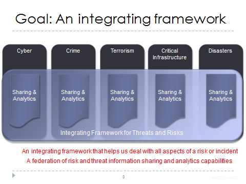<![endif]>

The art of the possible includes an integrating framework
across multiple domains and technologies. That integrating framework is then
backed by a robust technology infrastructure and supporting services.

<h2>Capability Offered</h2>

Our capability is based on a model driven<a
style='mso-footnote-id:ftn3' href="#_ftn3" name="_ftnref3" title=""><![if !supportFootnotes]>[3]<![endif]></a>
approach to information sharing, federation and analytics. This approach is
inclusive of ontological, system engineering, rule based and data
transformation technologies and standards. 

<h3>The basis of the approach is: </h3>

<![if !supportLists]>·&nbsp;&nbsp;&nbsp;&nbsp;&nbsp;&nbsp;
<![endif]>capture the concepts we use to communicate,
understand and analyze information in a robust model and then 

<![if !supportLists]>·&nbsp;&nbsp;&nbsp;&nbsp;&nbsp;&nbsp;
<![endif]>map existing data formats and protocols to and
through the conceptual model, bidirectionaly using rules.

<![if !supportLists]>·&nbsp;&nbsp;&nbsp;&nbsp;&nbsp;&nbsp;
<![endif]>use that model to combine information from
multiple technology and/or domain specific information sources. 

<![if !supportLists]>·&nbsp;&nbsp;&nbsp;&nbsp;&nbsp;&nbsp;
<![endif]>federate the information based on the common
semantics, again, using rules

<![if !supportLists]>·&nbsp;&nbsp;&nbsp;&nbsp;&nbsp;&nbsp;
<![endif]>apply context to the information to capture
relevance and trust

<![if !supportLists]>·&nbsp;&nbsp;&nbsp;&nbsp;&nbsp;&nbsp;
<![endif]>analyze the federated information to develop new
information and recognize patterns

<![if !supportLists]>·&nbsp;&nbsp;&nbsp;&nbsp;&nbsp;&nbsp;
<![endif]>communicate the information utilizing the same
or different technology and/or domain specific information formats and
protocols

<!--[if gte vml 1]><v:shape id="Picture_x0020_24"
 o:spid="_x0000_i1030" type="#_x0000_t75" style='width:277.2pt;height:226.2pt;
 visibility:visible;mso-wrap-style:square'>
 <v:imagedata src="ConceptLibraries_files/image009.png" o:title=""/>
</v:shape><![endif]--><![if !vml]>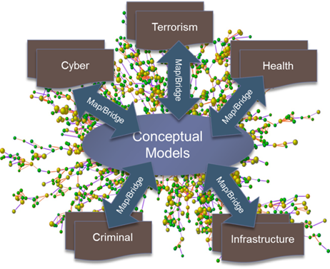<![endif]>

The above graphic illustrates the role of the conceptual
model as the integrating framework for diverse information across multiple
domains and technologies. Each is mapped, not replaced, thus embracing existing
standards, investments and technologies.

<!--[if gte vml 1]><v:shape id="Picture_x0020_23"
 o:spid="_x0000_i1029" type="#_x0000_t75" style='width:5in;height:270pt;
 visibility:visible;mso-wrap-style:square'>
 <v:imagedata src="ConceptLibraries_files/image011.png" o:title=""/>
</v:shape><![endif]--><![if !vml]>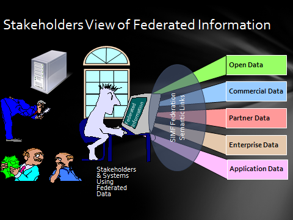<![endif]>

When this pattern is applies within and across the
enterprise we can utilize the combined benefits of open (public) data,
commercial data, partner data (including classified information), enterprise
wide data and that of specific applications. 
The combined impact of this federated data is our key value proposition.

<h3>Reference Vocabularies</h3>

These conceptual models are not built from whole cloth, but
synthesized from the extensive work that has gone into horizontal and domain
specific vocabularies, schema, frameworks and ontologies. The following are a
few of the sources we are federating.

<h4><!--[if gte vml 1]><v:shape id="Picture_x0020_28" o:spid="_x0000_s1037"
 type="#_x0000_t75" alt="http://ts4.mm.bing.net/th?id=HN.608021873319216115&amp;pid=15.1&amp;H=195&amp;W=160"
 href="javascript:%20void(0)" style='position:absolute;margin-left:350.25pt;
 margin-top:29.25pt;width:135pt;height:120pt;z-index:-251633664;visibility:visible;
 mso-wrap-style:square;mso-width-percent:0;mso-height-percent:0;
 mso-wrap-distance-left:9pt;mso-wrap-distance-top:0;mso-wrap-distance-right:9pt;
 mso-wrap-distance-bottom:0;mso-position-horizontal:absolute;
 mso-position-horizontal-relative:text;mso-position-vertical:absolute;
 mso-position-vertical-relative:text;mso-width-percent:0;mso-height-percent:0;
 mso-width-relative:page;mso-height-relative:page' o:button="t">
 <v:fill o:detectmouseclick="t"/>
 <v:imagedata src="ConceptLibraries_files/image012.jpg" o:title="th?id=HN.608021873319216115&amp;pid=15"/>
 <w:wrap type="tight"/>
</v:shape><![endif]--><![if !vml]><a href="javascript:%20void(0)">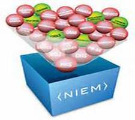</a><![endif]>NIEM &amp; GRA.</h4>

NIEM is the U.S. sponsored National Information Exchange
Framework (niem.gov). NIEM has its foundations in and is prevalent in justice
and public safety. NIEM provides an XML data model across multiple domains. MDS
helped produce NIEM-UML, the UML representation of NIEM and the commercial
Cameo NIEM-UML plugin. GRA, the “Global Reference Architecture” is a related
set of standards that provide the services aspects of information sharing. MDS
also produced GRA-UML.

NIEM is important in our community and to our stakeholders.
NIEM is being used as a basis for building the conceptual model, particularly
with respect to “real world” things like people, places and things. We will
include a mapping to NIEM will provide the gateway to all things NIEM. GRA is
the services counterpart to NIEM and will be able to configure gateways to
“speak” both NIEM and GRA. This approach allows us to fully embrace NIEM while
not being captive to its limitations and limited community.

<h4>STIX, TAXII &amp; Cybox.</h4>

STIX, TAXII &amp; Cybox are related XML schema developed by
MITRE for DHS to provide for cyber information sharing. STIX goes deep into
cyber technicalities but is not intended for cross domain. Much of the Cyber
input we are getting is from STIX. We will also map to and from a subset of
STIX to gain access to Cyber indicator information.

<h4>NIST Cyber Framework</h4>

The NIST cyber framework and related “800 series” standards
are well respected and foundational in the U.S. and mandated by many programs
and even internationally. The NIST framework provides polices and processes for
which our conceptual model helps provide the information view.

<h4>Oasis Emergency management – EDXL</h4>

EDXL is the emergency management framework from Oasis that
is gaining traction in that community. EDXL provides a basis for the emergency
response domains.

<h4>Others</h4>

We are identifying and integrating concepts from multiple
other sources to provide a sound basis for the cross-domain conceptual
foundation. This includes location from OGC, Custody from records management,
Units from NIST and others.

<o:p>&nbsp;</o:p>

<h3>The technology capabilities are then:</h3>

<![if !supportLists]>·&nbsp;&nbsp;&nbsp;&nbsp;&nbsp;&nbsp;
<![endif]>Ingest and publish threat and risk related
information to and from any data source

<![if !supportLists]>·&nbsp;&nbsp;&nbsp;&nbsp;&nbsp;&nbsp;
<![endif]>Utilization of a specialized federation rules
engine

<![if !supportLists]>·&nbsp;&nbsp;&nbsp;&nbsp;&nbsp;&nbsp;
<![endif]>Provide secure gateways to connect to external
parties respecting security, systems assurance and privacy 

<![if !supportLists]>·&nbsp;&nbsp;&nbsp;&nbsp;&nbsp;&nbsp;
<![endif]>Semantic federation of that information

<![if !supportLists]>·&nbsp;&nbsp;&nbsp;&nbsp;&nbsp;&nbsp;
<![endif]>Connection to resources to implement entity
resolution such that data on individuals is likewise federated

<![if !supportLists]>·&nbsp;&nbsp;&nbsp;&nbsp;&nbsp;&nbsp;
<![endif]>Context and provenance as first-class concepts

<![if !supportLists]>·&nbsp;&nbsp;&nbsp;&nbsp;&nbsp;&nbsp;
<![endif]>Powerful analytics on the federated data using
common semantics and terminology as well as domain specific terms, combining
the power of multiple analytics engines.

<![if !supportLists]>·&nbsp;&nbsp;&nbsp;&nbsp;&nbsp;&nbsp;
<![endif]>Publication of information both in party
specific communications using multiple protocols as well as broadcasting across
a community

<![if !supportLists]>·&nbsp;&nbsp;&nbsp;&nbsp;&nbsp;&nbsp;
<![endif]>Visualization through a variety of tools and
approaches.

<h2>Technologies Needed</h2>

<h3>Technologies in development</h3>

The following are the technologies we are or plan on
developing in support of our federation capability. These will work in
conjunction with external technologies from partners, industry or open source
that round-out the offerings. All technologies will leverage existing open
source and commercial software components.

<h4>Conceptual models</h4>

<!--[if gte vml 1]><v:shape id="Picture_x0020_7" o:spid="_x0000_s1036"
 type="#_x0000_t75" style='position:absolute;margin-left:334.45pt;margin-top:.1pt;
 width:166.9pt;height:104.9pt;z-index:-251648000;visibility:visible;
 mso-wrap-style:square;mso-width-percent:0;mso-height-percent:0;
 mso-wrap-distance-left:9pt;mso-wrap-distance-top:0;mso-wrap-distance-right:9pt;
 mso-wrap-distance-bottom:0;mso-position-horizontal:absolute;
 mso-position-horizontal-relative:text;mso-position-vertical:absolute;
 mso-position-vertical-relative:text;mso-width-percent:0;mso-height-percent:0;
 mso-width-relative:page;mso-height-relative:page'>
 <v:imagedata src="ConceptLibraries_files/image014.png" o:title=""/>
 <w:wrap type="tight"/>
</v:shape><![endif]--><![if !vml]>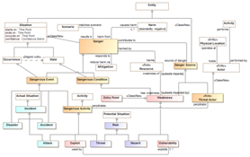<![endif]>The
core of this capability is a network of conceptual models: from very general
through industry specific to enterprise specific. By layering concepts we can
achieve interoperability and federation that has not, to date, been achieved.
While the conceptual models are a core asset it may be the best business
decision to make all or many of them open source and/or standardized so as to provide
customer’s confidence in longevity and openness.

The threat/risk conceptual models<a style='mso-footnote-id:
ftn4' href="#_ftn4" name="_ftnref4" title=""><![if !supportFootnotes]>[4]<![endif]></a>
provide an example of how our conceptual models will be represented in UML. This
representation is being synchronized with the SIMF (Semantic Information
Modeling for Federation) standards effort as well as the Nomagic conceptual
modeler.

It is important to recognize the value of the models as well
as the technologies to create and leverage those models.

<h4>Mapping models</h4>

<!--[if gte vml 1]><v:shape id="Picture_x0020_8" o:spid="_x0000_s1035"
 type="#_x0000_t75" style='position:absolute;margin-left:344.9pt;margin-top:5.6pt;
 width:156.4pt;height:93.7pt;z-index:-251646976;visibility:visible;
 mso-wrap-style:square;mso-width-percent:0;mso-height-percent:0;
 mso-wrap-distance-left:9pt;mso-wrap-distance-top:0;mso-wrap-distance-right:9pt;
 mso-wrap-distance-bottom:0;mso-position-horizontal:absolute;
 mso-position-horizontal-relative:text;mso-position-vertical:absolute;
 mso-position-vertical-relative:text;mso-width-percent:0;mso-height-percent:0;
 mso-width-relative:page;mso-height-relative:page'>
 <v:imagedata src="ConceptLibraries_files/image016.png" o:title=""/>
 <w:wrap type="tight"/>
</v:shape><![endif]--><![if !vml]>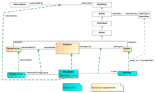<![endif]>Mapping
models provide the “semantic glue” between conceptual models and specific
schema, data structures and vocabularies. While some may be open or standard,
mappings to commercial and internal data structures can be proprietary and
profitable. We will describe how each concept in a conceptual model is
represented by data model specific technologies.

 

<b><i><o:p>&nbsp;</o:p></i></b>

<h4><!--[if gte vml 1]><v:shape id="Picture_x0020_3" o:spid="_x0000_s1034"
 type="#_x0000_t75" alt="http://ts3.mm.bing.net/th?id=HN.607989931651828386&amp;pid=15.1&amp;H=120&amp;W=160"
 href="javascript:%20void(0)" style='position:absolute;margin-left:346.1pt;
 margin-top:11.9pt;width:156.35pt;height:104.25pt;z-index:-251632640;
 visibility:visible;mso-wrap-style:square;mso-width-percent:0;
 mso-height-percent:0;mso-wrap-distance-left:9pt;mso-wrap-distance-top:0;
 mso-wrap-distance-right:9pt;mso-wrap-distance-bottom:0;
 mso-position-horizontal:absolute;mso-position-horizontal-relative:text;
 mso-position-vertical:absolute;mso-position-vertical-relative:text;
 mso-width-percent:0;mso-height-percent:0;mso-width-relative:page;
 mso-height-relative:page' o:button="t">
 <v:fill o:detectmouseclick="t"/>
 <v:imagedata src="ConceptLibraries_files/image018.jpg" o:title="th?id=HN.607989931651828386&amp;pid=15"/>
 <w:wrap type="tight"/>
</v:shape><![endif]--><![if !vml]><![endif]>Production Scale Federation
Engine</h4>

The models in and of themselves do nothing. The conceptual
and mapping models are the “source code” for the rule based federation engine.
The federation engine is the software component able to federate data and map
between formats based on the conceptual models. A core component of federation
is the rules engines which will implement the semantics defined in the models
(including rule models). As a component the federation engine is loosely
coupled and could be injected into a variety of platforms.

<h4>Pluggable foundation</h4>

Bringing together the models, mapping engine, protocol
adapters, analytics engines and visualization tools is a pluggable software
foundation where all behavior is as the result of pluggable components and
model driven configuration. The pluggable foundation is to be built on top of
an existing software foundation, tuned for a model driven approach. (Note:
Build/buy/partner still an option for the foundation – more exploration needed).<b><i><o:p></o:p></i></b>

<h4><!--[if gte vml 1]><v:shape id="Picture_x0020_10" o:spid="_x0000_s1033"
 type="#_x0000_t75" style='position:absolute;margin-left:-8pt;margin-top:-6.3pt;
 width:147.3pt;height:112.5pt;z-index:-251643904;visibility:visible;
 mso-wrap-style:square;mso-width-percent:0;mso-height-percent:0;
 mso-wrap-distance-left:9pt;mso-wrap-distance-top:0;mso-wrap-distance-right:9pt;
 mso-wrap-distance-bottom:0;mso-position-horizontal:absolute;
 mso-position-horizontal-relative:text;mso-position-vertical:absolute;
 mso-position-vertical-relative:text;mso-width-percent:0;mso-height-percent:0;
 mso-width-relative:page;mso-height-relative:page'>
 <v:imagedata src="ConceptLibraries_files/image020.jpg" o:title=""/>
 <w:wrap type="tight"/>
</v:shape><![endif]--><![if !vml]>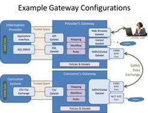<![endif]>Secure
gateway</h4>

Getting information into and out of an enterprise must be
accomplished with secured interfaces adapted to standard protocols and
technologies. We refer to this as a hardened model driven gateway with metadata
configurable plugins to adapt to both internal and external technologies,
polices and protocols.

<h4>Integration &amp; Federation Tooling</h4>

<!--[if gte vml 1]><v:shape id="Picture_x0020_18" o:spid="_x0000_s1032"
 type="#_x0000_t75" alt="Image result for data model"
 href="http://www.google.com/imgres?imgurl=http://img.jgi.doe.gov/w/doc/images/DataModel.jpg&amp;imgrefurl=http://img.jgi.doe.gov/w/doc/datamodel.html&amp;h=434&amp;w=579&amp;tbnid=pP8O4_iWzPifcM:&amp;zoom=1&amp;docid=wBWXYKEBbhCZZM&amp;ei=0L4dVdWWLem0sATH74LoBQ&amp;tbm=isch&amp;ved=0CEIQMygQMBA"
 style='position:absolute;margin-left:278.15pt;margin-top:1.55pt;width:194.4pt;
 height:145.3pt;z-index:-251637760;visibility:visible;mso-wrap-style:square;
 mso-width-percent:0;mso-height-percent:0;mso-wrap-distance-left:9pt;
 mso-wrap-distance-top:0;mso-wrap-distance-right:9pt;
 mso-wrap-distance-bottom:0;mso-position-horizontal:absolute;
 mso-position-horizontal-relative:text;mso-position-vertical:absolute;
 mso-position-vertical-relative:text;mso-width-percent:0;mso-height-percent:0;
 mso-width-relative:page;mso-height-relative:page' o:button="t">
 <v:fill o:detectmouseclick="t"/>
 <v:imagedata src="ConceptLibraries_files/image022.jpg" o:title="Image result for data model"/>
 <w:wrap type="tight"/>
</v:shape><![endif]--><![if !vml]><![endif]>Additional
tooling will be required to enable global collaboration on the creation of
conceptual models and mappings. The tooling will take conceptual modeling from
a desktop exercise for experts to a collaborative web experience for stakeholders
in all domains. 

The addition of technology tooling which better empower the
development of mappings to various technologies and schema will reduce the
time, cost and effort of integration and federation as well as make the
internal team more effective. Initially existing off-the-shelf tools will be
used, which are effective but less efficient.

<h3>Technologies to use/partner with</h3>

The following are technologies that are key to our
capability offering that we expect to acquire through partnership, acquisition,
or use of open source. Each of these will be loosely coupled such that many
such solutions can “plug into” the framework.

<h4><!--[if gte vml 1]><v:shape id="Picture_x0020_14" o:spid="_x0000_s1031"
 type="#_x0000_t75" alt="http://ts1.mm.bing.net/th?id=HN.608029406690541832&amp;pid=15.1&amp;H=137&amp;W=160"
 href="javascript:%20void(0)" style='position:absolute;margin-left:316.75pt;
 margin-top:16.45pt;width:2in;height:119.8pt;z-index:-251641856;visibility:visible;
 mso-wrap-style:square;mso-width-percent:0;mso-height-percent:0;
 mso-wrap-distance-left:9pt;mso-wrap-distance-top:0;mso-wrap-distance-right:9pt;
 mso-wrap-distance-bottom:0;mso-position-horizontal:absolute;
 mso-position-horizontal-relative:text;mso-position-vertical:absolute;
 mso-position-vertical-relative:text;mso-width-percent:0;mso-height-percent:0;
 mso-width-relative:page;mso-height-relative:page' o:button="t">
 <v:fill o:detectmouseclick="t"/>
 <v:imagedata src="ConceptLibraries_files/image023.jpg" o:title="th?id=HN.608029406690541832&amp;pid=15"/>
 <w:wrap type="tight"/>
</v:shape><![endif]--><![if !vml]><a href="javascript:%20void(0)">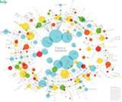</a><![endif]>Analytics</h4>

Analytics provides for deriving new information and
conclusions from the data you have. The combination of widely federated data
with rules and powerful analytics is the basis for effective mitigation and
response to threats and risks. In that there are multiple forms of analytics
our plan is to provide for analytic engine “plugins” that consume and augment
federated information. The federation engine will provide data to analytics
engines in the form they are able to accept.

<h4><!--[if gte vml 1]><v:shape id="Picture_x0020_12" o:spid="_x0000_s1030"
 type="#_x0000_t75" alt="Image result for data visualization"
 href="http://www.google.com/imgres?imgurl=http://www.wired.com/design/wp-content/uploads/2013/01/Iris-Ayasdi-660x363.png&amp;imgrefurl=http://www.wired.com/2013/01/data-viz-ayasdi-iris/&amp;h=363&amp;w=660&amp;tbnid=yhZztWNLtzps0M:&amp;zoom=1&amp;docid=IfKEIu0ekmXbqM&amp;ei=hLodVcWTFsi6ggS5qIPoBg&amp;tbm=isch&amp;ved=0CGAQMygkMCQ"
 style='position:absolute;margin-left:-22.15pt;margin-top:.8pt;width:172.1pt;
 height:94.2pt;z-index:-251642880;visibility:visible;mso-wrap-style:square;
 mso-width-percent:0;mso-height-percent:0;mso-wrap-distance-left:9pt;
 mso-wrap-distance-top:0;mso-wrap-distance-right:9pt;
 mso-wrap-distance-bottom:0;mso-position-horizontal:absolute;
 mso-position-horizontal-relative:text;mso-position-vertical:absolute;
 mso-position-vertical-relative:text;mso-width-percent:0;mso-height-percent:0;
 mso-width-relative:page;mso-height-relative:page' o:button="t">
 <v:fill o:detectmouseclick="t"/>
 <v:imagedata src="ConceptLibraries_files/image025.jpg" o:title="Image result for data visualization"/>
 <w:wrap type="tight"/>
</v:shape><![endif]--><![if !vml]><a
href="http://www.google.com/imgres?imgurl=http://www.wired.com/design/wp-content/uploads/2013/01/Iris-Ayasdi-660x363.png&amp;imgrefurl=http://www.wired.com/2013/01/data-viz-ayasdi-iris/&amp;h=363&amp;w=660&amp;tbnid=yhZztWNLtzps0M:&amp;zoom=1&amp;docid=IfKEIu0ekmXbqM&amp;ei=hLodVcWTFsi6ggS5qIPoBg&amp;tbm=isch&amp;ved=0CGAQMygkMCQ">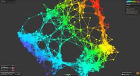</a><![endif]>Visualization</h4>

Like analytics, there are many ways to visualize data.
Rather than committing to one we will use/partner with visualization tools to
provide compelling views of federated and analyzed information – both for
situational awareness and risk analytics. Visualization technologies will plug
into the application fabric.

<h4><!--[if gte vml 1]><v:shape id="Picture_x0020_15" o:spid="_x0000_s1029"
 type="#_x0000_t75" alt="http://ts4.mm.bing.net/th?id=HN.608011243270374243&amp;pid=15.1&amp;H=89&amp;W=160"
 href="javascript:%20void(0)" style='position:absolute;margin-left:320.05pt;
 margin-top:4.55pt;width:172.9pt;height:92.25pt;z-index:-251640832;
 visibility:visible;mso-wrap-style:square;mso-width-percent:0;
 mso-height-percent:0;mso-wrap-distance-left:9pt;mso-wrap-distance-top:0;
 mso-wrap-distance-right:9pt;mso-wrap-distance-bottom:0;
 mso-position-horizontal:absolute;mso-position-horizontal-relative:text;
 mso-position-vertical:absolute;mso-position-vertical-relative:text;
 mso-width-percent:0;mso-height-percent:0;mso-width-relative:page;
 mso-height-relative:page' o:button="t">
 <v:fill o:detectmouseclick="t"/>
 <v:imagedata src="ConceptLibraries_files/image027.jpg" o:title="th?id=HN.608011243270374243&amp;pid=15"/>
 <w:wrap type="tight"/>
</v:shape><![endif]--><![if !vml]><![endif]>Business Intelligence</h4>

Business intelligence combines the capabilities of analytics
and visualization in a “lite” version where less sophisticated users are able
to define and execute their own analytics ad visualize it using simplified
paradigms or reports. Existing BI tools can be used and adapted through the
federation engine.

<h4>Graph+ Database</h4>

<!--[if gte vml 1]><v:shape id="Picture_x0020_17" o:spid="_x0000_s1028"
 type="#_x0000_t75" alt="http://ts4.mm.bing.net/th?id=HN.608032426054715487&amp;pid=15.1&amp;H=116&amp;W=160"
 href="javascript:%20void(0)" style='position:absolute;margin-left:0;
 margin-top:6.25pt;width:164.25pt;height:102.6pt;z-index:-251638784;
 visibility:visible;mso-wrap-style:square;mso-width-percent:0;
 mso-height-percent:0;mso-wrap-distance-left:9pt;mso-wrap-distance-top:0;
 mso-wrap-distance-right:9pt;mso-wrap-distance-bottom:0;
 mso-position-horizontal:absolute;mso-position-horizontal-relative:text;
 mso-position-vertical:absolute;mso-position-vertical-relative:text;
 mso-width-percent:0;mso-height-percent:0;mso-width-relative:page;
 mso-height-relative:page' o:button="t">
 <v:fill o:detectmouseclick="t"/>
 <v:imagedata src="ConceptLibraries_files/image029.jpg" o:title="th?id=HN.608032426054715487&amp;pid=15"/>
 <w:wrap type="tight"/>
</v:shape><![endif]--><![if !vml]><a href="javascript:%20void(0)">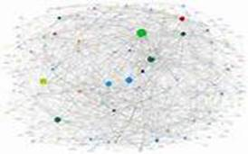</a><![endif]>Information federated from
multiple sources across different context and purposes does not have the rigid
structure typical in a relational DBMS. The information is inherently a graph.
Further, to provide for context and provenance of information each fact in that
graph needs to be a “first class” element so it can be tracked and its scope
and trust evaluated. The graph database must be able to perform with big data
in a constant stream. Graph DBMS technologies will be evaluated for best fit.

<h4>Systems assurance</h4>

<!--[if gte vml 1]><v:shape id="Picture_x0020_16" o:spid="_x0000_s1027"
 type="#_x0000_t75" alt="http://ts1.mm.bing.net/th?id=HN.608050297409964796&amp;pid=15.1&amp;H=132&amp;W=160"
 href="javascript:%20void(0)" style='position:absolute;margin-left:301pt;
 margin-top:3.6pt;width:192.1pt;height:87.7pt;z-index:-251639808;visibility:visible;
 mso-wrap-style:square;mso-width-percent:0;mso-height-percent:0;
 mso-wrap-distance-left:9pt;mso-wrap-distance-top:0;mso-wrap-distance-right:9pt;
 mso-wrap-distance-bottom:0;mso-position-horizontal:absolute;
 mso-position-horizontal-relative:text;mso-position-vertical:absolute;
 mso-position-vertical-relative:text;mso-width-percent:0;mso-height-percent:0;
 mso-width-relative:page;mso-height-relative:page' o:button="t">
 <v:fill o:detectmouseclick="t"/>
 <v:imagedata src="ConceptLibraries_files/image031.jpg" o:title="th?id=HN.608050297409964796&amp;pid=15"/>
 <w:wrap type="tight"/>
</v:shape><![endif]--><![if !vml]><![endif]>In the environment of today <b
style='mso-bidi-font-weight:normal'><i style='mso-bidi-font-style:normal'>no
system should be deployed without rigorous software assurance</i></b>. Software
assurance should be part of any software quality control program – yet that is
not common practice today.  A key feature
of the all software components will be that each component will be assured with
a rigorous and well defined software assurance process supported by the latest
assurance technologies. We will “eat out own dog food” with respect to using
the OMG standard Tool Output Integration Framework (<a
href="http://www.kdmanalytics.com/toif/">TOIF</a>) to provide trusted
components. This trust will enhance marketability and limit risk. Assured model
driven components reduce cost and risk by vastly reducing the amount of new
code that will be written.

 

<b><o:p>&nbsp;</o:p></b>

<h1>Appendix 1 – Federation Engine</h1>

<!--[if gte vml 1]><v:shape id="Picture_x0020_26" o:spid="_x0000_s1026"
 type="#_x0000_t75" alt="http://www.ex-astris-scientia.org/gallery/other/ufp-emblem.jpg"
 style='position:absolute;margin-left:303pt;margin-top:5.1pt;width:180.75pt;
 height:139.5pt;z-index:-251634688;visibility:visible;mso-wrap-style:square;
 mso-width-percent:0;mso-height-percent:0;mso-wrap-distance-left:9pt;
 mso-wrap-distance-top:0;mso-wrap-distance-right:9pt;
 mso-wrap-distance-bottom:0;mso-position-horizontal:absolute;
 mso-position-horizontal-relative:text;mso-position-vertical:absolute;
 mso-position-vertical-relative:text;mso-width-percent:0;mso-height-percent:0;
 mso-width-relative:page;mso-height-relative:page'>
 <v:imagedata src="ConceptLibraries_files/image033.jpg" o:title="ufp-emblem"/>
 <w:wrap type="tight"/>
</v:shape><![endif]--><![if !vml]>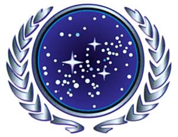<![endif]> The federation engine is the heart of the
provided capability and technology. The federation engine utilizes conceptual,
mapping and rules models to provide essential functions:

<![if !supportLists]>·&nbsp;&nbsp;&nbsp;&nbsp;&nbsp;&nbsp;
<![endif]>Read and write data in a variety of formats and
map the data into a data graph repository based on the conceptual models

<![if !supportLists]>·&nbsp;&nbsp;&nbsp;&nbsp;&nbsp;&nbsp;
<![endif]>Federate data from multiple sources such that
new facts can be determined though matching entities and advanced analytics

<![if !supportLists]>·&nbsp;&nbsp;&nbsp;&nbsp;&nbsp;&nbsp;
<![endif]>Apply rules to infer new information and map
information

With the success of XML, a single XML adapter will provide
for many of the data forms we need. This combined with SQL integration will
round out our initial capabilities for getting data into and out of the
federation engine for our initial offering. Other technologies will be adapted
as needed by customers.

The conceptual and mapping models are not fixed, but
extensible and configurable based on the context of the data sources and
stakeholders. Generic cross-domain models can be combined with industry and
internal models to provide a foundation for all the information that need be
shared or integrated inside or outside of the enterprise. Where existing
mappings don’t exist, our services will fill out the missing pieces.

<!--[if gte vml 1]><v:shape id="Picture_x0020_22"
 o:spid="_x0000_i1028" type="#_x0000_t75" style='width:5in;height:270pt;
 visibility:visible;mso-wrap-style:square'>
 <v:imagedata src="ConceptLibraries_files/image035.png" o:title=""/>
</v:shape><![endif]--><![if !vml]>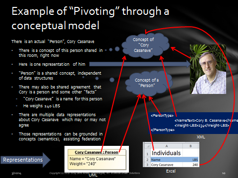<![endif]>

The diagram, above,
shown how common concepts serve to federate data.

The models derived from the OMG threat and risk effort will
provide both generic (horizontal) and risk/threat specific concepts, thus
seeding the model foundation. We will then add-on models based on stakeholder
demand and contracted services.

<h2>Foundational capabilities</h2>

A few of the foundational capabilities of the federation
engine are:

<![if !supportLists]>·&nbsp;&nbsp;&nbsp;&nbsp;&nbsp;&nbsp;
<![endif]><b style='mso-bidi-font-weight:normal'>Represents
relation:</b> The represents relation connects one of many data representations
with the concept(s) it represents. Transformations are then two-way
interpretations of the represents relations. Complex represents relations
utilize patterns mapping. Represents is the foundation of data mapping.

<![if !supportLists]>·&nbsp;&nbsp;&nbsp;&nbsp;&nbsp;&nbsp;
<![endif]><b style='mso-bidi-font-weight:normal'>Context:</b>
Any fact or rule is valid within a certain set of context. The lack of context
as a “first class” concept makes most models brittle outside of a narrow usage.
Context can be applied to any statement, any name, any rule. A stakeholders
perspective is relative to one or more context – thus “closing the world” to
their viewpoint and selecting the information they need and trust.

<![if !supportLists]>·&nbsp;&nbsp;&nbsp;&nbsp;&nbsp;&nbsp;
<![endif]><b style='mso-bidi-font-weight:normal'>Provenance:</b>
Every fact in the federation engine’s repository can be tracked to the source
resource and specific transaction (and thus the time and provider). Provenance
is critical for evaluating the trust of threat and risk information. Provenance
will utilize a required feature of the repository, that every fact (relation or
assertion) may itself participate in other relations or assertions (i.e. edges
can have edges).

<![if !supportLists]>·&nbsp;&nbsp;&nbsp;&nbsp;&nbsp;&nbsp;
<![endif]><b style='mso-bidi-font-weight:normal'>Equivalence:</b>
Different data sources will have different representations of, identities for
and facts about the same things. Equivalence states that different data
elements represent the same “real thing” in the world, or extent of things –
thus connecting and federating the independent data sources. Equivalence can be
asserted, derived from rules or computed by external entity extraction tools.

<![if !supportLists]>·&nbsp;&nbsp;&nbsp;&nbsp;&nbsp;&nbsp;
<![endif]><b style='mso-bidi-font-weight:normal'>Dynamic
multiple classification:</b> Anything may be classified in multiple ways
depending on need, timeframe, perspective and context. The federation engine
will provide for dynamic multiple classification such that business friendly
concepts such as roles and phases of things over time can be accommodated
without complex “4D” ontologies.

<![if !supportLists]>·&nbsp;&nbsp;&nbsp;&nbsp;&nbsp;&nbsp;
<![endif]><b style='mso-bidi-font-weight:normal'>Rules
engine:</b> Generic inference as is found in most OWL inference tools is both
impractical for and insufficient for federation and integration. The federation
engine will use rules as the basis for inference, pattern matching and mapping.
The rule engine will be general, but tailored to and optimized for this
purpose. Rules will power the implementation of the above semantic
capabilities. The rules engine can build on other model execution capabilities
as well as a generic rules engine.

<h2>Perspectives of information</h2>

The federation engine will be ingesting and presenting many
kinds of information from many sources. Different needs will demand that this
information be tailored, subset and analyzed in different ways and presented in
accordance with different technologies and data formats. The users needs and
perspectives define their view of information.

<!--[if gte vml 1]><v:shape
 id="Picture_x0020_9" o:spid="_x0000_i1027" type="#_x0000_t75" style='width:438.6pt;
 height:160.2pt;visibility:visible;mso-wrap-style:square'>
 <v:imagedata src="ConceptLibraries_files/image036.png" o:title=""/>
</v:shape><![endif]--><![if !vml]>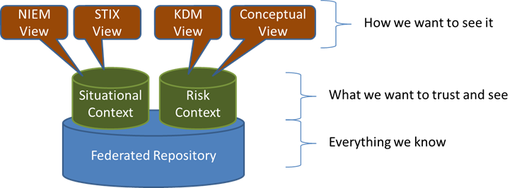<![endif]>

The diagram above illustrates how
the federated repository of information (from any source) can be viewed based
on the context required by the stakeholder and then presented thought any of
the supported data formats and technologies.

<![if !supportLists]>·&nbsp;&nbsp;&nbsp;&nbsp;&nbsp;&nbsp;
<![endif]>The distributed federated repository holds
everything we know – all information from all sources

<![if !supportLists]>·&nbsp;&nbsp;&nbsp;&nbsp;&nbsp;&nbsp;
<![endif]>Context, as defined by the stakeholder, subsets
that information and applies rules as applicable to that context. This results
in user focused contextual information.

<![if !supportLists]>·&nbsp;&nbsp;&nbsp;&nbsp;&nbsp;&nbsp;
<![endif]>The user focused conceptual information can then
be exported to or ingested from any of the supported standard data formats and
technologies – such as NIEM or STIX. The information can also be used in terms
of the conceptual vocabulary or product specific forms like the KDM toolset.

The federation engine handles
contest, rules and projection of information through multiple formats.

<b><o:p>&nbsp;</o:p></b>

 

<b><o:p>&nbsp;</o:p></b>

<h1>Appendix 2 –Gateway</h1>

Getting information into and out of an enterprise must be
accomplished with secured interfaces adapted to standard protocols and
technologies. We refer to this as a model driven gateway with metadata
configurable plugins to adapt to both internal and external technologies,
polices and protocols.

The diagram below shows how each organization’s gateway
adapts their internal systems to produce and consume information using multiple
“Gatelet” adapters. Models, policies and ontologies in each gateway adapt the
structure and semantics of the information as it is shared between independent
producers and consumers. For example, a NIEM/GRA gatelet will directly read a
NIEM IEPD and GRA services specification to configure the gatelet.

<!--[if gte vml 1]><v:shape id="Picture_x0020_19"
 o:spid="_x0000_i1026" type="#_x0000_t75" style='width:5in;height:270pt;
 visibility:visible;mso-wrap-style:square'>
 <v:imagedata src="ConceptLibraries_files/image038.png" o:title=""/>
</v:shape><![endif]--><![if !vml]>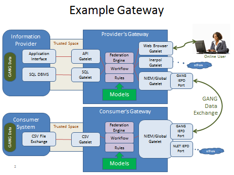<![endif]>

Note that this architecture allows for but does not require
any intermediate “hubs”, every gateway is a hub.

<h2>High-level capabilities</h2>

The following enumerate some of the high-level technical
requirements and capabilities of the gateway.

<h3>Pluggable architecture</h3>

Conceptually the gateway has no “embedded” capability for a
particular standard; capabilities to support specific standards or interfaces
are “plugged in”, either as code or model based configurations. A gateway with
the appropriate plugins and configurations then provides a specific capability.
Therefor a fundamental to the gateway architecture is configurable
plugins.  Plugins points will be
available for:

<![if !supportLists]>·&nbsp;&nbsp;&nbsp;&nbsp;&nbsp;&nbsp;
<![endif]>Vocabularies

<![if !supportLists]>·&nbsp;&nbsp;&nbsp;&nbsp;&nbsp;&nbsp;
<![endif]>Data structures &amp; Schema

<![if !supportLists]>·&nbsp;&nbsp;&nbsp;&nbsp;&nbsp;&nbsp;
<![endif]>Data formats (e.g. XML)

<![if !supportLists]>·&nbsp;&nbsp;&nbsp;&nbsp;&nbsp;&nbsp;
<![endif]>Middleware (e.g. Web services implementations)

<![if !supportLists]>·&nbsp;&nbsp;&nbsp;&nbsp;&nbsp;&nbsp;
<![endif]>Mappings

<![if !supportLists]>·&nbsp;&nbsp;&nbsp;&nbsp;&nbsp;&nbsp;
<![endif]>APIs

<![if !supportLists]>·&nbsp;&nbsp;&nbsp;&nbsp;&nbsp;&nbsp;
<![endif]>Service choreographies

<![if !supportLists]>·&nbsp;&nbsp;&nbsp;&nbsp;&nbsp;&nbsp;
<![endif]>Data security policies

<![if !supportLists]>·&nbsp;&nbsp;&nbsp;&nbsp;&nbsp;&nbsp;
<![endif]>Message security policies

<![if !supportLists]>·&nbsp;&nbsp;&nbsp;&nbsp;&nbsp;&nbsp;
<![endif]>Query languages

<![if !supportLists]>·&nbsp;&nbsp;&nbsp;&nbsp;&nbsp;&nbsp;
<![endif]>Process execution

<![if !supportLists]>·&nbsp;&nbsp;&nbsp;&nbsp;&nbsp;&nbsp;
<![endif]>Privacy filters

<![if !supportLists]>·&nbsp;&nbsp;&nbsp;&nbsp;&nbsp;&nbsp;
<![endif]>Authentication

<![if !supportLists]>·&nbsp;&nbsp;&nbsp;&nbsp;&nbsp;&nbsp;
<![endif]>Authorization

<![if !supportLists]>·&nbsp;&nbsp;&nbsp;&nbsp;&nbsp;&nbsp;
<![endif]>User Interface Templates

As the external sharing interfaces tend to implement
specific standards and policy profiles, an implementation package will
correspond to each such profile. Each of these external interfaces packages
will be referred to as a “<b style='mso-bidi-font-weight:normal'><u>gatelet</u></b>”.

<h3>Choreographed information exchange</h3>

Many information exchanges require a specific exchange
“protocol” and/or API. Such exchanges are highly structured and follow specific
exchange patterns, or choreographies. This is the style of interaction is used
for the Global Reference Architecture (GRA) and is typical of “Service Oriented
Architecture” designs. The gateway will directly support choreographed
exchanges.

<h3>Publish/subscribe information exchange</h3>

Publish/subscribe interactions provide less coupling between
the information provider and consumer. Information is “pushed” by the provider
and consumed by all subscribing agents with the appropriate credentials. The
gateway will directly support publish/subscribe exchanges and the filtering of
notifications based on the consumers authorizations.

<h3>Query oriented information exchange</h3>

Query oriented exchange assumes an information provider has
and exposes an information repository. This repository (or a subset of it) is
made available to credentialed consumers. A query interface is “pull” oriented
– the consumer requesting the information they need.  The gateway will directly support query
exchanges and the filtering of results based on the consumers authorizations as
defined by security and privacy policies. SPARQL may be used as a query
language but more user friendly alternatives will also be explored.

<h3>Linked data exchanges</h3>

Linked data exchanges work like web page URLS, each URL
accessing a piece of information. Credentialed users can then get the
information across the link, which may be filtered based on the receiver’s
credentials. Instead of only web pages, consuming applications can also receive
structured data which can then be processed. Linked data exchanges typically
provide augmentation of information using other exchange types, such as query
or choreographed exchange.  The gateway
will directly support linked data exchanges and data filtering. 

<h3>System to system exchange systems interfaces</h3>

The primary external interface to the gateway will be
through standards based “gatelets” that implement system to system
interactions. These system-system exchanges will use specific exchange
standards and protocols as defined by the policies and design of a particular
exchange scenario

<h3>User to system exchange web user interfaces</h3>

While system-system interactions are crucial, in some cases
users will need to access information for which they have no systems agent.
Therefor web access to the same resources will be provided allowing any
authorized user to exchange information through the gateway with nothing more
than a web browser. The user interface for the user will be driven directly off
of the metadata that defines the external data available to that user.

<h3>Mapping vocabularies and schema</h3>

Inherent in the information exchange problem is that
different standards and internal systems use different vocabularies, data
structures and technologies. The gateway will include a scalable and
configurable information mapping capability that will help users define how
information relates across systems and standards. Augmenting this capability
will be reference vocabularies that serve to normalize information across these
different providers and consumers. The threat and risk model, NIEM and other
reference models will be used as a valuable source for such reference
vocabularies, with the technology and structural dependencies removed so that
the vocabularies can be more generally applied. Mapping will utilize model
driven architecture (MDA) and semantic web standards.

<h3>Internal systems interfaces</h3>

As important as it is to support the external information
exchange interfaces, it is just as crucial that internal applications and data
bases be able to provide and consume information <u>easily</u>.  External data formats and protocols tend to
be complex and overwhelming for the typical application developer.  To support this requirement a variety of
simple and configurable interfaces will be provided, this includes: Simple XML,
Name/value pairs, CSV files &amp; direct SQL access. The gateway will then
transform this information and share it through secure gatelets. The purpose of
the internal interfaces will be to make it quick and easy to interface anything
with a gateway and thereby supporting secure exchange standards. The time,
effort and cost to utilize these simplified interfaces will be minimal.

<h3>Authentication</h3>

The gateway will have both a high level abstraction for
authentications as well as multiple authentication technology adapters that are
then used by gatelets. Authentication will be able to be federated across
multiple domains based on policies. Authentication technologies will “plug in”.

<h3 style='tab-stops:114.0pt'>Authorization                </h3>

The gateway will have both a high level abstraction for
authorization as well as multiple authorization technology adapters that are
then used by gatelets. Authorization will be able to be federated across
multiple domains based on policies. Authorization technologies will “plug in”.

<h3>Filtering</h3>

An information provider may provide more information than a
consumer is authorized to access. For this scenario the gateway will filter the
information provided based on policies. Filtering technologies will “plug in”.

<h3>Cloud deployment</h3>

The gateway will be available through one or more cloud
resources such that users can securely connect to and utilize a gateway without
any internal infrastructure or implementation. Cloud deployments could be both
commercial and/or within government facilities. 

<h3>Internal appliance or component deployment</h3>

Where use of cloud deployment is not practical, gateways
will be available as ready to use virtual “appliances” that can be easily
installed and deployed behind organizational firewalls. As an open source
resource the gateway would also be available as components that users could
build on or specialize for their own needs.

<h3>Model Driven</h3>

As the gateway is to provide for multiple technologies and
standards that can be easily configured the implementation must be very general
and configurable. The gateway will be built, composed and configured using a
model driven approach based on industry standards. This will ensure that the
gateway is flexible and future-proof. The model driven capability will be based
on MDA standards from the OMG and semantic web standards from W3C.

<![if !supportFootnotes]> 

<![endif]>

<a style='mso-footnote-id:ftn1' href="#_ftnref1"
name="_ftn1" title=""><![if !supportFootnotes]>[1]<![endif]></a>
http://www.whitehouse.gov/the-press-office/2015/02/13/executive-order-promoting-private-sector-cybersecurity-information-shari

<a style='mso-footnote-id:ftn2' href="#_ftnref2"
name="_ftn2" title=""><![if !supportFootnotes]>[2]<![endif]></a>
http://genius.com/Stephen-hawking-on-the-threat-of-artificial-intelligence-annotated

<a style='mso-footnote-id:ftn3' href="#_ftnref3"
name="_ftn3" title=""><![if !supportFootnotes]>[3]<![endif]></a>
http://www.omg.org/cgi-bin/doc?ormsc/14-06-01.pdf

<a style='mso-footnote-id:ftn4' href="#_ftnref4"
name="_ftn4" title=""><![if !supportFootnotes]>[4]<![endif]></a>
https://github.com/omg-threat-modeling/phase1/raw/master/Submission/Draft%20Operational%20Threat%20Risk%20Submission.doc

</body>

</html>
